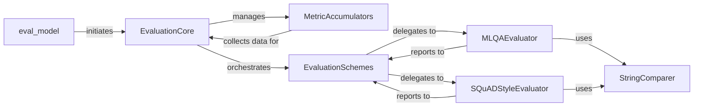

## Details

The `jiant` evaluation subsystem provides a modular and extensible architecture for assessing natural language processing models. At its highest level, the `eval_model` function orchestrates the evaluation process by interacting with the central `EvaluationCore`. This core component is responsible for managing the overall evaluation flow, including the collection of raw model outputs via `MetricAccumulators` and the delegation of metric computation to task-specific `EvaluationSchemes`. These schemes, acting as specialized dispatchers, then invoke concrete evaluators such as `MLQAEvaluator` and `SQuADStyleEvaluator` to perform detailed metric calculations. A shared utility, `StringComparer`, supports these evaluators by providing essential text normalization and comparison functionalities, ensuring accurate and consistent evaluation results across diverse tasks. This design promotes clear separation of concerns, allowing for easy integration of new tasks and evaluation metrics.

### EvaluationCore
Orchestrates the overall evaluation process. It manages metric accumulation and dispatches to appropriate task-specific evaluation schemes. It provides a generalized interface for evaluation across different tasks.

**Related Classes/Methods**:

- <a href="https://github.com/nyu-mll/jiant/blob/master/jiant/tasks/evaluate/core.py#L10-L100" target="_blank" rel="noopener noreferrer">`jiant.tasks.evaluate.core.EvaluationCore`:10-100</a>

### MetricAccumulators
Collects and aggregates raw model outputs (e.g., logits, predicted strings) and corresponding ground truth labels during an evaluation run. Different accumulators are used based on the type of data being collected.

**Related Classes/Methods**:

- <a href="https://github.com/nyu-mll/jiant/blob/master/jiant/tasks/evaluate/core.py#L102-L200" target="_blank" rel="noopener noreferrer">`jiant.tasks.evaluate.core.MetricAccumulators`:102-200</a>

### EvaluationSchemes
Defines the specific set of metrics and the high-level logic for computing them for a particular task type. It acts as a dispatcher, delegating the actual computation to specialized task evaluators.

**Related Classes/Methods**:

- <a href="https://github.com/nyu-mll/jiant/blob/master/jiant/tasks/evaluate/core.py#L202-L300" target="_blank" rel="noopener noreferrer">`jiant.tasks.evaluate.core.EvaluationSchemes`:202-300</a>

### eval_model
Integrates the evaluation process into the main training/validation loops. It triggers evaluation at specified intervals and manages the saving of results.

**Related Classes/Methods**:

- <a href="https://github.com/nyu-mll/jiant/blob/master/jiant/proj/main/metarunner.py#L164-L165" target="_blank" rel="noopener noreferrer">`jiant.proj.main.metarunner.eval_model`:164-165</a>

### MLQAEvaluator
Implements the specific evaluation logic for MLQA tasks, including specialized answer normalization and the calculation of F1 and Exact Match scores for question answering.

**Related Classes/Methods**:

- <a href="https://github.com/nyu-mll/jiant/blob/master/jiant/tasks/lib/mlqa.py#L10-L150" target="_blank" rel="noopener noreferrer">`jiant.tasks.lib.mlqa.MLQAEvaluator`:10-150</a>

### SQuADStyleEvaluator
Provides utilities for evaluating SQuAD-style span prediction tasks, including converting model logits into predicted answer spans, performing answer normalization, and computing F1 and Exact Match scores.

**Related Classes/Methods**:

- <a href="https://github.com/nyu-mll/jiant/blob/master/jiant/tasks/lib/templates/squad_style/utils.py#L10-L200" target="_blank" rel="noopener noreferrer">`jiant.tasks.lib.templates.squad_style.utils.SQuADStyleEvaluator`:10-200</a>

### StringComparer
Offers general-purpose string manipulation and comparison functions essential for normalizing text before computing metrics like F1 or Exact Match.

**Related Classes/Methods**:

- <a href="https://github.com/nyu-mll/jiant/blob/master/jiant/utils/string_comparing.py#L10-L80" target="_blank" rel="noopener noreferrer">`jiant.utils.string_comparing.StringComparer`:10-80</a>

### [FAQ](https://github.com/CodeBoarding/GeneratedOnBoardings/tree/main?tab=readme-ov-file#faq)