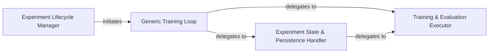

## Details

The `Experiment Orchestrator` subsystem is the core control unit for managing the entire NLP experiment lifecycle within the `jiant` project. It coordinates the execution flow from environment setup and data loading to training, evaluation, and result persistence, embodying the project's "Experiment-Centric" architectural bias.

### Experiment Lifecycle Manager
This is the top-level orchestrator responsible for initiating, resuming, or continuing NLP experiments. It sets up the environment, manages the overall experiment flow, and delegates specific tasks to other components. It embodies the "Experiment-Centric" architectural bias by controlling the entire research workflow.

**Related Classes/Methods**:

- <a href="https://github.com/nyu-mll/jiant/blob/master/jiant/proj/main/runscript.py" target="_blank" rel="noopener noreferrer">`jiant.proj.main.runscript:main`</a>
- <a href="https://github.com/nyu-mll/jiant/blob/master/jiant/proj/main/runscript.py" target="_blank" rel="noopener noreferrer">`jiant.proj.main.runscript:run_loop`</a>
- <a href="https://github.com/nyu-mll/jiant/blob/master/jiant/proj/main/runscript.py" target="_blank" rel="noopener noreferrer">`jiant.proj.main.runscript:setup_runner`</a>

### Generic Training Loop
Defines the abstract sequence of operations for a training process. It acts as a template, providing the high-level structure for how a training run should proceed, allowing for concrete implementations to fill in the details. This component supports the "Extensibility Points" bias by allowing different training strategies.

**Related Classes/Methods**:

- <a href="https://github.com/nyu-mll/jiant/blob/master/jiant/shared/metarunner.py" target="_blank" rel="noopener noreferrer">`jiant.shared.metarunner:run_train_loop`</a>

### Experiment State & Persistence Handler
Manages the experiment's state, including saving and loading models, checkpoints, and handling the persistence of evaluation results. It provides concrete actions that are invoked by the generic training loop to maintain the experiment's progress and output. This component is crucial for the iterative nature of research.

**Related Classes/Methods**:

- <a href="https://github.com/nyu-mll/jiant/blob/master/jiant/proj/main/metarunner.py" target="_blank" rel="noopener noreferrer">`jiant.proj.main.metarunner:eval_model`</a>
- <a href="https://github.com/nyu-mll/jiant/blob/master/jiant/proj/main/metarunner.py" target="_blank" rel="noopener noreferrer">`jiant.proj.main.metarunner:save_checkpoint`</a>
- <a href="https://github.com/nyu-mll/jiant/blob/master/jiant/proj/main/metarunner.py" target="_blank" rel="noopener noreferrer">`jiant.proj.main.metarunner:done_training`</a>
- <a href="https://github.com/nyu-mll/jiant/blob/master/jiant/proj/main/metarunner.py" target="_blank" rel="noopener noreferrer">`jiant.proj.main.metarunner:yield_train_step`</a>

### Training & Evaluation Executor
Executes the detailed training, validation, and testing steps. It interacts directly with data loaders and the NLP model, performing the actual forward and backward passes, and metric calculations. This component embodies the "Data Flow Emphasis" by handling the direct interaction with data and models.

**Related Classes/Methods**:

- <a href="https://github.com/nyu-mll/jiant/blob/master/jiant/proj/main/runner.py" target="_blank" rel="noopener noreferrer">`jiant.proj.main.runner:run_train_context`</a>
- <a href="https://github.com/nyu-mll/jiant/blob/master/jiant/proj/main/runner.py" target="_blank" rel="noopener noreferrer">`jiant.proj.main.runner:run_train_step`</a>
- <a href="https://github.com/nyu-mll/jiant/blob/master/jiant/proj/main/runner.py" target="_blank" rel="noopener noreferrer">`jiant.proj.main.runner:run_val`</a>
- <a href="https://github.com/nyu-mll/jiant/blob/master/jiant/proj/main/runner.py" target="_blank" rel="noopener noreferrer">`jiant.proj.main.runner:run_test`</a>

### [FAQ](https://github.com/CodeBoarding/GeneratedOnBoardings/tree/main?tab=readme-ov-file#faq)