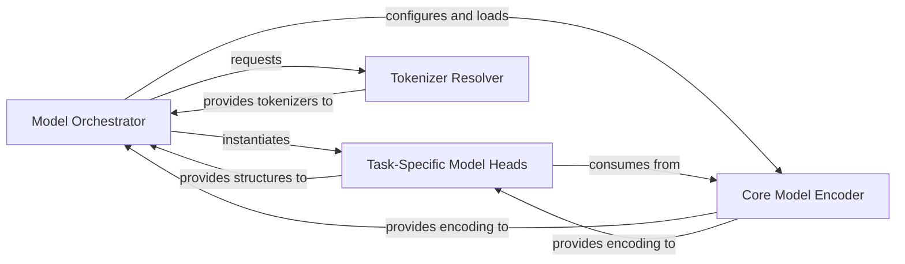

## Details

The Model Management subsystem encompasses the following key modules and their functionalities: jiant.shared.model_setup, jiant.proj.main.modeling.primary, jiant.proj.main.modeling.taskmodels, jiant.shared.model_resolution.

### Model Orchestrator
This component is the primary entry point for model configuration and setup within the Model Management subsystem. It manages the end-to-end model lifecycle, including instantiating task-specific models, loading pre-trained weights (e.g., from Hugging Face transformers), configuring optimizers, learning rate schedulers, and setting up model parallelism (distributed, GPU) and precision (FP16).

**Related Classes/Methods**:

- <a href="https://github.com/nyu-mll/jiant/blob/master/jiant/shared/model_setup.py" target="_blank" rel="noopener noreferrer">`jiant.shared.model_setup`</a>

### Core Model Encoder
Provides the fundamental model encoding capabilities. It defines how raw inputs are transformed into model-ready features and executes the core forward pass of the underlying encoder model (e.g., BERT, RoBERta), producing generic model outputs (embeddings). This component represents the shared backbone of the NLP models.

**Related Classes/Methods**:

- <a href="https://github.com/nyu-mll/jiant/blob/master/jiant/proj/main/modeling/primary.py" target="_blank" rel="noopener noreferrer">`jiant.proj.main.modeling.primary`</a>

### Task-Specific Model Heads
Implements the forward pass and loss computation logic tailored for specific NLP tasks (e.g., Masked Language Modeling, Question Answering, Sentence Pair Classification). These classes typically represent the "heads" that process the output of a shared encoder for a particular downstream task.

**Related Classes/Methods**:

- <a href="https://github.com/nyu-mll/jiant/blob/master/jiant/proj/main/modeling/taskmodels.py" target="_blank" rel="noopener noreferrer">`jiant.proj.main.modeling.taskmodels`</a>

### Tokenizer Resolver
A utility component responsible for resolving and providing the correct tokenizer class based on the specified model architecture. This ensures that input data is tokenized appropriately for the chosen model, aligning with the pre-trained weights.

**Related Classes/Methods**:

- <a href="https://github.com/nyu-mll/jiant/blob/master/jiant/shared/model_resolution.py" target="_blank" rel="noopener noreferrer">`jiant.shared.model_resolution`</a>

### [FAQ](https://github.com/CodeBoarding/GeneratedOnBoardings/tree/main?tab=readme-ov-file#faq)