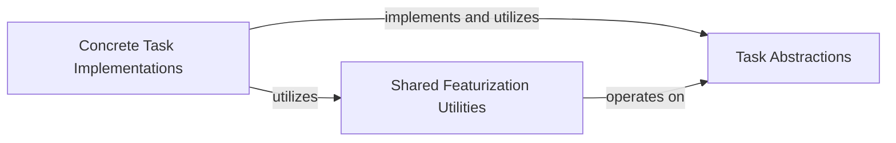

## Details

The `jiant.tasks` subsystem is structured around a clear separation of concerns, facilitating the definition, processing, and evaluation of various NLP tasks. The `Task Abstractions` component forms the core, providing essential data structures and abstract interfaces that standardize how tasks are represented and handled throughout the system. Building upon these abstractions, the `Shared Featurization Utilities` component offers reusable functions for common data preparation steps, promoting efficiency and consistency. Finally, the `Concrete Task Implementations` component houses the specific logic for each NLP task, adhering to the interfaces defined by `Task Abstractions` and leveraging the `Shared Featurization Utilities` for data processing. This layered architecture ensures modularity, extensibility, and maintainability, allowing for easy integration of new tasks and efficient processing of existing ones.

### Task Abstractions
This component defines the fundamental data structures (e.g., `Example`, `TokenizedExample`, `DataRow`, `BatchTuple`) and abstract interfaces (e.g., `JiantTask` which is implemented by the `Task` class) that all NLP tasks must adhere to. It provides a standardized contract and common language for task definition, promoting consistency across the toolkit.

**Related Classes/Methods**:

- <a href="https://github.com/nyu-mll/jiant/blob/master/jiant/tasks/core.py" target="_blank" rel="noopener noreferrer">`jiant.tasks.core.Example`</a>
- <a href="https://github.com/nyu-mll/jiant/blob/master/jiant/tasks/core.py" target="_blank" rel="noopener noreferrer">`jiant.tasks.core.TokenizedExample`</a>
- <a href="https://github.com/nyu-mll/jiant/blob/master/jiant/tasks/core.py" target="_blank" rel="noopener noreferrer">`jiant.tasks.core.DataRow`</a>
- <a href="https://github.com/nyu-mll/jiant/blob/master/jiant/tasks/core.py#L107-L119" target="_blank" rel="noopener noreferrer">`jiant.tasks.core.BatchTuple`:107-119</a>
- <a href="https://github.com/nyu-mll/jiant/blob/master/jiant/tasks/core.py#L137-L185" target="_blank" rel="noopener noreferrer">`jiant.tasks.core.JiantTask`:137-185</a>

### Shared Featurization Utilities
This component provides generic, reusable functions and classes for common task operations, particularly related to input featurization (e.g., `single_sentence_featurize`, `double_sentence_featurize`). This component promotes code reuse and reduces redundancy across different task implementations.

**Related Classes/Methods**:

- <a href="https://github.com/nyu-mll/jiant/blob/master/jiant/tasks/lib/templates/shared.py#L38-L59" target="_blank" rel="noopener noreferrer">`jiant.tasks.lib.templates.shared.single_sentence_featurize`:38-59</a>
- <a href="https://github.com/nyu-mll/jiant/blob/master/jiant/tasks/lib/templates/shared.py#L62-L101" target="_blank" rel="noopener noreferrer">`jiant.tasks.lib.templates.shared.double_sentence_featurize`:62-101</a>

### Concrete Task Implementations
This component implements the specific logic for individual NLP tasks (e.g., `abductive_nli`, `mnli`, `cola`). This includes: defining how to read and parse raw dataset files into `Example` objects, specifying text tokenization and featurization rules to convert `Example` objects into `DataRow` objects, and defining task-specific metrics and evaluation logic.

**Related Classes/Methods**:

- <a href="https://github.com/nyu-mll/jiant/blob/master/jiant/tasks/lib/__init__.py" target="_blank" rel="noopener noreferrer">`jiant.tasks.lib.__init__.py`</a>
- <a href="https://github.com/nyu-mll/jiant/blob/master/jiant/tasks/lib/abductive_nli.py" target="_blank" rel="noopener noreferrer">`jiant.tasks.lib.abductive_nli`</a>
- <a href="https://github.com/nyu-mll/jiant/blob/master/jiant/tasks/lib/mnli.py" target="_blank" rel="noopener noreferrer">`jiant.tasks.lib.mnli`</a>
- <a href="https://github.com/nyu-mll/jiant/blob/master/jiant/tasks/lib/cola.py" target="_blank" rel="noopener noreferrer">`jiant.tasks.lib.cola`</a>

### [FAQ](https://github.com/CodeBoarding/GeneratedOnBoardings/tree/main?tab=readme-ov-file#faq)