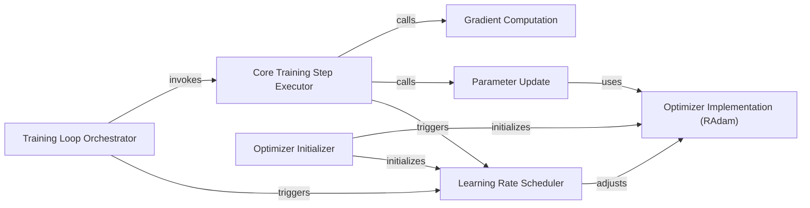

## Details

The `Training & Optimization Engine` subsystem is the core of the `jiant` project's machine learning capabilities, orchestrating the entire training lifecycle from data processing to model parameter updates. It embodies the "Experiment-Centric" and "Configurability as a First-Class Citizen" architectural biases by providing a structured yet flexible environment for training deep learning models.

### Training Loop Orchestrator
Manages the high-level flow of training, including iteration control, epoch management, checkpointing decisions, and triggering periodic evaluations. It is the primary coordinator of the training process.

**Related Classes/Methods**:

- <a href="https://github.com/nyu-mll/jiant/blob/master/jiant/shared/metarunner.py#L35-L54" target="_blank" rel="noopener noreferrer">`jiant.shared.metarunner.run_train_loop`:35-54</a>

### Core Training Step Executor
Executes a single training iteration for a batch of data, encompassing the forward pass, loss calculation, gradient computation, and parameter updates.

**Related Classes/Methods**:

- <a href="https://github.com/nyu-mll/jiant/blob/master/jiant/proj/main/runner.py#L95-L128" target="_blank" rel="noopener noreferrer">`jiant.proj.main.runner.run_train_step`:95-128</a>

### Optimizer Initializer
Configures and instantiates the optimizer (e.g., RAdam) and sets up the learning rate schedule based on the training configuration.

**Related Classes/Methods**:

- <a href="https://github.com/nyu-mll/jiant/blob/master/jiant/shared/model_setup.py#L28-L47" target="_blank" rel="noopener noreferrer">`jiant.shared.model_setup.create_optimizer`:28-47</a>

### Optimizer Implementation (RAdam)
Provides the specific algorithm for updating model parameters based on computed gradients, implementing the core optimization logic.

**Related Classes/Methods**:

- <a href="https://github.com/nyu-mll/jiant/blob/master/jiant/ext/radam.py" target="_blank" rel="noopener noreferrer">`jiant.ext.radam`</a>

### Gradient Computation
Performs the backward pass to compute gradients of the loss with respect to model parameters, a critical step in backpropagation.

**Related Classes/Methods**:

- <a href="https://github.com/nyu-mll/jiant/blob/master/jiant/proj/main/runner.py#L223-L232" target="_blank" rel="noopener noreferrer">`jiant.proj.main.runner.complex_backpropagate`:223-232</a>

### Parameter Update
Applies the calculated gradients to update the model's parameters using the chosen optimizer's `step` method.

**Related Classes/Methods**:

- <a href="https://github.com/nyu-mll/jiant/blob/master/jiant/proj/main/runner.py" target="_blank" rel="noopener noreferrer">`jiant.proj.main.runner.step`</a>

### Learning Rate Scheduler
Dynamically adjusts the learning rate of the optimizer throughout the training process, often based on epochs or steps, to optimize convergence.

**Related Classes/Methods**:

- <a href="https://github.com/nyu-mll/jiant/blob/master/jiant/shared/model_setup.py#L7-L25" target="_blank" rel="noopener noreferrer">`jiant.shared.model_setup.OptimizerScheduler`:7-25</a>

### [FAQ](https://github.com/CodeBoarding/GeneratedOnBoardings/tree/main?tab=readme-ov-file#faq)