```mermaid
graph LR
    Configuration_Management["Configuration Management"]
    Experiment_Orchestrator["Experiment Orchestrator"]
    Data_Acquisition_Preprocessing["Data Acquisition & Preprocessing"]
    Task_Definition_Layer["Task Definition Layer"]
    Model_Management["Model Management"]
    Training_Optimization_Engine["Training & Optimization Engine"]
    Evaluation_Metrics_Engine["Evaluation & Metrics Engine"]
    Configuration_Management -- "Provides Experiment Configuration" --> Experiment_Orchestrator
    Configuration_Management -- "Configures Data Pipeline" --> Data_Acquisition_Preprocessing
    Configuration_Management -- "Defines Task Specifics" --> Task_Definition_Layer
    Configuration_Management -- "Configures Model Architecture" --> Model_Management
    Configuration_Management -- "Sets Training Parameters" --> Training_Optimization_Engine
    Configuration_Management -- "Specifies Evaluation Metrics" --> Evaluation_Metrics_Engine
    Experiment_Orchestrator -- "Requests Configuration" --> Configuration_Management
    Experiment_Orchestrator -- "Requests Data Batches" --> Data_Acquisition_Preprocessing
    Data_Acquisition_Preprocessing -- "Supplies Processed Data" --> Experiment_Orchestrator
    Data_Acquisition_Preprocessing -- "Uses Task Definitions for Processing" --> Task_Definition_Layer
    Task_Definition_Layer -- "Informs Data Structuring" --> Data_Acquisition_Preprocessing
    Experiment_Orchestrator -- "Initializes & Runs Model" --> Model_Management
    Model_Management -- "Returns Model Outputs" --> Experiment_Orchestrator
    Experiment_Orchestrator -- "Orchestrates Training Step" --> Training_Optimization_Engine
    Training_Optimization_Engine -- "Updates Model Parameters" --> Model_Management
    Experiment_Orchestrator -- "Triggers Evaluation" --> Evaluation_Metrics_Engine
    Evaluation_Metrics_Engine -- "Reports Metrics" --> Experiment_Orchestrator
    Model_Management -- "Provides Predictions/Losses" --> Evaluation_Metrics_Engine
    Task_Definition_Layer -- "Informs Model Structure" --> Model_Management
    Task_Definition_Layer -- "Defines Evaluation Logic" --> Evaluation_Metrics_Engine
    click Configuration_Management href "https://github.com/CodeBoarding/GeneratedOnBoardings/blob/main/jiant/Configuration_Management.md" "Details"
    click Experiment_Orchestrator href "https://github.com/CodeBoarding/GeneratedOnBoardings/blob/main/jiant/Experiment_Orchestrator.md" "Details"
    click Data_Acquisition_Preprocessing href "https://github.com/CodeBoarding/GeneratedOnBoardings/blob/main/jiant/Data_Acquisition_Preprocessing.md" "Details"
    click Task_Definition_Layer href "https://github.com/CodeBoarding/GeneratedOnBoardings/blob/main/jiant/Task_Definition_Layer.md" "Details"
    click Model_Management href "https://github.com/CodeBoarding/GeneratedOnBoardings/blob/main/jiant/Model_Management.md" "Details"
    click Training_Optimization_Engine href "https://github.com/CodeBoarding/GeneratedOnBoardings/blob/main/jiant/Training_Optimization_Engine.md" "Details"
    click Evaluation_Metrics_Engine href "https://github.com/CodeBoarding/GeneratedOnBoardings/blob/main/jiant/Evaluation_Metrics_Engine.md" "Details"
```

## Details

The `jiant` project is structured around a clear, modular architecture designed for managing NLP experiments. The `Configuration Management` component acts as the central authority, dictating experiment parameters to all other components. The `Experiment Orchestrator` drives the overall workflow, coordinating data handling, model interactions, training, and evaluation. Data flows through the `Data Acquisition & Preprocessing` component, which prepares raw data based on specifications from the `Task Definition Layer`. The `Model Management` component handles model lifecycle, receiving configurations and providing outputs. The `Training & Optimization Engine` iteratively refines models, while the `Evaluation & Metrics Engine` assesses performance, both relying on the `Task Definition Layer` for task-specific logic. This interconnected system ensures a streamlined and configurable approach to NLP experimentation.

### Configuration Management [[Expand]](./Configuration_Management.md)
The central hub for all experiment parameters. It parses, validates, and distributes configurations, acting as the single source of truth that drives the behavior of other components.

**Related Classes/Methods**:

- <a href="https://github.com/nyu-mll/jiant/blob/master/jiant/proj/main/scripts/configurator.py#L19-L26" target="_blank" rel="noopener noreferrer">`configurator`:19-26</a>
- <a href="https://github.com/nyu-mll/jiant/blob/master/jiant/proj/main/metarunner.py" target="_blank" rel="noopener noreferrer">`core`</a>
- <a href="https://github.com/nyu-mll/jiant/blob/master/jiant/proj/main/components/container_setup.py" target="_blank" rel="noopener noreferrer">`container_setup`</a>

### Experiment Orchestrator [[Expand]](./Experiment_Orchestrator.md)
The primary control unit that manages the entire NLP experiment lifecycle. It coordinates the execution flow from setup and data loading to training, evaluation, and result persistence.

**Related Classes/Methods**:

- <a href="https://github.com/nyu-mll/jiant/blob/master/jiant/proj/main/runscript.py" target="_blank" rel="noopener noreferrer">`runscript`</a>
- <a href="https://github.com/nyu-mll/jiant/blob/master/jiant/proj/main/metarunner.py#L58-L262" target="_blank" rel="noopener noreferrer">`runner`:58-262</a>
- <a href="https://github.com/nyu-mll/jiant/blob/master/jiant/proj/main/metarunner.py#L58-L262" target="_blank" rel="noopener noreferrer">`metarunner`:58-262</a>

### Data Acquisition & Preprocessing [[Expand]](./Data_Acquisition_Preprocessing.md)
Manages the end-to-end data pipeline, including downloading, loading, tokenization, and numerical featurization of raw datasets. It prepares data into a model-consumable format.

**Related Classes/Methods**:

- <a href="https://github.com/nyu-mll/jiant/blob/master/jiant/scripts/download_data/runscript.py" target="_blank" rel="noopener noreferrer">`runscript`</a>
- <a href="https://github.com/nyu-mll/jiant/blob/master/jiant/scripts/download_data/dl_datasets/files_tasks.py" target="_blank" rel="noopener noreferrer">`files_tasks`</a>
- <a href="https://github.com/nyu-mll/jiant/blob/master/jiant/proj/main/preprocessing.py" target="_blank" rel="noopener noreferrer">`preprocessing`</a>
- <a href="https://github.com/nyu-mll/jiant/blob/master/jiant/proj/main/tokenize_and_cache.py" target="_blank" rel="noopener noreferrer">`tokenize_and_cache`</a>
- <a href="https://github.com/nyu-mll/jiant/blob/master/jiant/shared/caching.py" target="_blank" rel="noopener noreferrer">`caching`</a>

### Task Definition Layer [[Expand]](./Task_Definition_Layer.md)
Defines the specific logic and data structures for various NLP tasks. It abstracts task-specific details, enabling models to be applied consistently across different tasks.

**Related Classes/Methods**:

- <a href="https://github.com/nyu-mll/jiant/blob/master/jiant/tasks/lib/abductive_nli.py" target="_blank" rel="noopener noreferrer">`abductive_nli`</a>
- <a href="https://github.com/nyu-mll/jiant/blob/master/jiant/tasks/lib/templates/shared.py" target="_blank" rel="noopener noreferrer">`shared`</a>
- <a href="https://github.com/nyu-mll/jiant/blob/master/jiant/proj/main/metarunner.py" target="_blank" rel="noopener noreferrer">`core`</a>

### Model Management [[Expand]](./Model_Management.md)
Handles the lifecycle of NLP models, including initialization, loading of pre-trained weights (e.g., from Hugging Face `transformers`), and executing the model's forward pass.

**Related Classes/Methods**:

- <a href="https://github.com/nyu-mll/jiant/blob/master/jiant/shared/model_setup.py#L156-L180" target="_blank" rel="noopener noreferrer">`model_setup`:156-180</a>
- <a href="https://github.com/nyu-mll/jiant/blob/master/jiant/proj/main/modeling/taskmodels.py" target="_blank" rel="noopener noreferrer">`taskmodels`</a>
- <a href="https://github.com/nyu-mll/jiant/blob/master/jiant/proj/main/modeling/primary.py" target="_blank" rel="noopener noreferrer">`primary`</a>
- <a href="https://github.com/nyu-mll/jiant/blob/master/jiant/shared/model_resolution.py" target="_blank" rel="noopener noreferrer">`model_resolution`</a>

### Training & Optimization Engine [[Expand]](./Training_Optimization_Engine.md)
Encapsulates the core training logic, including gradient computation, optimizer steps, and learning rate scheduling, orchestrating the training loop.

**Related Classes/Methods**:

- <a href="https://github.com/nyu-mll/jiant/blob/master/jiant/proj/main/metarunner.py#L58-L262" target="_blank" rel="noopener noreferrer">`runner`:58-262</a>
- <a href="https://github.com/nyu-mll/jiant/blob/master/jiant/shared/model_setup.py#L156-L180" target="_blank" rel="noopener noreferrer">`model_setup`:156-180</a>
- <a href="https://github.com/nyu-mll/jiant/blob/master/jiant/ext/radam.py#L7-L113" target="_blank" rel="noopener noreferrer">`radam`:7-113</a>

### Evaluation & Metrics Engine [[Expand]](./Evaluation_Metrics_Engine.md)
Responsible for collecting model predictions and ground truth labels, and computing task-specific evaluation metrics to assess model performance.

**Related Classes/Methods**:

- <a href="https://github.com/nyu-mll/jiant/blob/master/jiant/proj/main/metarunner.py" target="_blank" rel="noopener noreferrer">`core`</a>
- <a href="https://github.com/nyu-mll/jiant/blob/master/jiant/tasks/lib/mlqa.py" target="_blank" rel="noopener noreferrer">`mlqa`</a>
- <a href="https://github.com/nyu-mll/jiant/blob/master/jiant/tasks/lib/templates/squad_style/utils.py" target="_blank" rel="noopener noreferrer">`utils`</a>

### [FAQ](https://github.com/CodeBoarding/GeneratedOnBoardings/tree/main?tab=readme-ov-file#faq)