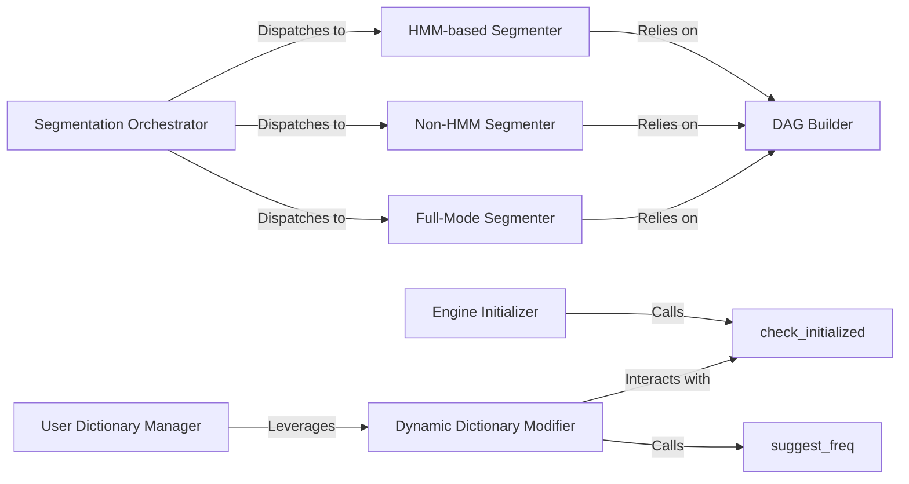

## Details

The Core Segmentation Engine subsystem is the heart of the jieba library, responsible for the fundamental processes of Chinese word segmentation. It encapsulates the logic for text processing, dictionary management, and the application of various segmentation algorithms.

### Segmentation Orchestrator
The primary entry point for word segmentation. It acts as a facade, orchestrating the segmentation process by dispatching to specific underlying algorithms based on the desired segmentation mode (e.g., precise, full, or search).

**Related Classes/Methods**:

- <a href="https://github.com/fxsjy/jieba/blob/master/jieba/__init__.py" target="_blank" rel="noopener noreferrer">`jieba.__init__.cut`</a>

### Engine Initializer
Responsible for the initial setup of the segmentation engine. This includes loading the default dictionary and generating the prefix-dictionary (pfdict) for fast word lookups, ensuring the engine is ready for operation.

**Related Classes/Methods**:

- <a href="https://github.com/fxsjy/jieba/blob/master/jieba/__init__.py" target="_blank" rel="noopener noreferrer">`jieba.__init__.initialize`</a>

### DAG Builder
Constructs the Directed Acyclic Graph (DAG) for a given input sentence. This graph represents all possible word paths within the sentence, forming the basis for efficient word path exploration by the segmentation algorithms.

**Related Classes/Methods**:

- <a href="https://github.com/fxsjy/jieba/blob/master/jieba/__init__.py" target="_blank" rel="noopener noreferrer">`jieba.__init__.get_DAG`</a>

### HMM-based Segmenter
Implements a core segmentation algorithm that utilizes the constructed DAG in conjunction with a Hidden Markov Model (HMM). This approach leverages statistical models to improve segmentation accuracy, especially for unknown words.

**Related Classes/Methods**:

- <a href="https://github.com/fxsjy/jieba/blob/master/jieba/__init__.py#L249-L287" target="_blank" rel="noopener noreferrer">`jieba.__init__.__cut_DAG`:249-287</a>

### Non-HMM Segmenter
Implements a core segmentation algorithm that processes the DAG without incorporating a Hidden Markov Model. This mode typically offers faster segmentation by relying purely on dictionary lookups and dynamic programming.

**Related Classes/Methods**:

- <a href="https://github.com/fxsjy/jieba/blob/master/jieba/__init__.py#L226-L247" target="_blank" rel="noopener noreferrer">`jieba.__init__.__cut_DAG_NO_HMM`:226-247</a>

### Full-Mode Segmenter
Implements a full-mode segmentation algorithm. Unlike precise mode, this component aims to find all possible words in the input text, often resulting in overlapping segments and a more exhaustive output.

**Related Classes/Methods**:

- <a href="https://github.com/fxsjy/jieba/blob/master/jieba/__init__.py#L198-L224" target="_blank" rel="noopener noreferrer">`jieba.__init__.__cut_all`:198-224</a>

### User Dictionary Manager
Manages the integration of custom user dictionaries. This component allows users to extend the vocabulary beyond the default dictionary, enabling the system to recognize domain-specific terms and influence segmentation behavior.

**Related Classes/Methods**:

- <a href="https://github.com/fxsjy/jieba/blob/master/jieba/__init__.py" target="_blank" rel="noopener noreferrer">`jieba.__init__.load_userdict`</a>

### Dynamic Dictionary Modifier
Provides dynamic control over the dictionary by allowing the addition or modification of single words and their frequencies at runtime. This enables fine-tuning of segmentation results without reloading entire dictionaries.

**Related Classes/Methods**:

- <a href="https://github.com/fxsjy/jieba/blob/master/jieba/__init__.py" target="_blank" rel="noopener noreferrer">`jieba.__init__.add_word`</a>

### check_initialized
Utility function to ensure the engine is ready for operation.

**Related Classes/Methods**:

- <a href="https://github.com/fxsjy/jieba/blob/master/jieba/__init__.py#L168-L170" target="_blank" rel="noopener noreferrer">`jieba.__init__.check_initialized`:168-170</a>

### suggest_freq
Utility function for frequency optimization.

**Related Classes/Methods**:

- <a href="https://github.com/fxsjy/jieba/blob/master/jieba/__init__.py" target="_blank" rel="noopener noreferrer">`jieba.__init__.suggest_freq`</a>

### [FAQ](https://github.com/CodeBoarding/GeneratedOnBoardings/tree/main?tab=readme-ov-file#faq)