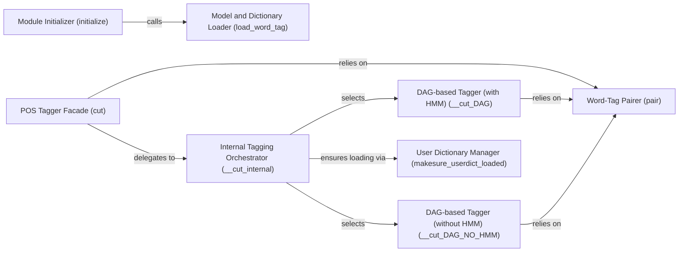

## Details

The Part-of-Speech (POS) Tagging Module is a core subsystem within the jieba project, specifically located under jieba.posseg. It extends the base segmentation capabilities by assigning grammatical tags to words, leveraging its own probabilistic models and internal algorithms.

### POS Tagger Facade (cut)
Serves as the primary public interface for initiating the part-of-speech tagging process. It orchestrates the overall flow by delegating to internal components, providing a simplified entry point for users.

**Related Classes/Methods**:

- <a href="https://github.com/fxsjy/jieba/blob/master/jieba/posseg/__init__.py" target="_blank" rel="noopener noreferrer">`jieba.posseg:cut`</a>

### Module Initializer (initialize)
Manages the initial setup of the POS tagging module, including loading necessary probabilistic models and dictionaries required for operation. This ensures the module is ready for tagging.

**Related Classes/Methods**:

- <a href="https://github.com/fxsjy/jieba/blob/master/jieba/posseg/__init__.py" target="_blank" rel="noopener noreferrer">`jieba.posseg:initialize`</a>

### Model and Dictionary Loader (load_word_tag)
Handles the loading of probabilistic models and dictionaries that are crucial for accurate POS tagging. This component is typically invoked during the module's initialization.

**Related Classes/Methods**:

- <a href="https://github.com/fxsjy/jieba/blob/master/jieba/posseg/__init__.py" target="_blank" rel="noopener noreferrer">`jieba.posseg:load_word_tag`</a>

### Internal Tagging Orchestrator (__cut_internal)
Acts as the central internal orchestrator for word segmentation and initial tag assignment. It dynamically selects and applies different cutting strategies based on configuration (e.g., presence of HMM).

**Related Classes/Methods**:

- <a href="https://github.com/fxsjy/jieba/blob/master/jieba/posseg/__init__.py" target="_blank" rel="noopener noreferrer">`jieba.posseg:__cut_internal`</a>

### Word-Tag Pairer (pair)
A fundamental component responsible for associating segmented words with their most probable part-of-speech tags, likely based on the application of probabilistic models. It finalizes the tagging process for individual words.

**Related Classes/Methods**:

- <a href="https://github.com/fxsjy/jieba/blob/master/jieba/posseg/__init__.py" target="_blank" rel="noopener noreferrer">`jieba.posseg:pair`</a>

### DAG-based Tagger (with HMM) (__cut_DAG)
Implements a specific segmentation and tagging strategy using a Directed Acyclic Graph (DAG) approach, incorporating Hidden Markov Models (HMM) for enhanced accuracy in tag prediction.

**Related Classes/Methods**:

- <a href="https://github.com/fxsjy/jieba/blob/master/jieba/posseg/__init__.py" target="_blank" rel="noopener noreferrer">`jieba.posseg:__cut_DAG`</a>

### DAG-based Tagger (without HMM) (__cut_DAG_NO_HMM)
Provides an alternative DAG-based segmentation and tagging strategy designed to operate without Hidden Markov Models, offering a potentially faster processing path for scenarios where HMM's accuracy is not strictly required.

**Related Classes/Methods**:

- <a href="https://github.com/fxsjy/jieba/blob/master/jieba/posseg/__init__.py" target="_blank" rel="noopener noreferrer">`jieba.posseg:__cut_DAG_NO_HMM`</a>

### User Dictionary Manager (makesure_userdict_loaded)
Ensures that user-defined dictionaries are properly loaded and integrated into the tagging process, allowing for custom vocabulary and tagging rules to influence the output.

**Related Classes/Methods**:

- <a href="https://github.com/fxsjy/jieba/blob/master/jieba/posseg/__init__.py" target="_blank" rel="noopener noreferrer">`jieba.posseg:makesure_userdict_loaded`</a>

### [FAQ](https://github.com/CodeBoarding/GeneratedOnBoardings/tree/main?tab=readme-ov-file#faq)