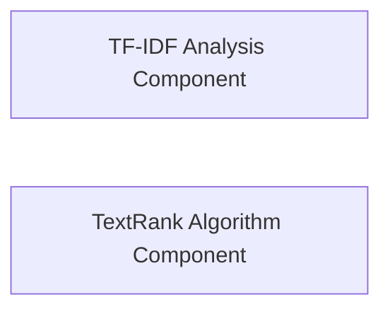

## Details

The Text Analysis Module is a dedicated subsystem within the project, primarily responsible for advanced text analysis functionalities. Its core focus is on extracting significant terms from text using statistical and graph-based algorithms, specifically TF-IDF and TextRank, and preparing these insights for downstream applications like search frameworks.

### TF-IDF Analysis Component
This component manages the entire lifecycle of Inverse Document Frequency (IDF) data. It is responsible for loading, configuring paths for, and providing IDF values, which are crucial for weighting terms based on their statistical rarity across a document corpus. This forms the basis for identifying important words in a given text.

**Related Classes/Methods**:

- <a href="https://github.com/fxsjy/jieba/blob/master/jieba/analyse/tfidf.py#L61-L66" target="_blank" rel="noopener noreferrer">`jieba.analyse.tfidf.__init__`:61-66</a>
- <a href="https://github.com/fxsjy/jieba/blob/master/jieba/analyse/tfidf.py#L55-L56" target="_blank" rel="noopener noreferrer">`jieba.analyse.tfidf.get_idf`:55-56</a>
- <a href="https://github.com/fxsjy/jieba/blob/master/jieba/analyse/tfidf.py#L44-L53" target="_blank" rel="noopener noreferrer">`jieba.analyse.tfidf.set_new_path`:44-53</a>
- <a href="https://github.com/fxsjy/jieba/blob/master/jieba/analyse/tfidf.py#L35-L56" target="_blank" rel="noopener noreferrer">`jieba.analyse.tfidf.IDFLoader`:35-56</a>

### TextRank Algorithm Component
This component encapsulates the complete implementation of the TextRank algorithm. It constructs a graph where words are nodes and their co-occurrence defines weighted edges. An iterative ranking algorithm, similar to PageRank, is then applied to this graph to identify and extract the most significant keywords and keyphrases from the text.

**Related Classes/Methods**:

- <a href="https://github.com/fxsjy/jieba/blob/master/jieba/analyse/textrank.py#L69-L108" target="_blank" rel="noopener noreferrer">`jieba.analyse.textrank.textrank`:69-108</a>
- <a href="https://github.com/fxsjy/jieba/blob/master/jieba/analyse/textrank.py#L13-L54" target="_blank" rel="noopener noreferrer">`jieba.analyse.textrank.UndirectWeightedGraph`:13-54</a>
- <a href="https://github.com/fxsjy/jieba/blob/master/jieba/analyse/textrank.py#L19-L22" target="_blank" rel="noopener noreferrer">`jieba.analyse.textrank.addEdge`:19-22</a>
- <a href="https://github.com/fxsjy/jieba/blob/master/jieba/analyse/textrank.py#L24-L54" target="_blank" rel="noopener noreferrer">`jieba.analyse.textrank.rank`:24-54</a>
- <a href="https://github.com/fxsjy/jieba/blob/master/jieba/analyse/textrank.py#L65-L67" target="_blank" rel="noopener noreferrer">`jieba.analyse.textrank.pairfilter`:65-67</a>

### [FAQ](https://github.com/CodeBoarding/GeneratedOnBoardings/tree/main?tab=readme-ov-file#faq)