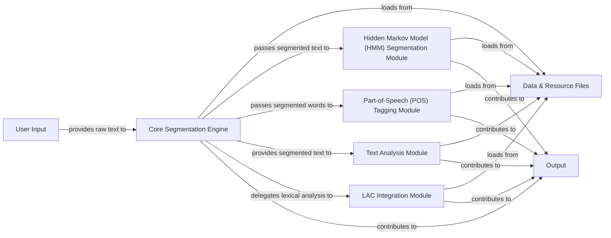

## Details

The `jieba` library operates as a modular text processing system, centered around the **Core Segmentation Engine**. This engine acts as the primary orchestrator, receiving **User Input** (raw text) and initiating the segmentation process. It relies heavily on **Data & Resource Files** for dictionaries and probabilistic models, which are loaded during initialization. Depending on the configuration, the Core Segmentation Engine can delegate to or integrate with specialized modules. For refining segmentation, especially for unknown words, it interacts with the **Hidden Markov Model (HMM) Segmentation Module**. For grammatical tagging, it passes segmented words to the **Part-of-Speech (POS) Tagging Module**. Advanced functionalities like keyword extraction are handled by the **Text Analysis Module**, which also consumes segmented text. Additionally, the system can integrate with external tools via the **LAC Integration Module** for neural network-based lexical analysis. All these processing paths ultimately contribute to the final **Output**, which consists of various forms of structured text, such as segmented words or tagged tokens. This architecture allows for flexible and extensible text processing, with clear data flow from input through various processing stages to the final output.

### Core Segmentation Engine [[Expand]](./Core_Segmentation_Engine.md)
The central component responsible for initial word segmentation, dictionary management, and DAG construction. It serves as the primary entry point for text processing.

**Related Classes/Methods**:

- <a href="https://github.com/fxsjy/jieba/blob/master/jieba/__init__.py" target="_blank" rel="noopener noreferrer">`jieba.__init__.cut`</a>
- <a href="https://github.com/fxsjy/jieba/blob/master/jieba/__init__.py" target="_blank" rel="noopener noreferrer">`jieba.__init__.initialize`</a>

### Hidden Markov Model (HMM) Segmentation Module
Refines initial segmentation, particularly for unknown words, using the HMM and Viterbi algorithm.

**Related Classes/Methods**:

- <a href="https://github.com/fxsjy/jieba/blob/master/jieba/finalseg/__init__.py#L85-L100" target="_blank" rel="noopener noreferrer">`jieba.finalseg.__init__.cut`:85-100</a>
- <a href="https://github.com/fxsjy/jieba/blob/master/jieba/finalseg/__init__.py#L37-L56" target="_blank" rel="noopener noreferrer">`jieba.finalseg.__init__.viterbi`:37-56</a>

### Part-of-Speech (POS) Tagging Module [[Expand]](./Part_of_Speech_POS_Tagging_Module.md)
Extends segmentation by assigning grammatical tags to words, utilizing its own probabilistic models.

**Related Classes/Methods**:

- <a href="https://github.com/fxsjy/jieba/blob/master/jieba/posseg/__init__.py#L273-L304" target="_blank" rel="noopener noreferrer">`jieba.posseg.__init__.cut`:273-304</a>
- <a href="https://github.com/fxsjy/jieba/blob/master/jieba/posseg/__init__.py" target="_blank" rel="noopener noreferrer">`jieba.posseg.__init__.initialize`</a>

### Text Analysis Module [[Expand]](./Text_Analysis_Module.md)
Provides advanced text analysis, including TF-IDF and TextRank for keyword extraction, and integration with search frameworks.

**Related Classes/Methods**:

- <a href="https://github.com/fxsjy/jieba/blob/master/jieba/analyse/tfidf.py#L61-L66" target="_blank" rel="noopener noreferrer">`jieba.analyse.tfidf.__init__`:61-66</a>
- <a href="https://github.com/fxsjy/jieba/blob/master/jieba/analyse/textrank.py#L69-L108" target="_blank" rel="noopener noreferrer">`jieba.analyse.textrank.textrank`:69-108</a>

### LAC Integration Module
Facilitates integration with Baidu's LAC toolkit, offering neural network-based lexical analysis as an alternative or enhancement.

**Related Classes/Methods**:

- <a href="https://github.com/fxsjy/jieba/blob/master/jieba/lac_small/nets.py#L25-L122" target="_blank" rel="noopener noreferrer">`jieba.lac_small.nets.lex_net`:25-122</a>

### Data & Resource Files
Contains all static data crucial for module operations, including dictionaries, probabilistic models, and IDF values.

**Related Classes/Methods**:

- <a href="https://github.com/fxsjy/jieba/blob/master/jieba/__init__.py" target="_blank" rel="noopener noreferrer">`jieba.__init__.initialize`</a>

### User Input
Raw text provided by the user for processing.

**Related Classes/Methods**:

- <a href="https://github.com/fxsjy/jieba/blob/master/jieba/__init__.py" target="_blank" rel="noopener noreferrer">`jieba.__init__.cut`</a>

### Output
Various forms of structured text output from the jieba library.

**Related Classes/Methods**:

- <a href="https://github.com/fxsjy/jieba/blob/master/jieba/__init__.py#L198-L224" target="_blank" rel="noopener noreferrer">`jieba.__init__.__cut_all`:198-224</a>
- <a href="https://github.com/fxsjy/jieba/blob/master/jieba/__init__.py#L249-L287" target="_blank" rel="noopener noreferrer">`jieba.__init__.__cut_DAG`:249-287</a>
- <a href="https://github.com/fxsjy/jieba/blob/master/jieba/__init__.py" target="_blank" rel="noopener noreferrer">`jieba.__init__.cut`</a>

### [FAQ](https://github.com/CodeBoarding/GeneratedOnBoardings/tree/main?tab=readme-ov-file#faq)