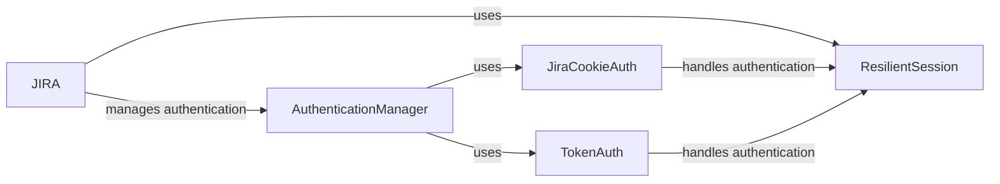

## Component Details

The authentication process in the Jira API involves several components working together to ensure secure access. The JIRA class serves as the main entry point, utilizing a ResilientSession for handling requests with retries. Authentication is managed by either JiraCookieAuth for cookie-based authentication or TokenAuth for token-based authentication. The AuthenticationManager orchestrates the authentication flow, obtaining and managing authentication tokens, and adding them to HTTP requests. The ResilientSession enhances reliability by automatically retrying failed requests. This system supports different authentication methods, providing flexibility and security when interacting with the Jira API.

### JIRA
The main class for interacting with the Jira API. It handles authentication, session management, and request execution. It initializes the session and authentication based on the provided options.
- **Related Classes/Methods**: `jira.jira.client.JIRA`

### ResilientSession
A session class that provides resilience by retrying requests in case of failures. It wraps the standard requests session and adds retry logic.
- **Related Classes/Methods**: `jira.jira.resilientsession.ResilientSession`

### JiraCookieAuth
Handles cookie-based authentication with Jira. It manages the authentication process, obtains cookies, and handles 401 errors by refreshing the authentication.
- **Related Classes/Methods**: `jira.jira.client.JiraCookieAuth`

### TokenAuth
Handles token-based authentication with Jira. It manages the authentication process using tokens.
- **Related Classes/Methods**: `jira.jira.client.TokenAuth`

### AuthenticationManager
The AuthenticationManager component handles the authentication process with the Jira API. It supports various authentication methods, such as cookie-based authentication, OAuth, and JWT. It is responsible for obtaining and managing authentication tokens and adding them to the HTTP requests.
- **Related Classes/Methods**: `jira.jira.client.JiraCookieAuth`, `jira.jira.client.TokenAuth`
