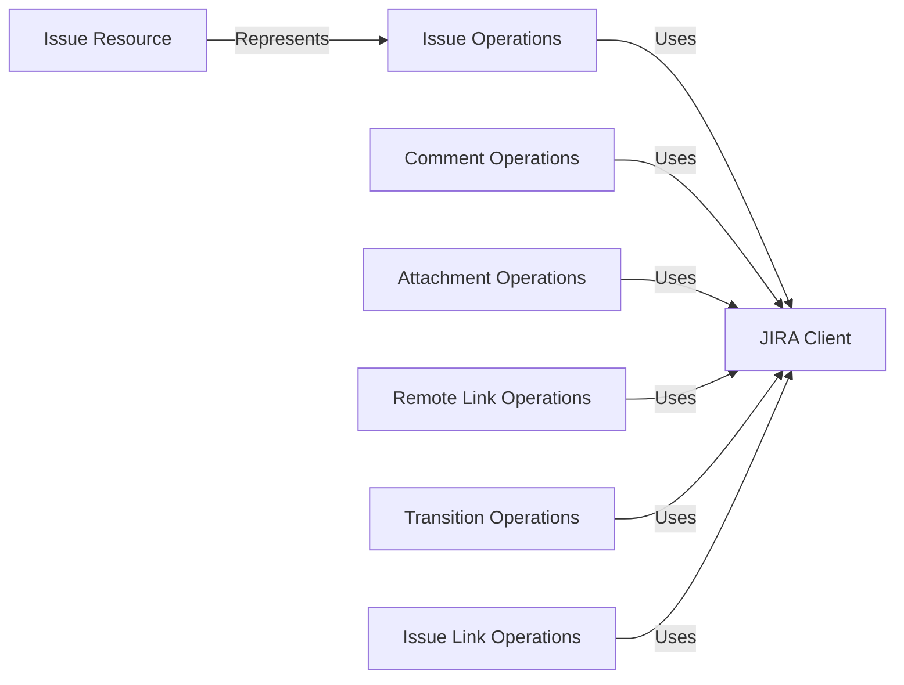

## Component Details

The Jira Issue Management Subsystem provides a comprehensive set of functionalities for interacting with Jira issues. It encompasses operations such as creating, retrieving, updating, and deleting issues, as well as managing comments, attachments, remote links, transitions, issue links, watchers, worklogs, votes, issue properties, and issue assignment. The core of this subsystem relies on the JIRA Client for establishing a connection with the Jira API and the Issue Resource for representing individual Jira issues. The subsystem is designed to provide a high-level interface for performing various issue-related tasks within a Jira environment.

### JIRA Client
The JIRA Client component is responsible for managing the connection to the Jira API. It handles authentication and provides methods for executing API requests. It serves as the central point of interaction for all Jira operations within the subsystem.
- **Related Classes/Methods**: `jira.jira.client.JIRA`

### Issue Resource
The Issue Resource component represents a single Jira issue. It provides methods for accessing and manipulating issue properties, such as fields, comments, and attachments. It encapsulates the data and behavior associated with a specific issue.
- **Related Classes/Methods**: `jira.jira.resources.Issue`

### Issue Operations
The Issue Operations component provides functions for performing CRUD (Create, Read, Update, Delete) operations on Jira issues. It includes methods for creating new issues, retrieving existing issues, updating issue fields, and deleting issues.
- **Related Classes/Methods**: `jira.jira.client.JIRA:issue`, `jira.jira.client.JIRA:create_issue`, `jira.jira.client.JIRA:create_issues`, `jira.jira.resources.Issue:update`, `jira.jira.resources.Issue:delete`, `jira.jira.client.JIRA:search_issues`, `jira.jira.client.JIRA:enhanced_search_issues`, `jira.jira.client.JIRA:approximate_issue_count`

### Comment Operations
The Comment Operations component provides functions for managing comments on Jira issues. It includes methods for adding new comments, retrieving existing comments, and pinning comments to the top of the issue.
- **Related Classes/Methods**: `jira.jira.client.JIRA:comments`, `jira.jira.client.JIRA:comment`, `jira.jira.client.JIRA:add_comment`, `jira.jira.client.JIRA:pinned_comments`, `jira.jira.client.JIRA:pin_comment`

### Attachment Operations
The Attachment Operations component offers functions for managing attachments on Jira issues. It includes methods for adding new attachments, retrieving existing attachments, and deleting attachments.
- **Related Classes/Methods**: `jira.jira.client.JIRA:add_attachment`, `jira.jira.client.JIRA:delete_attachment`, `jira.jira.client.JIRA:attachment`, `jira.jira.client.JIRA:attachment_meta`

### Remote Link Operations
The Remote Link Operations component provides functions for managing remote links associated with Jira issues. It includes methods for adding new remote links, retrieving existing remote links, and deleting remote links.
- **Related Classes/Methods**: `jira.jira.client.JIRA:remote_links`, `jira.jira.client.JIRA:remote_link`, `jira.jira.client.JIRA:add_remote_link`, `jira.jira.client.JIRA:delete_remote_link`, `jira.jira.client.JIRA:add_simple_link`

### Transition Operations
The Transition Operations component provides functions for transitioning Jira issues between different statuses. It includes methods for retrieving available transitions, finding transition IDs by name, and transitioning issues to a specific status.
- **Related Classes/Methods**: `jira.jira.client.JIRA:transitions`, `jira.jira.client.JIRA:find_transitionid_by_name`, `jira.jira.client.JIRA:transition_issue`

### Issue Link Operations
The Issue Link Operations component provides functions for creating and deleting links between Jira issues. It includes methods for creating new issue links and deleting existing issue links.
- **Related Classes/Methods**: `jira.jira.client.JIRA:create_issue_link`, `jira.jira.client.JIRA:delete_issue_link`, `jira.jira.client.JIRA:issue_link`
