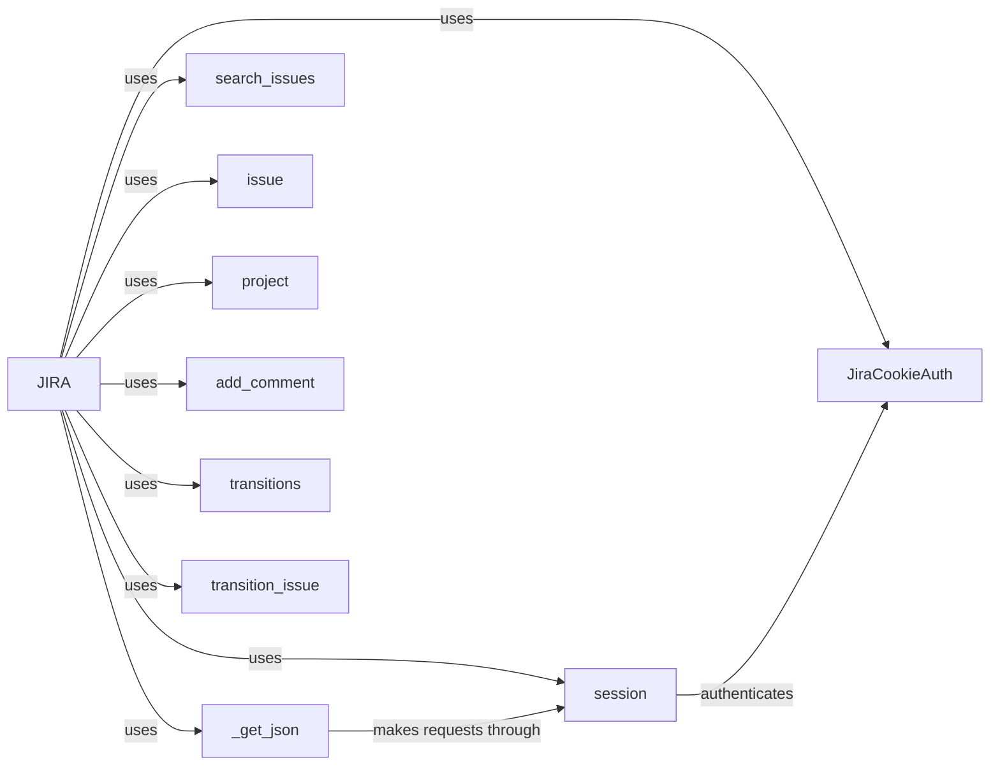

## Component Details

The JiraClient component serves as the primary interface for interacting with the Jira API. It encapsulates authentication, session management, and provides access to various Jira resources. The client initializes and configures a ResilientSession for handling API requests and an AuthenticationManager for managing authentication. It offers methods for performing operations such as searching for issues, retrieving specific issues or projects, adding comments, and transitioning issues between states.

### JIRA
The `JIRA` class is the main entry point for interacting with the Jira API. It handles authentication, session management, and provides methods for performing various operations on Jira resources.
- **Related Classes/Methods**: `jira.jira.client.JIRA`

### JiraCookieAuth
The `JiraCookieAuth` class handles cookie-based authentication with the Jira API, automatically re-authenticating when necessary.
- **Related Classes/Methods**: `jira.jira.client.JiraCookieAuth`

### session
The `session` object (typically a `requests.Session` instance) manages the HTTP session for communication with the Jira API, handling connection pooling and cookie persistence.
- **Related Classes/Methods**: `jira.jira.client.JIRA:session`, `jira.jira.client.JIRA:_create_oauth_session`, `jira.jira.client.JIRA:_create_jwt_session`, `jira.jira.client.JIRA:_create_token_session`

### _get_json
The `_get_json` method is a utility function within the `JIRA` class responsible for making HTTP GET requests to the Jira API and parsing the JSON response.
- **Related Classes/Methods**: `jira.jira.client.JIRA:_get_json`

### search_issues
The `search_issues` method allows searching for issues in Jira using JQL (Jira Query Language).
- **Related Classes/Methods**: `jira.jira.client.JIRA:search_issues`

### issue
The `issue` method retrieves a specific issue from Jira based on its key.
- **Related Classes/Methods**: `jira.jira.client.JIRA:issue`

### project
The `project` method retrieves a specific project from Jira based on its key.
- **Related Classes/Methods**: `jira.jira.client.JIRA:project`

### add_comment
The `add_comment` method adds a comment to a specific issue in Jira.
- **Related Classes/Methods**: `jira.jira.client.JIRA:add_comment`

### transitions
The `transitions` method retrieves the available transitions for a specific issue in Jira.
- **Related Classes/Methods**: `jira.jira.client.JIRA:transitions`

### transition_issue
The `transition_issue` method transitions an issue to a new state in Jira.
- **Related Classes/Methods**: `jira.jira.client.JIRA:transition_issue`
