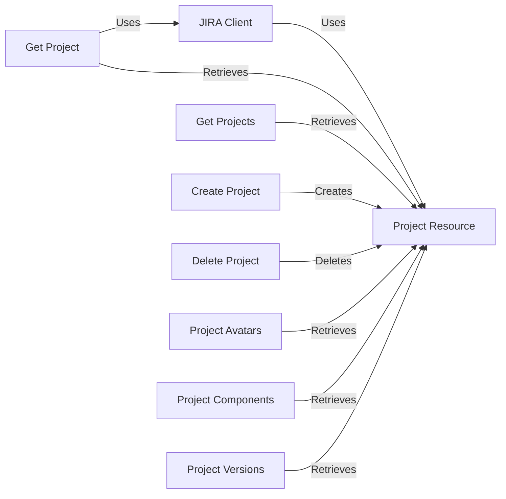

## Component Details

The ProjectManager component facilitates the management of Jira projects by providing an interface to create, retrieve, update, and delete projects and their associated elements like avatars, components, versions, and roles. It leverages the JiraClient to interact with the Jira API, abstracting away the complexities of direct API calls and providing a higher-level interface for project management operations.

### JIRA Client
The JIRA client (`jira.jira.client.JIRA`) serves as the primary interface for interacting with the Jira API. It encapsulates methods for various project-related operations, including creating, retrieving, updating, and deleting projects, avatars, components, versions, and roles. It handles authentication and request construction, providing a convenient way to access Jira functionality.
- **Related Classes/Methods**: `jira.jira.client.JIRA`

### Project Resource
The Project resource (`jira.jira.resources.Project`) represents a Jira project entity. It encapsulates project-specific data and provides methods for interacting with individual projects, such as retrieving details or updating configurations. It is used by the JIRA client to represent and manipulate project data.
- **Related Classes/Methods**: `jira.jira.resources.Project`

### Get Project
The `project` method in `jira.jira.client.JIRA` retrieves a specific project by its key. It uses the `_find_for_resource` method to locate the project resource and return it.
- **Related Classes/Methods**: `jira.jira.client.JIRA:project`

### Get Projects
The `projects` method in `jira.jira.client.JIRA` retrieves all projects from the Jira instance. It directly interacts with the Jira API to fetch the list of projects.
- **Related Classes/Methods**: `jira.jira.client.JIRA:projects`

### Create Project
The `create_project` method in `jira.jira.client.JIRA` creates a new project in Jira. It sends a request to the Jira API with the necessary project details.
- **Related Classes/Methods**: `jira.jira.client.JIRA:create_project`

### Delete Project
The `delete_project` method in `jira.jira.client.JIRA` deletes a project from Jira. It sends a request to the Jira API to delete the specified project.
- **Related Classes/Methods**: `jira.jira.client.JIRA:delete_project`

### Project Avatars
The `project_avatars` method in `jira.jira.client.JIRA` retrieves the avatars associated with a specific project.
- **Related Classes/Methods**: `jira.jira.client.JIRA:project_avatars`

### Project Components
The `project_components` method in `jira.jira.client.JIRA` retrieves the components associated with a specific project.
- **Related Classes/Methods**: `jira.jira.client.JIRA:project_components`

### Project Versions
The `project_versions` method in `jira.jira.client.JIRA` retrieves the versions associated with a specific project.
- **Related Classes/Methods**: `jira.jira.client.JIRA:project_versions`
