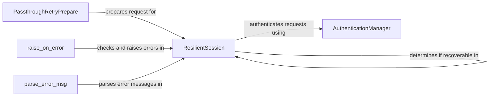

## Component Details

The ResilientSession component is responsible for managing the communication between the Jira client and the Jira API. It handles session management, authentication, request preparation, retry logic, error handling, and response parsing. The component ensures that API requests are sent reliably and that errors are handled gracefully, providing a robust and fault-tolerant communication layer.

### ResilientSession
Manages HTTP sessions with retry logic and error handling for Jira API requests. It authenticates requests, serializes/deserializes data, and determines if a request can be retried. It uses an AuthenticationManager to handle authentication and a custom retry mechanism to handle transient errors.
- **Related Classes/Methods**: `jira.jira.resilientsession.ResilientSession`

### AuthenticationManager
Handles the authentication process for the Jira API. It retrieves and manages authentication tokens, adding them to the request headers. It supports various authentication methods, such as basic authentication and OAuth.
- **Related Classes/Methods**: `jira.client.AuthenticationManager`

### PassthroughRetryPrepare
Prepares requests before each retry attempt, potentially modifying headers or other request parameters. It ensures that each retry is properly configured. This component allows for customization of the request before each retry, such as updating authentication tokens or adding specific headers.
- **Related Classes/Methods**: `jira.jira.resilientsession.PassthroughRetryPrepare`

### raise_on_error
Checks the response status code and raises an exception if it indicates an error. It ensures that errors are properly handled and propagated. This function centralizes error checking and ensures that all API errors are consistently handled.
- **Related Classes/Methods**: `jira.jira.resilientsession:raise_on_error`

### parse_error_msg
Parses the error message from the response body, extracting relevant information for error reporting and handling. This function extracts the error message from the JSON response and provides a user-friendly error message.
- **Related Classes/Methods**: `jira.jira.resilientsession:parse_error_msg`
