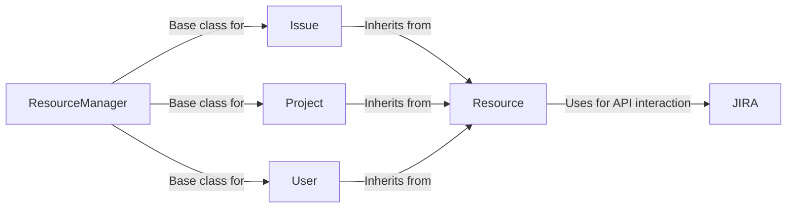

## Component Details

The Jira API client facilitates interaction with the Jira platform by providing components for managing resources like issues, projects, and users. The core flow involves the `JIRA` client authenticating and constructing requests to the Jira API. These requests are then processed by resource-specific classes (`Issue`, `Project`, `User`) that inherit from the base `Resource` class, which handles common operations like finding, updating, and deleting resources. The `ResourceManager` serves as a base class for resource managers, providing common functionality for interacting with Jira resources.

### JIRA
The `JIRA` class serves as the primary interface for interacting with the Jira API. It handles authentication, constructs requests, and parses responses. It provides methods for performing operations on various Jira resources like issues, projects, users, and groups.
- **Related Classes/Methods**: `jira.client.JIRA`

### Resource
The `Resource` class acts as a base class for all Jira resource classes. It provides common methods for finding, updating, and deleting resources. It also handles the parsing of raw data received from the Jira API.
- **Related Classes/Methods**: `jira.resources.Resource`

### Issue
The `Issue` class represents a Jira issue resource. It inherits from the `Resource` class and provides methods specific to interacting with issues, such as retrieving, updating, and deleting issues.
- **Related Classes/Methods**: `jira.resources.Issue`

### Project
The `Project` class represents a Jira project resource. It inherits from the `Resource` class and provides methods specific to interacting with projects, such as retrieving project details and updating project settings.
- **Related Classes/Methods**: `jira.resources.Project`

### User
The `User` class represents a Jira user resource. It inherits from the `Resource` class and provides methods specific to interacting with users, such as retrieving user details and updating user profiles.
- **Related Classes/Methods**: `jira.resources.User`

### ResourceManager
The ResourceManager component serves as a base class for all resource managers (IssueManager, ProjectManager, UserManager, etc.). It provides common functionality for interacting with Jira resources, such as creating, retrieving, updating, and deleting resources. It uses the JiraClient to make requests to the Jira API and handles the parsing of the responses.
- **Related Classes/Methods**: `jira.jira.resources.Resource`, `jira.jira.resources`
