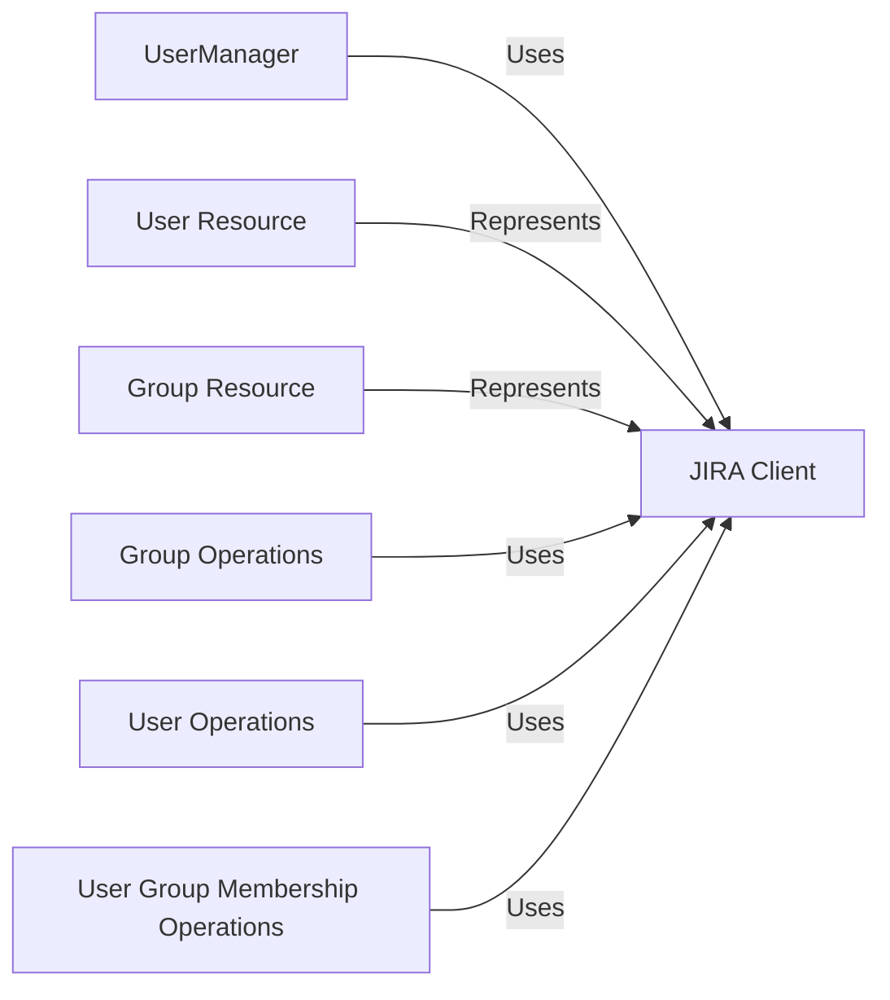

## Component Details

The UserManager component facilitates the management of users and groups within a Jira instance. It leverages the Jira API, accessed through the JiraClient, to perform operations such as creating, retrieving, updating, and deleting users and groups. Additionally, it handles tasks like adding users to groups and managing user avatars, providing a comprehensive interface for user and group administration.

### UserManager
The UserManager component provides methods for creating, retrieving, updating, and deleting users and groups. It also handles operations such as adding users to groups and managing user avatars. It inherits from ResourceManager and uses the JiraClient to make requests to the Jira API.
- **Related Classes/Methods**: _None_

### JIRA Client
The JIRA Client component, represented by the `jira.jira.client.JIRA` class, serves as the primary interface for interacting with the Jira REST API. It encapsulates various methods for performing operations on Jira resources, including users, groups, issues, and projects.
- **Related Classes/Methods**: `jira.jira.client.JIRA`

### User Resource
The User Resource component, represented by the `jira.jira.resources.User` class, models a Jira user. It provides attributes and methods for accessing and manipulating user-related information, such as username, display name, email address, and avatar.
- **Related Classes/Methods**: `jira.jira.resources.User`

### Group Resource
The Group Resource component, represented by the `jira.jira.resources.Group` class, models a Jira group. It provides attributes and methods for accessing and manipulating group-related information, such as group name and members.
- **Related Classes/Methods**: `jira.jira.resources.Group`

### Group Operations
This component includes methods within the JIRA client for managing groups, such as retrieving group information (`group`, `groups`, `group_members`), creating groups (`add_group`), and deleting groups (`remove_group`).
- **Related Classes/Methods**: `jira.jira.client.JIRA:group`, `jira.jira.client.JIRA:groups`, `jira.jira.client.JIRA:group_members`, `jira.jira.client.JIRA:add_group`, `jira.jira.client.JIRA:remove_group`

### User Operations
This component encompasses methods within the JIRA client for managing users, including retrieving user information (`user`), searching for users (`search_users`, `search_assignable_users_for_projects`, `search_assignable_users_for_issues`, `search_allowed_users_for_issue`), managing user avatars (`user_avatars`, `create_temp_user_avatar`, `confirm_user_avatar`, `set_user_avatar`, `delete_user_avatar`), and modifying user attributes (`rename_user`, `delete_user`, `deactivate_user`, `add_user`).
- **Related Classes/Methods**: `jira.jira.client.JIRA:user`, `jira.jira.client.JIRA:search_users`, `jira.jira.client.JIRA:search_assignable_users_for_projects`, `jira.jira.client.JIRA:search_assignable_users_for_issues`, `jira.jira.client.JIRA:search_allowed_users_for_issue`, `jira.jira.client.JIRA:user_avatars`, `jira.jira.client.JIRA:create_temp_user_avatar`, `jira.jira.client.JIRA:confirm_user_avatar`, `jira.jira.client.JIRA:set_user_avatar`, `jira.jira.client.JIRA:delete_user_avatar`, `jira.jira.client.JIRA:rename_user`, `jira.jira.client.JIRA:delete_user`, `jira.jira.client.JIRA:deactivate_user`, `jira.jira.client.JIRA:add_user`

### User Group Membership Operations
This component provides methods for managing user group memberships, specifically adding users to groups (`add_user_to_group`) and removing users from groups (`remove_user_from_group`).
- **Related Classes/Methods**: `jira.jira.client.JIRA:add_user_to_group`, `jira.jira.client.JIRA:remove_user_from_group`
