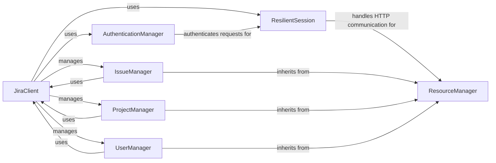

## Component Details

The Jira API client library provides a Python interface for interacting with the Atlassian Jira issue tracking and project management software. The library handles authentication, request construction, and response processing, allowing users to programmatically access and manipulate Jira resources such as issues, projects, users, and groups. It offers a high-level abstraction over the Jira REST API, simplifying common tasks and providing a more Pythonic way to interact with Jira.

### JiraClient
The JiraClient component is the main entry point for interacting with the Jira API. It encapsulates session management, authentication, and resource management. It is responsible for creating and configuring the ResilientSession and AuthenticationManager, as well as providing access to the various resource managers (IssueManager, ProjectManager, etc.).
- **Related Classes/Methods**: `jira.jira.client.JIRA`, `jira.jira.client`

### ResilientSession
The ResilientSession component handles the HTTP communication with the Jira API. It provides retry logic and error handling to ensure that requests are successful even in the face of network issues or server errors. It uses the AuthenticationManager to authenticate requests and handles the serialization and deserialization of data.
- **Related Classes/Methods**: `jira.jira.resilientsession.ResilientSession`, `jira.jira.resilientsession`

### AuthenticationManager
The AuthenticationManager component handles the authentication process with the Jira API. It supports various authentication methods, such as cookie-based authentication, OAuth, and JWT. It is responsible for obtaining and managing authentication tokens and adding them to the HTTP requests.
- **Related Classes/Methods**: `jira.jira.client.JiraCookieAuth`, `jira.jira.client.TokenAuth`

### ResourceManager
The ResourceManager component serves as a base class for all resource managers (IssueManager, ProjectManager, UserManager, etc.). It provides common functionality for interacting with Jira resources, such as creating, retrieving, updating, and deleting resources. It uses the JiraClient to make requests to the Jira API and handles the parsing of the responses.
- **Related Classes/Methods**: `jira.jira.resources.Resource`, `jira.jira.resources`

### IssueManager
The IssueManager component provides methods for creating, retrieving, updating, and deleting issues. It also handles operations such as adding comments, attachments, and remote links to issues. It inherits from ResourceManager and uses the JiraClient to make requests to the Jira API.
- **Related Classes/Methods**: `jira.jira.client.JIRA`, `jira.jira.resources.Issue`

### ProjectManager
The ProjectManager component provides methods for creating, retrieving, updating, and deleting projects. It also handles operations such as managing project components, versions, and roles. It inherits from ResourceManager and uses the JiraClient to make requests to the Jira API.
- **Related Classes/Methods**: `jira.jira.client.JIRA`, `jira.jira.resources.Project`

### UserManager
The UserManager component provides methods for creating, retrieving, updating, and deleting users and groups. It also handles operations such as adding users to groups and managing user avatars. It inherits from ResourceManager and uses the JiraClient to make requests to the Jira API.
- **Related Classes/Methods**: `jira.jira.client.JIRA`, `jira.jira.resources.User`, `jira.jira.resources.Group`