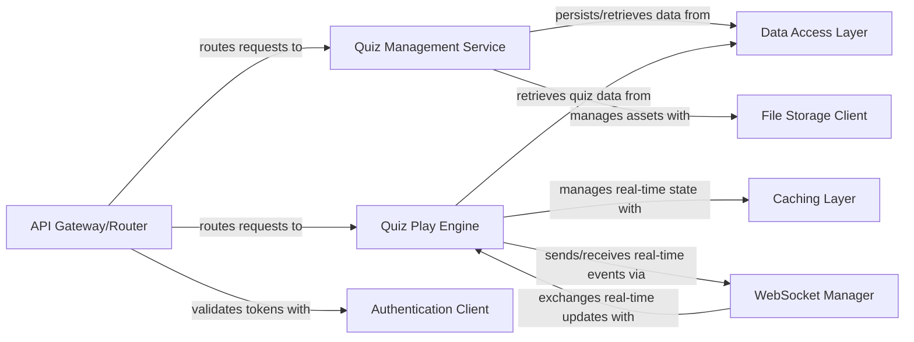

## Details

The `Backend Core Services` subsystem is the central Go application responsible for the core business logic of the interactive learning/entertainment platform. It orchestrates quiz creation, management, the real-time quiz engine, and WebSocket communication, interacting with various data stores and external services.

### API Gateway/Router
The primary entry point for all external HTTP requests to the backend. It is responsible for parsing requests, routing them to the appropriate internal service handlers (Quiz Management, Quiz Play), and performing initial authentication/authorization validation by interacting with the Authentication Client.

**Related Classes/Methods**:

- `api/cmd/main.go`
- `api/handlers/`

### Quiz Management Service
Encapsulates the business logic for managing the lifecycle of quizzes, including creation, retrieval, updating, and deletion. It interacts with the Data Access Layer for persistent storage and the File Storage Client for handling quiz-related assets.

**Related Classes/Methods**:

- `api/services/quiz_management/`
- `api/models/quiz/`

### Quiz Play Engine
Orchestrates the real-time quiz game sessions. It manages game state, calculates scores, handles player actions, and communicates real-time updates via the WebSocket Manager. It uses the Caching Layer for fast access to session data and the Data Access Layer for retrieving quiz questions.

**Related Classes/Methods**:

- `api/services/quiz_play/`
- `api/models/game_session/`

### WebSocket Manager
Handles all WebSocket connections, manages client subscriptions, and facilitates bidirectional real-time communication between the backend and connected clients. It receives updates from the Quiz Play Engine and broadcasts them to relevant clients.

**Related Classes/Methods**:

- `api/websocket/`

### Data Access Layer
Provides an abstraction layer for all database operations, primarily interacting with PostgreSQL. It handles CRUD operations for quizzes, users, game sessions, and other persistent data, ensuring data integrity and consistency.

**Related Classes/Methods**:

- `api/database/`
- `api/store/`

### Caching Layer
Manages in-memory and distributed caching, primarily using Redis. It stores transient data such as real-time game session states, user sessions, and frequently accessed quiz data to improve performance and reduce database load.

**Related Classes/Methods**:

- `api/cache/`
- `api/store/redis/`

### Authentication Client
Acts as a client for the external Ory Kratos authentication service. It is responsible for validating user tokens, retrieving user information, and managing user sessions in conjunction with Kratos.

**Related Classes/Methods**:

- `api/auth/`

### File Storage Client
Provides an interface for interacting with the S3-compatible object storage (MinIO locally). It handles uploading, retrieving, and managing static assets related to quizzes, such as images or media files.

**Related Classes/Methods**:

- `api/storage/`

### [FAQ](https://github.com/CodeBoarding/GeneratedOnBoardings/tree/main?tab=readme-ov-file#faq)