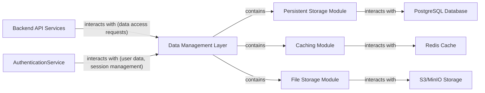

## Details

One paragraph explaining the functionality which is represented by this graph. What the main flow is and what is its purpose.

### Data Management Layer [[Expand]](./Data_Management_Layer.md)
Consolidates persistent storage (PostgreSQL), in-memory caching (Redis), and file storage (S3/MinIO) for all application data, ensuring efficient data retrieval and storage. It provides a unified interface for various data stores, abstracting the underlying storage mechanisms.

**Related Classes/Methods**:

- `api/internal/data_management/` (1:1)

### Persistent Storage Module
Manages all structured application data using PostgreSQL. It is responsible for data integrity, consistency, and transactional operations, providing an interface for CRUD operations on the primary database.

**Related Classes/Methods**:

- `jovvix.database.DatabaseManager` (1:1)
- `jovvix.database.EntityManager` (1:1)

### Caching Module
Provides fast data retrieval for frequently accessed information, session management, and real-time data caching using Redis. It reduces the load on the primary database and improves application responsiveness.

**Related Classes/Methods**:

- `api/internal/cache/` (1:1)

### File Storage Module
Handles the storage and retrieval of unstructured data, such as user-uploaded images, media files, and documents, using S3/MinIO. It provides scalable and durable object storage capabilities.

**Related Classes/Methods**:

- `api/internal/storage/` (1:1)

### Backend API Services
Represents the external services that consume data and functionality provided by the Data Management Layer, typically handling business logic and exposing APIs to clients.

**Related Classes/Methods**: _None_

### AuthenticationService
An external service responsible for user authentication and session management, interacting with the Data Management Layer for user data and session persistence.

**Related Classes/Methods**: _None_

### PostgreSQL Database
The primary relational database used for persistent storage of structured application data, managed by the Persistent Storage Module.

**Related Classes/Methods**: _None_

### Redis Cache
An in-memory data store used by the Caching Module for fast data retrieval, session management, and real-time data caching.

**Related Classes/Methods**: _None_

### S3/MinIO Storage
An object storage service utilized by the File Storage Module for scalable and durable storage of unstructured data like files and media.

**Related Classes/Methods**: _None_

### [FAQ](https://github.com/CodeBoarding/GeneratedOnBoardings/tree/main?tab=readme-ov-file#faq)