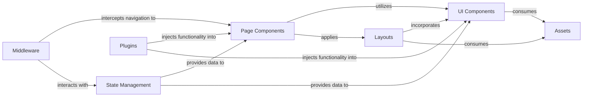

## Details

The user-facing interface, built with Vue.js/Nuxt 3, responsible for rendering the UI, handling user input, and displaying real-time updates. It serves as the primary interaction point for users.

### Page Components
These components, located in `app/pages/`, define the routes and serve as the top-level views for different sections of the application. They orchestrate the display of UI components and interact with the application's state.

**Related Classes/Methods**:

- `app/pages/` (1:1)

### UI Components
Found in `app/components/`, these are reusable, atomic UI elements (e.g., buttons, forms, cards) that encapsulate specific visual and interactive functionalities. They are designed to be modular and easily composable.

**Related Classes/Methods**:

- `app/components/` (1:1)

### Layouts
Defined in `app/layouts/`, these components provide the structural templates for different page types, including common elements like headers, footers, and navigation. They ensure a consistent look and feel across the application.

**Related Classes/Methods**:

- `app/layouts/` (1:1)

### State Management
Located in `app/store/` (e.g., using Pinia or Vuex), this component manages the global application state, handles data fetching from backend APIs, and provides a centralized source of truth for data consumed by other frontend components.

**Related Classes/Methods**:

- `app/store/` (1:1)

### Plugins
Files in `app/plugins/` are used to extend Vue/Nuxt functionality, inject global utilities, or configure third-party libraries that need to be available across the application (e.g., API clients, analytics tools).

**Related Classes/Methods**:

- `app/plugins/` (1:1)

### Middleware
Defined in `app/middleware/`, these functions execute logic before navigating to a route. They are commonly used for authentication checks, authorization, redirects, or other route-specific pre-rendering logic.

**Related Classes/Methods**:

- `app/middleware/` (1:1)

### Assets
The `app/assets/` directory stores static resources such as images, fonts, and global stylesheets. These assets are consumed by UI components and layouts to define the visual presentation of the application.

**Related Classes/Methods**:

- `app/assets/` (1:1)

### [FAQ](https://github.com/CodeBoarding/GeneratedOnBoardings/tree/main?tab=readme-ov-file#faq)