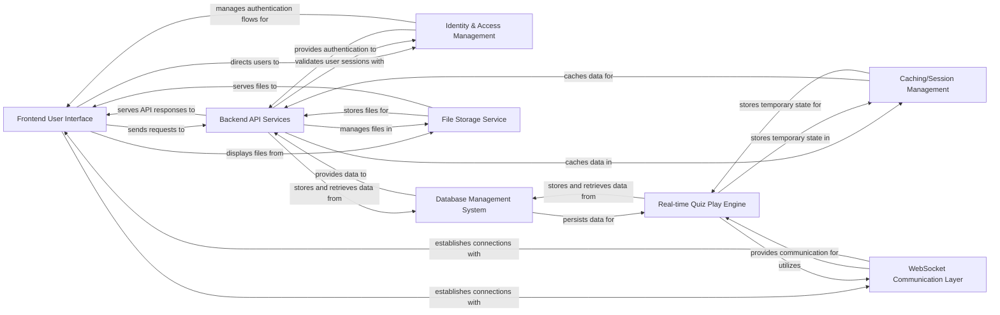

## Details

One paragraph explaining the functionality which is represented by this graph. What the main flow is and what is its purpose.

### Frontend User Interface
The client-side application built with Vue.js and Nuxt 3, providing the interactive user experience, including quiz participation, creation, and administration. It handles all user interactions and renders dynamic content.

**Related Classes/Methods**: _None_

### Backend API Services
The core server-side application developed in Golang, exposing RESTful APIs for quiz management, user data, and integrating with various other services. It encapsulates the primary business logic.

**Related Classes/Methods**: _None_

### Identity & Access Management [[Expand]](./Identity_Access_Management.md)
An external service (Ory Kratos) responsible for user authentication, authorization, and session management, ensuring secure access to the platform. It handles user registration, login, password recovery, and session validation.

**Related Classes/Methods**: _None_

### Real-time Quiz Play Engine
The Golang-based component responsible for managing real-time quiz sessions, handling game logic, scoring, and broadcasting updates to participants via WebSockets. It is central to the interactive nature of the platform.

**Related Classes/Methods**: _None_

### Database Management System
A PostgreSQL database instance used for persistent storage of all application data, including user profiles, quiz definitions, questions, scores, and historical data. It is the single source of truth for structured data.

**Related Classes/Methods**: _None_

### Caching/Session Management
A Redis instance used for high-speed data caching, temporary storage of session data, and potentially real-time leaderboards or ephemeral quiz states to improve performance and responsiveness.

**Related Classes/Methods**: _None_

### File Storage Service
An S3-compatible object storage service (MinIO for local development) used for storing static assets, user-uploaded images (e.g., quiz images, avatars), and other media files.

**Related Classes/Methods**: _None_

### WebSocket Communication Layer
The component responsible for establishing and managing WebSocket connections, enabling real-time, bidirectional communication between the server and connected clients for interactive quiz play and live updates.

**Related Classes/Methods**: _None_

### [FAQ](https://github.com/CodeBoarding/GeneratedOnBoardings/tree/main?tab=readme-ov-file#faq)