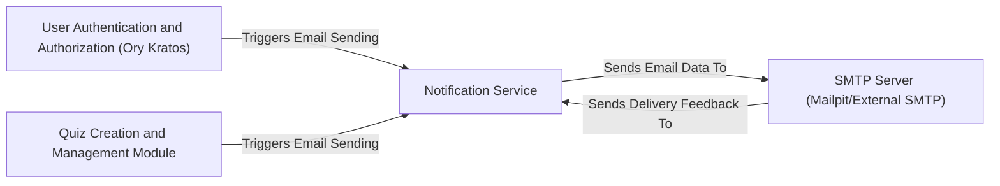

## Details

One paragraph explaining the functionality which is represented by this graph. What the main flow is and what is its purpose.

### Notification Service [[Expand]](./Notification_Service.md)
The Notification Service is a dedicated backend component responsible for managing and dispatching all transactional email communications within the application. This includes critical user-facing notifications such as account verification, password reset links, and invitations to quizzes. It abstracts the underlying email sending mechanism, ensuring reliable and timely delivery of essential communications.

**Related Classes/Methods**:

- `api.internal.notification` (1:1)
- `api.pkg.email` (1:1)
- `api.configs.mail` (1:1)

### User Authentication and Authorization (Ory Kratos)
This component handles user registration, login, session management, and authorization flows. It triggers email sending for actions like account verification and password resets.

**Related Classes/Methods**: _None_

### Quiz Creation and Management Module
This module manages the creation, editing, and administration of quizzes. It triggers email notifications for events such as inviting users to a quiz or sending quiz-related updates.

**Related Classes/Methods**: _None_

### SMTP Server (Mailpit/External SMTP)
This represents the external Simple Mail Transfer Protocol (SMTP) server responsible for the actual sending of emails. It receives email data from the Notification Service and may provide delivery feedback.

**Related Classes/Methods**: _None_

### [FAQ](https://github.com/CodeBoarding/GeneratedOnBoardings/tree/main?tab=readme-ov-file#faq)