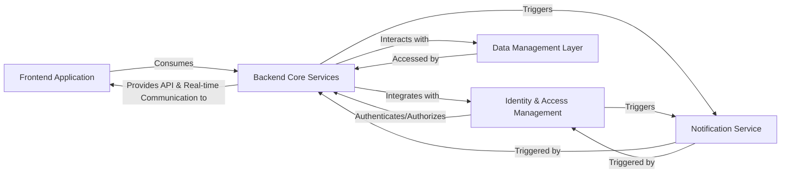

## Details

High-level architectural analysis of a polyglot system, focusing on logical components and their interactions. Specific source code references are not provided due to the multi-language nature of the project and the limitations of available Python-specific analysis tools.

### Frontend Application [[Expand]](./Frontend_Application.md)
The user-facing interface, built with Vue.js/Nuxt 3, responsible for rendering the UI, handling user input, and displaying real-time updates. It serves as the primary interaction point for users.

**Related Classes/Methods**: _None_

### Backend Core Services [[Expand]](./Backend_Core_Services.md)
The central Go application handling core business logic, including quiz creation, management, the real-time quiz engine, and WebSocket communication. It orchestrates interactions with data stores and external services.

**Related Classes/Methods**: _None_

### Identity & Access Management [[Expand]](./Identity_Access_Management.md)
An external service (Ory Kratos) responsible for user authentication, authorization, and session management, ensuring secure access to the platform.

**Related Classes/Methods**: _None_

### Data Management Layer [[Expand]](./Data_Management_Layer.md)
Consolidates persistent storage (PostgreSQL), in-memory caching (Redis), and file storage (S3/MinIO) for all application data, ensuring efficient data retrieval and storage.

**Related Classes/Methods**: _None_

### Notification Service [[Expand]](./Notification_Service.md)
Handles transactional email communications for various purposes, such as account verification, password resets, and quiz invitations.

**Related Classes/Methods**: _None_

### [FAQ](https://github.com/CodeBoarding/GeneratedOnBoardings/tree/main?tab=readme-ov-file#faq)