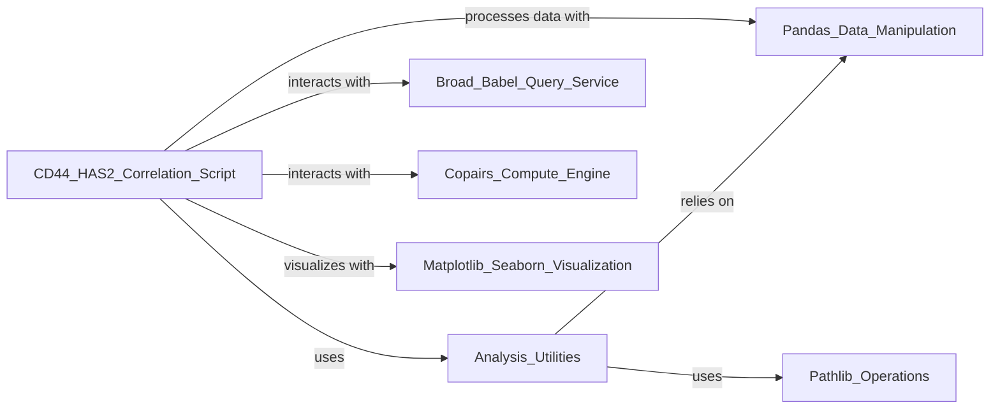

## Component Details

This subsystem focuses on analyzing the correlation between CD44 and HAS2 genes within a larger dataset. It orchestrates data loading, gene-specific querying, similarity computation, and visualization to identify and present these correlations.

### CD44_HAS2_Correlation_Script
This is the primary script (1_correlations.py) that orchestrates the entire correlation analysis workflow. It defines the sequence of operations from data ingestion and gene querying to similarity calculation and final visualization. It's fundamental because it embodies the specific logic and steps for this particular analysis.

**Related Classes/Methods**:

- <a href="https://github.com/broadinstitute/jump_hub/blob/master/workspace/analysis/CD44_HAS2/1_correlations.py#L-1-L-1" target="_blank" rel="noopener noreferrer">`1_correlations.py` (-1:-1)</a>

### Analysis_Utilities
This component (utils.py) provides essential helper functions for the main correlation script. Specifically, it handles data loading (load_path) and manages the output directory for figures (get_figs_dir). It's fundamental as it encapsulates reusable utility functions, promoting modularity and reducing redundancy in the main script.

**Related Classes/Methods**:

- <a href="https://github.com/broadinstitute/jump_hub/blob/master/workspace/analysis/CD44_HAS2/utils.py#L-1-L-1" target="_blank" rel="noopener noreferrer">`utils.py` (-1:-1)</a>
- `load_path` (-1:-1)
- `get_figs_dir` (-1:-1)

### Broad_Babel_Query_Service
Represents the broad_babel.query library, which is crucial for retrieving gene-specific information from a broader dataset using the run_query function. This service acts as the data access layer for gene-related queries. It's fundamental because it provides the necessary gene annotation and data retrieval capabilities.

**Related Classes/Methods**:

- `broad_babel.query` (-1:-1)
- `broad_babel.query:run_query` (-1:-1)

### Copairs_Compute_Engine
Represents the copairs.compute library, specifically its pairwise_cosine function. This component is essential for the core analytical task of calculating the similarity (cosine distance) between gene expression profiles. It's fundamental as it performs the central mathematical computation of the correlation analysis.

**Related Classes/Methods**:

- `copairs.compute` (-1:-1)
- `copairs.compute:pairwise_cosine` (-1:-1)

### Pandas_Data_Manipulation
Represents the pandas library, which is foundational for all data manipulation and analysis within this subsystem. It provides the DataFrame structure and associated methods used for loading, subsetting, indexing, and transforming the gene expression data. It's fundamental because it provides the core data structures and operations for efficient data handling.

**Related Classes/Methods**:

- `pandas` (-1:-1)

### Matplotlib_Seaborn_Visualization
Represents the matplotlib.pyplot and seaborn libraries, which are used for generating high-quality statistical graphics, specifically the heatmap visualization of correlations. It's fundamental for presenting the results of the analysis in an interpretable visual format.

**Related Classes/Methods**:

- `matplotlib.pyplot` (-1:-1)
- `seaborn` (-1:-1)

### Pathlib_Operations
Represents Python's built-in pathlib module, used within Analysis_Utilities for robust path manipulation and directory creation (e.g., for get_figs_dir). It's fundamental for reliable file system interactions.

**Related Classes/Methods**:

- `pathlib` (-1:-1)

### [FAQ](https://github.com/CodeBoarding/GeneratedOnBoardings/tree/main?tab=readme-ov-file#faq)