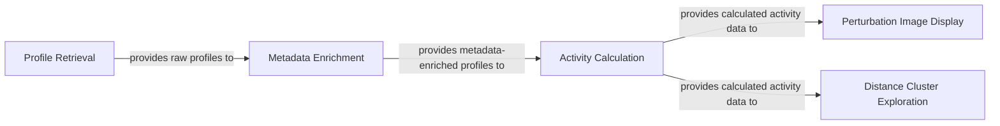

## Component Details

These components are fundamental to the `jump_hub` platform's `Data Processing & Analysis Core` because they represent distinct, sequential, and essential stages in transforming raw Cell Painting data into actionable biological insights. Each component addresses a critical aspect of the data lifecycle:

1.  **Profile Retrieval**: This is the absolute starting point. Without efficient and scalable retrieval of raw profiles, no further analysis is possible. Its use of `polars` for lazy loading highlights its importance in handling the large-scale nature of Cell Painting data.

2.  **Metadata Enrichment**: Raw profiles alone lack context. This component is crucial for adding biological and experimental metadata, which is indispensable for interpreting the profiles and performing meaningful analyses. It bridges the gap between raw data and biological relevance.

3.  **Activity Calculation**: This is the core analytical engine. It quantifies the phenotypic effects of perturbations, moving beyond raw measurements to derive meaningful biological activity scores. This component directly generates the "actionable insights" mentioned in the overall description.

4.  **Perturbation Image Display**: While numerical data is vital, visual inspection of cellular phenotypes is equally important for validation and qualitative understanding. This component provides a direct visual link to the underlying biological changes, making the data more accessible and interpretable.

5.  **Distance Cluster Exploration**: This component addresses the need for understanding relationships and patterns within the vast dataset. By providing tools to explore similarities and dissimilarities between perturbations, it enables researchers to identify novel connections and group similar biological responses, which is a key goal of phenotypic screening.

Together, these components form a cohesive pipeline that takes raw data, enriches it, analyzes it quantitatively, and presents it visually, thereby fulfilling the core purpose of the `Data Processing & Analysis Core` within the `jump_hub` platform. They are fundamental because each step is a prerequisite for the subsequent one, building up from raw data to sophisticated, interpretable biological knowledge.

### Profile Retrieval
This component is responsible for the initial retrieval of Cell Painting profiles from the JUMP Cell Painting datasets, specifically from AWS S3. It uses `polars` for lazy loading of Parquet files, which is crucial for handling large datasets that may not fit into memory. It acts as the entry point for raw data into the `jump_hub` platform's processing pipeline.

**Related Classes/Methods**:

- <a href="https://github.com/broadinstitute/jump_hub/blob/master/scripts/11_retrieve_profiles.py#L0-L0" target="_blank" rel="noopener noreferrer">`scripts.11_retrieve_profiles` (0:0)</a>

### Metadata Enrichment
This component enriches the retrieved Cell Painting profiles by associating them with relevant metadata, such as perturbation type (treatment, negative control, positive control) and standard names. It leverages the `broad_babel` library to query and map JUMP identifiers to more descriptive metadata. This step is crucial for contextualizing the raw data and preparing it for further analysis.

**Related Classes/Methods**:

- <a href="https://github.com/broadinstitute/jump_hub/blob/master/scripts/12_add_metadata.py#L0-L0" target="_blank" rel="noopener noreferrer">`scripts.12_add_metadata` (0:0)</a>

### Activity Calculation
This component calculates phenotypic activity from the enriched Cell Painting profiles using the `copairs` package. It employs mean average precision (mAP) to quantify the replicability and similarity of perturbations relative to negative controls. This is a core analytical step that transforms profile data into meaningful biological insights, indicating how similar a given set of compounds are.

**Related Classes/Methods**:

- <a href="https://github.com/broadinstitute/jump_hub/blob/master/scripts/13_calculate_activity.py#L0-L0" target="_blank" rel="noopener noreferrer">`scripts.13_calculate_activity` (0:0)</a>

### Perturbation Image Display
This component generates and displays primary analytical visualizations in the form of perturbation images. It utilizes the `jump_portrait` library to fetch and render multi-channel images of cells, allowing for visual inspection of phenotypic changes induced by perturbations. It provides a visual representation of the phenotypic activity.

**Related Classes/Methods**:

- <a href="https://github.com/broadinstitute/jump_hub/blob/master/scripts/14_display_perturbation_images.py#L0-L0" target="_blank" rel="noopener noreferrer">`scripts.14_display_perturbation_images` (0:0)</a>

### Distance Cluster Exploration
This component facilitates the exploration of distance clusters by querying pre-calculated cosine similarity matrices of perturbations. It allows users to find perturbations that are phenotypically similar or dissimilar to a given perturbation. This offers another primary analytical visualization method to understand relationships and patterns within the Cell Painting profiles, especially for large datasets where all-vs-all calculations are intractable.

**Related Classes/Methods**:

- <a href="https://github.com/broadinstitute/jump_hub/blob/master/scripts/15_explore_distance_clusters.py#L0-L0" target="_blank" rel="noopener noreferrer">`scripts.15_explore_distance_clusters` (0:0)</a>

### [FAQ](https://github.com/CodeBoarding/GeneratedOnBoardings/tree/main?tab=readme-ov-file#faq)