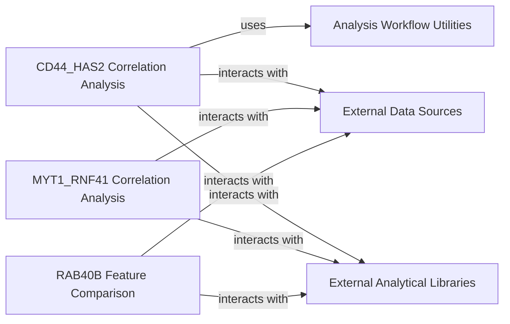

## Component Details

These components are fundamental because they embody the "Domain-Specific Analysis Workflows" as the application layer of the system. They serve as concrete examples and executable scripts that demonstrate how the platform's core data processing and analytical capabilities are applied to answer specific scientific questions. Direct Scientific Application: Each component directly addresses a specific biological or scientific question (e.g., correlation between two genes, feature comparison between gene clusters). This makes them the tangible output of the platform's utility for researchers. Demonstration of Platform Capabilities: They showcase the end-to-end usage of the underlying data and analytical tools. For instance, they demonstrate how raw data is transformed, queried, analyzed, and visualized to produce scientific findings. Modularity and Reproducibility: By being distinct, self-contained workflows, they promote modularity in analysis. This design makes it easier to reproduce specific analyses, share methodologies, and adapt them for similar investigations. Foundation for Further Research: These workflows can serve as templates or starting points for new, more complex analyses, allowing researchers to build upon established methods and data processing pipelines. Clear Use Cases: They provide clear, actionable use cases for the platform, illustrating its value in generating specific scientific insights rather than just providing raw data or generic tools.

### CD44_HAS2 Correlation Analysis
This component is a specialized workflow designed to investigate the correlation between the CD44 and HAS2 genes. It processes harmonized gene expression profiles, identifies relevant gene matches, computes pairwise cosine distances between gene profiles, and visualizes these correlations as a heatmap. This workflow demonstrates a specific application of the platform's analytical capabilities to derive insights into gene relationships.

**Related Classes/Methods**:

- <a href="https://github.com/broadinstitute/jump_hub/blob/master/workspace/analysis/CD44_HAS2/1_correlations.py#L1-L1" target="_blank" rel="noopener noreferrer">`1_correlations.py` (1:1)</a>
- <a href="https://github.com/broadinstitute/jump_hub/blob/master/workspace/analysis/CD44_HAS2/utils.py#L1-L1" target="_blank" rel="noopener noreferrer">`utils.py` (1:1)</a>

### MYT1_RNF41 Correlation Analysis
This component provides a dedicated workflow for analyzing the correlations between the MYT1 and RNF41 genes. Similar to the CD44_HAS2 workflow, it loads harmonized gene expression data, identifies specific gene perturbations, calculates cosine similarities between their profiles, and generates a heatmap to visualize the correlation patterns. This workflow addresses a specific biological hypothesis regarding the interaction of these two genes.

**Related Classes/Methods**:

- <a href="https://github.com/broadinstitute/jump_hub/blob/master/workspace/analysis/CD44_HAS2/1_correlations.py#L1-L1" target="_blank" rel="noopener noreferrer">`1_correlations.py` (1:1)</a>

### RAB40B Feature Comparison
This component implements a workflow for comparing features across predefined gene clusters, specifically focusing on RAB40B, RAB40C, INSYN1, and PIK3R3. It loads ORF profiles, groups genes into their respective clusters, calculates median differences in features between clusters, performs statistical tests (t-tests), applies multiple testing correction, and identifies statistically significant features. This workflow is crucial for identifying distinguishing characteristics between gene groups.

**Related Classes/Methods**:

- <a href="https://github.com/broadinstitute/jump_hub/blob/master/workspace/analysis/RAB40B/compare_features.py#L1-L1" target="_blank" rel="noopener noreferrer">`compare_features.py` (1:1)</a>

### Analysis Workflow Utilities
This component provides common utility functions that support the various domain-specific analysis workflows. Its primary functions include loading data from parquet files and managing the creation and retrieval of directories for saving figures. This component promotes code reusability and consistency across different analysis scripts.

**Related Classes/Methods**:

- <a href="https://github.com/broadinstitute/jump_hub/blob/master/workspace/analysis/CD44_HAS2/utils.py#L1-L1" target="_blank" rel="noopener noreferrer">`utils.py` (1:1)</a>

### External Data Sources
Represents external data sources, typically .parquet files, from which analysis workflows read harmonized gene expression profiles and ORF profiles.

**Related Classes/Methods**: _None_

### External Analytical Libraries
Represents external libraries like pandas, numpy, matplotlib, seaborn, broad_babel.query, copairs.compute, polars, scipy.stats, and statsmodels.stats.multitest, used by analysis workflows for data manipulation, statistical analysis, and visualization.

**Related Classes/Methods**: _None_

### [FAQ](https://github.com/CodeBoarding/GeneratedOnBoardings/tree/main?tab=readme-ov-file#faq)