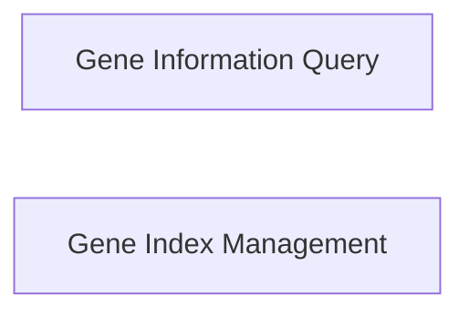

## Component Details

This component is crucial for enriching the project's internal data with external biological context, specifically focusing on gene-related information. It achieves this by integrating with external biological knowledge bases and maintaining a programmatic index of genes.

### Gene Information Query
This script is responsible for querying external biological databases, specifically NCBI Entrez, to retrieve detailed information about genes. It takes gene symbols as input, maps them to Entrez IDs using `broad_babel`, and then fetches summaries, descriptions, and other relevant data using `Biopython`'s Entrez utilities. This component is vital for adding biological relevance to the analyzed data by providing comprehensive external context for genes of interest.

**Related Classes/Methods**:

- `Bio.Entrez` (1:1)
- `broad_babel.query.get_mapper` (1:1)
- `polars` (1:1)

### Gene Index Management
This script manages a programmatic index of genes, providing a reference for genes available within the JUMP project or associated tables. It retrieves gene data from a remote source (Zenodo) using `pooch` and displays it in an interactive, human-readable format using `itables`. This component ensures that analyses can be cross-referenced with a comprehensive and up-to-date list of genes, facilitating the integration of external biological context.

**Related Classes/Methods**:

- `polars` (1:1)
- `pooch` (1:1)
- `itables` (1:1)

### [FAQ](https://github.com/CodeBoarding/GeneratedOnBoardings/tree/main?tab=readme-ov-file#faq)