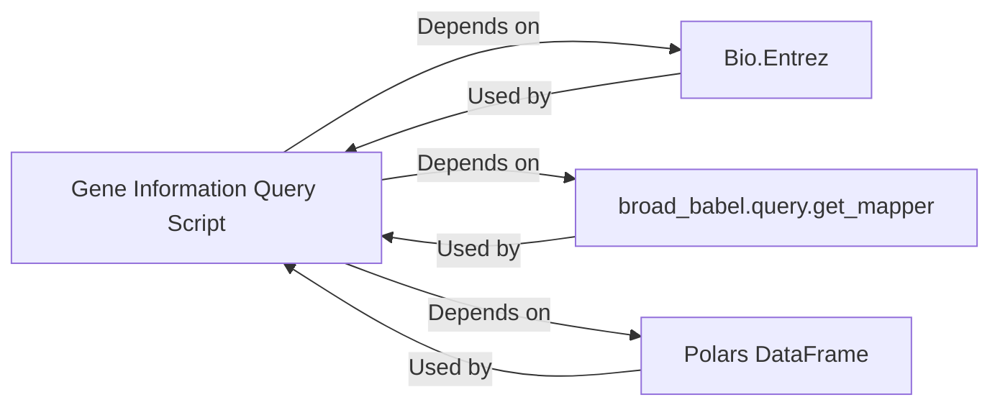

## Component Details

The Gene Information Query component, implemented in scripts/16_query_genes_externally.py, is fundamental for enriching experimental data with biological context by querying external gene databases. It acts as an integration layer, connecting internal gene symbols to comprehensive external information.

### Gene Information Query Script
This is the main script (scripts/16_query_genes_externally.py) that orchestrates the entire gene information retrieval process. It defines the workflow, imports necessary libraries, sets up Entrez parameters, and processes the gene data.

**Related Classes/Methods**:

- <a href="https://github.com/broadinstitute/jump_hub/blob/master/scripts/16_query_genes_externally.py#L1-L1000" target="_blank" rel="noopener noreferrer">`scripts/16_query_genes_externally.py` (1:1000)</a>

### Bio.Entrez
This is a module from the Biopython library that provides an interface to the NCBI Entrez databases. It's used for sending queries (e.g., esummary) and parsing the XML responses (e.g., read).

**Related Classes/Methods**: _None_

### broad_babel.query.get_mapper
This function is responsible for mapping gene symbols to their corresponding NCBI Entrez IDs. It's a crucial step for translating internal identifiers into a format usable by the Entrez database.

**Related Classes/Methods**: _None_

### Polars DataFrame
The Polars library provides a high-performance DataFrame object used for efficient data manipulation and display of the retrieved gene information.

**Related Classes/Methods**: _None_

### [FAQ](https://github.com/CodeBoarding/GeneratedOnBoardings/tree/main?tab=readme-ov-file#faq)