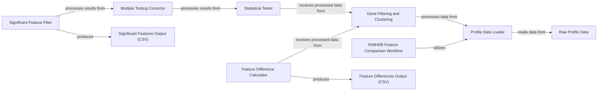

## Component Details

This analysis workflow, encapsulated primarily within compare_features.py, is designed to compare features associated with a specific set of genes (RAB40B, RAB40C, INSYN1, PIK3R3). It systematically processes profile data, identifies gene clusters, calculates feature differences, performs statistical tests, and corrects for multiple comparisons to pinpoint statistically significant features. The results are then saved to CSV files for further analysis.

### RAB40B Feature Comparison Workflow
This is the overarching logical component representing the entire analytical pipeline. It orchestrates the sequence of operations from data loading to final output generation, ensuring the complete execution of the feature comparison.

**Related Classes/Methods**:

- <a href="https://github.com/broadinstitute/jump_hub/blob/master/workspace/analysis/RAB40B/compare_features.py#L0-L0" target="_blank" rel="noopener noreferrer">`workspace/analysis/RAB40B/compare_features.py` (0:0)</a>

### Profile Data Loader
Responsible for ingesting the raw profile data from the specified Parquet file. It acts as the initial data entry point for the entire analysis.

**Related Classes/Methods**:

- <a href="https://github.com/broadinstitute/jump_hub/blob/master/workspace/analysis/RAB40B/compare_features.py#L25-L26" target="_blank" rel="noopener noreferrer">`workspace/analysis/RAB40B/compare_features.py` (25:26)</a>

### Gene Filtering and Clustering
This component filters the loaded profile data to include only the genes of interest and then groups them into predefined clusters (e.g., "RAB40B/C" and "INS/PIK"). This step is crucial for preparing the data for comparative analysis.

**Related Classes/Methods**:

- <a href="https://github.com/broadinstitute/jump_hub/blob/master/workspace/analysis/RAB40B/compare_features.py#L26-L34" target="_blank" rel="noopener noreferrer">`workspace/analysis/RAB40B/compare_features.py` (26:34)</a>

### Feature Difference Calculator
Computes the median differences for all features between the identified gene clusters. This component quantifies the raw variations in features before statistical assessment.

**Related Classes/Methods**:

- <a href="https://github.com/broadinstitute/jump_hub/blob/master/workspace/analysis/RAB40B/compare_features.py#L37-L39" target="_blank" rel="noopener noreferrer">`workspace/analysis/RAB40B/compare_features.py` (37:39)</a>

### Statistical Tester
Performs independent t-tests for each feature to assess the statistical significance of the observed differences between the gene clusters. It generates initial p-values for each feature.

**Related Classes/Methods**:

- <a href="https://github.com/broadinstitute/jump_hub/blob/master/workspace/analysis/RAB40B/compare_features.py#L50-L57" target="_blank" rel="noopener noreferrer">`workspace/analysis/RAB40B/compare_features.py` (50:57)</a>

### Multiple Testing Corrector
Applies a multiple testing correction method (specifically Benjamini-Hochberg FDR) to the p-values obtained from the statistical tests. This is vital for controlling the false discovery rate when performing numerous comparisons.

**Related Classes/Methods**:

- <a href="https://github.com/broadinstitute/jump_hub/blob/master/workspace/analysis/RAB40B/compare_features.py#L67-L68" target="_blank" rel="noopener noreferrer">`workspace/analysis/RAB40B/compare_features.py` (67:68)</a>

### Significant Feature Filter
Filters the results based on the corrected p-values to identify and select only those features that are statistically significant (e.g., corrected p-value < 0.05). This component extracts the key findings of the analysis.

**Related Classes/Methods**:

- <a href="https://github.com/broadinstitute/jump_hub/blob/master/workspace/analysis/RAB40B/compare_features.py#L71-L71" target="_blank" rel="noopener noreferrer">`workspace/analysis/RAB40B/compare_features.py` (71:71)</a>

### Raw Profile Data
The external Parquet file containing the comprehensive cellular profile data. This serves as the primary input dataset for the entire analysis.

**Related Classes/Methods**:

- `/dgx1nas1/storage/data/shared/morphmap_profiles/orf/full_profiles_cc_adj_mean_corr.parquet` (0:0)

### Feature Differences Output (CSV)
An intermediate output file in CSV format that stores the calculated median differences for all features. It provides a detailed record of the raw feature variations.

**Related Classes/Methods**:

- `feature_diffs.csv` (0:0)

### Significant Features Output (CSV)
The final output file in CSV format, containing only the features identified as statistically significant after all analytical steps, including multiple testing correction. This file represents the core findings of the comparison.

**Related Classes/Methods**:

- `significant_features.csv` (0:0)

### [FAQ](https://github.com/CodeBoarding/GeneratedOnBoardings/tree/main?tab=readme-ov-file#faq)