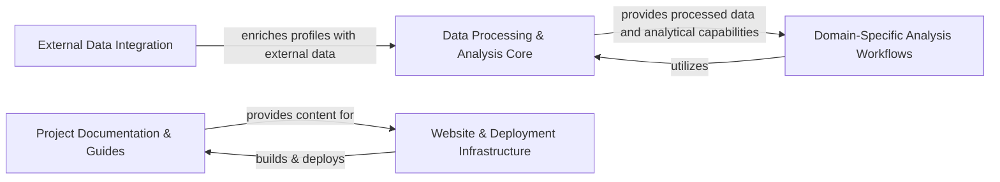

## Component Details

The `jump_hub` project is structured around a core data processing and analysis pipeline, supported by external data integration, specific research applications, comprehensive documentation, and automated deployment infrastructure. This architecture ensures a robust system for handling biological data, deriving insights, and making them accessible.

### Data Processing & Analysis Core
This component forms the backbone of the `jump_hub` platform, managing the entire lifecycle of Cell Painting profiles from initial retrieval and enrichment with metadata to the calculation of phenotypic activity and the generation of primary analytical visualizations (perturbation images, distance clusters). It is fundamental as it transforms raw data into actionable insights.

**Related Classes/Methods**:

- <a href="https://github.com/broadinstitute/jump_hub/blob/master/scripts/11_retrieve_profiles.py#L1-L1" target="_blank" rel="noopener noreferrer">`scripts/11_retrieve_profiles.py` (1:1)</a>
- <a href="https://github.com/broadinstitute/jump_hub/blob/master/scripts/12_add_metadata.py#L1-L1" target="_blank" rel="noopener noreferrer">`scripts/12_add_metadata.py` (1:1)</a>
- <a href="https://github.com/broadinstitute/jump_hub/blob/master/scripts/13_calculate_activity.py#L1-L1" target="_blank" rel="noopener noreferrer">`scripts/13_calculate_activity.py` (1:1)</a>
- <a href="https://github.com/broadinstitute/jump_hub/blob/master/scripts/14_display_perturbation_images.py#L1-L1" target="_blank" rel="noopener noreferrer">`scripts/14_display_perturbation_images.py` (1:1)</a>
- <a href="https://github.com/broadinstitute/jump_hub/blob/master/scripts/15_explore_distance_clusters.py#L1-L1" target="_blank" rel="noopener noreferrer">`scripts/15_explore_distance_clusters.py` (1:1)</a>

### External Data Integration
This component is responsible for connecting the project's internal data with external biological knowledge bases. It facilitates querying external databases for gene-related information and maintains a programmatic index of genes, ensuring that analyses are enriched with up-to-date and comprehensive external context. It is crucial for adding biological relevance to the raw phenotypic data.

**Related Classes/Methods**:

- <a href="https://github.com/broadinstitute/jump_hub/blob/master/scripts/16_query_genes_externally.py#L1-L1" target="_blank" rel="noopener noreferrer">`scripts/16_query_genes_externally.py` (1:1)</a>
- <a href="https://github.com/broadinstitute/jump_hub/blob/master/reference/00_gene_index.py#L1-L1" target="_blank" rel="noopener noreferrer">`reference/00_gene_index.py` (1:1)</a>

### Domain-Specific Analysis Workflows
This component represents the application layer where specific research questions are investigated. It contains tailored scripts that leverage the core data processing and analytical capabilities to perform in-depth analyses on particular gene sets or features (e.g., correlations), demonstrating concrete use cases and generating specific scientific findings. It highlights the extensibility and utility of the platform.

**Related Classes/Methods**:

- <a href="https://github.com/broadinstitute/jump_hub/blob/master/workspace/analysis/CD44_HAS2/1_correlations.py#L1-L1" target="_blank" rel="noopener noreferrer">`workspace/analysis/CD44_HAS2/1_correlations.py` (1:1)</a>
- <a href="https://github.com/broadinstitute/jump_hub/blob/master/workspace/analysis/MYT1_RNF41/1_correlations.py#L1-L1" target="_blank" rel="noopener noreferrer">`workspace/analysis/MYT1_RNF41/1_correlations.py` (1:1)</a>
- <a href="https://github.com/broadinstitute/jump_hub/blob/master/workspace/analysis/RAB40B/compare_features.py#L1-L1" target="_blank" rel="noopener noreferrer">`workspace/analysis/RAB40B/compare_features.py` (1:1)</a>

### Project Documentation & Guides
This crucial component serves as the comprehensive knowledge base for the entire project. It provides detailed documentation, including how-to guides, explanations of data and computational pipelines, glossaries, FAQs, and known issues. Its purpose is to ensure clarity, facilitate user understanding, and support the effective use of the `jump_hub` platform, making it accessible to a wider audience.

**Related Classes/Methods**:

- `reference/01_chemical_query.md` (1:1)
- `reference/computational_pipelines.md` (1:1)
- `reference/glossary.md` (1:1)
- `explanations/FAQ.md` (1:1)
- `explanations/data_description.md` (1:1)
- `explanations/known_issues.md` (1:1)
- `howto/0_howto.md` (1:1)
- `howto/0_howto_interactive_tools.md` (1:1)
- `howto/1_jumprr_steps.md` (1:1)

### Website & Deployment Infrastructure
This component automates the continuous integration and deployment (CI/CD) process for the project's website and documentation. It ensures that updates to the documentation and other web assets are automatically built, tested, and deployed, maintaining an up-to-date and accessible online presence for the project. It also includes general utility scripts that support development and deployment tasks. This component is vital for the project's visibility and maintainability.

**Related Classes/Methods**:

- `.github/workflows/build_website.yml` (1:1)
- `tools/deploy.sh` (1:1)
- 

### [FAQ](https://github.com/CodeBoarding/GeneratedOnBoardings/tree/main?tab=readme-ov-file#faq)