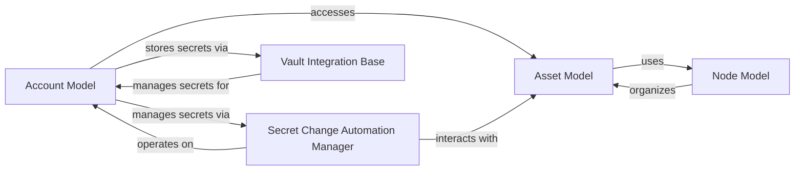

## Component Details

The `Asset & Credential Management` subsystem in Jumpserver is crucial for defining and managing the IT resources and the credentials used to access them. It establishes the foundational data models and processes for cataloging assets, organizing them hierarchically, and securely managing their associated accounts and secrets.

### Asset Model
This component defines the core `Asset` model, which represents all managed IT resources such as hosts, databases, and cloud assets. It establishes the schema, properties, and connectivity details for these resources, including their associated protocols (e.g., SSH, RDP) and their hierarchical grouping within nodes. It's the central definition of *what* resources Jumpserver manages.

**Related Classes/Methods**: _None_

### Node Model
This component defines the `Node` model, which is responsible for creating and managing the hierarchical structure used to logically group and categorize assets. It provides methods for navigating and querying the node tree, enabling efficient organization and management of resources.

**Related Classes/Methods**: _None_

### Account Model
This component defines the `Account` model, representing the credentials (usernames, passwords, private keys) used to access assets. It stores sensitive account details, manages historical versions of secrets for auditing, and links directly to specific assets, defining *how* Jumpserver accesses resources.

**Related Classes/Methods**: _None_

### Secret Change Automation Manager
This component orchestrates the automated generation, rotation, and verification processes for account secrets. It manages the entire lifecycle of secret changes, including creating records of changes, handling different secret strategies (e.g., custom, random), and sending notifications or reports on the status of these operations.

**Related Classes/Methods**: _None_

### Vault Integration Base
This abstract base class provides a standardized interface for integrating Jumpserver with various external secret management systems (vaults). It defines the core methods for securely storing, retrieving, creating, updating, and deleting sensitive account secrets, ensuring that these credentials are not persistently stored in the local database but rather in a dedicated, secure vault.

**Related Classes/Methods**: _None_

### [FAQ](https://github.com/CodeBoarding/GeneratedOnBoardings/tree/main?tab=readme-ov-file#faq)