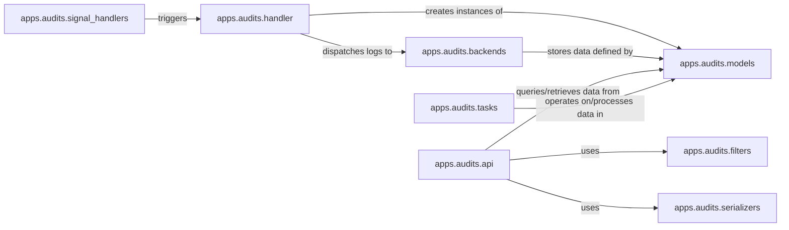

## Component Details

The `Auditing & Compliance` subsystem is critical for maintaining security, ensuring compliance, and enabling forensic analysis by meticulously logging all system activities. Its architecture is designed to capture, process, store, and provide access to a comprehensive audit trail.

### apps.audits.signal_handlers
These modules are the initial entry points for audit data. They actively listen for specific system events (e.g., user logins, activity, operations) via Django signals and trigger the audit logging process. They are fundamental because they are responsible for *capturing* the raw events that need to be audited.

**Related Classes/Methods**:

- <a href="https://github.com/jumpserver/jumpserver/blob/master/apps/audits/signal_handlers/login_log.py#L1-L1" target="_blank" rel="noopener noreferrer">`apps.audits.signal_handlers.login_log` (1:1)</a>
- <a href="https://github.com/jumpserver/jumpserver/blob/master/apps/audits/signal_handlers/activity_log.py#L1-L1" target="_blank" rel="noopener noreferrer">`apps.audits.signal_handlers.activity_log` (1:1)</a>
- <a href="https://github.com/jumpserver/jumpserver/blob/master/apps/audits/signal_handlers/operate_log.py#L1-L1" target="_blank" rel="noopener noreferrer">`apps.audits.signal_handlers.operate_log` (1:1)</a>

### apps.audits.handler
This component acts as the central processing unit for all incoming audit events. It standardizes, enriches, and prepares audit records before dispatching them to the appropriate storage backends. It's fundamental as it orchestrates the transformation and routing of audit data, ensuring consistency and proper handling.

**Related Classes/Methods**:

- <a href="https://github.com/jumpserver/jumpserver/blob/master/apps/audits/handler.py#L1-L1" target="_blank" rel="noopener noreferrer">`apps.audits.handler` (1:1)</a>

### apps.audits.models
This component defines the foundational data structures (Django models) for all types of audit logs. It ensures a consistent structure for audit records and dictates how they are persisted in the database. It is fundamental because it establishes the schema for all audit data, forming the backbone of the persistent layer.

**Related Classes/Methods**:

- <a href="https://github.com/jumpserver/jumpserver/blob/master/apps/audits/models.py#L1-L1" target="_blank" rel="noopener noreferrer">`apps.audits.models` (1:1)</a>

### apps.audits.backends
This component provides the actual storage mechanisms for audit logs. It includes both a relational database backend (for direct persistence) and an Elasticsearch backend (for scalable, highly searchable storage). These are fundamental as they are responsible for the long-term *persistence* and *retrievability* of audit data.

**Related Classes/Methods**:

- <a href="https://github.com/jumpserver/jumpserver/blob/master/apps/audits/backends/db.py#L1-L1" target="_blank" rel="noopener noreferrer">`apps.audits.backends.db` (1:1)</a>
- <a href="https://github.com/jumpserver/jumpserver/blob/master/apps/audits/backends/es.py#L1-L1" target="_blank" rel="noopener noreferrer">`apps.audits.backends.es` (1:1)</a>

### apps.audits.api
This component exposes RESTful APIs, allowing authorized users and external systems to query, filter, and retrieve audit logs. It leverages serializers and filters for efficient data presentation and access. It is fundamental because it provides the primary interface for *accessing* and *analyzing* the collected audit data.

**Related Classes/Methods**:

- <a href="https://github.com/jumpserver/jumpserver/blob/master/apps/audits/api.py#L1-L1" target="_blank" rel="noopener noreferrer">`apps.audits.api` (1:1)</a>
- <a href="https://github.com/jumpserver/jumpserver/blob/master/apps/audits/urls/api_urls.py#L1-L1" target="_blank" rel="noopener noreferrer">`apps.audits.urls.api_urls` (1:1)</a>

### apps.audits.filters
This component provides advanced querying capabilities for audit logs. It allows the API to efficiently filter and retrieve specific subsets of audit data based on various criteria. It is fundamental as it enables granular and efficient *retrieval* of audit information, crucial for analysis and reporting.

**Related Classes/Methods**:

- <a href="https://github.com/jumpserver/jumpserver/blob/master/apps/audits/filters.py#L1-L1" target="_blank" rel="noopener noreferrer">`apps.audits.filters` (1:1)</a>

### apps.audits.serializers
This component handles the serialization and deserialization of audit log data. It transforms complex Django model instances into easily consumable formats (e.g., JSON) for the API. It is fundamental because it ensures that audit data is presented in a structured and *consumable format* for external systems and UI.

**Related Classes/Methods**:

- <a href="https://github.com/jumpserver/jumpserver/blob/master/apps/audits/serializers.py#L1-L1" target="_blank" rel="noopener noreferrer">`apps.audits.serializers` (1:1)</a>

### apps.audits.tasks
This component manages asynchronous operations related to auditing, such as periodic data processing, aggregation, cleanup, or synchronization. It ensures that resource-intensive audit-related operations are handled efficiently in the background. It is fundamental for maintaining the *performance* and *integrity* of the audit system over time.

**Related Classes/Methods**:

- <a href="https://github.com/jumpserver/jumpserver/blob/master/apps/audits/tasks.py#L1-L1" target="_blank" rel="noopener noreferrer">`apps.audits.tasks` (1:1)</a>

### [FAQ](https://github.com/CodeBoarding/GeneratedOnBoardings/tree/main?tab=readme-ov-file#faq)