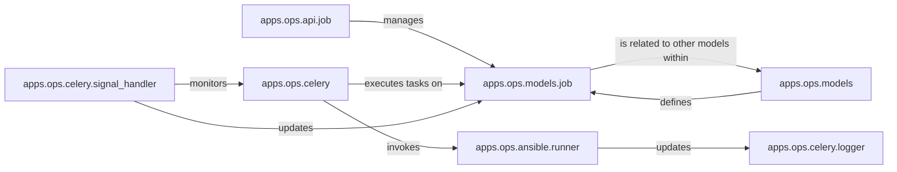

## Component Details

The `Automation & Orchestration` subsystem in Jumpserver provides a robust framework for executing automated tasks. Its core functionality revolves around defining, scheduling, executing, and monitoring these tasks, primarily leveraging Ansible for execution and Celery for asynchronous processing.

### apps.ops.models.job
This module defines the `Job` model, which is the central data structure representing an automated task or playbook execution. It encapsulates all metadata related to a job, including its status, associated assets, and execution history. It acts as the single source of truth for the state of any automation.

**Related Classes/Methods**:

- <a href="https://github.com/jumpserver/jumpserver/blob/master/apps/ops/models/job.py#L1-L1" target="_blank" rel="noopener noreferrer">`apps/ops/models/job.py` (1:1)</a>

### apps.ops.ansible.runner
This is the primary interface for executing Ansible playbooks and ad-hoc commands. It abstracts the complexities of interacting with Ansible, providing a clean API for the automation framework to trigger and manage Ansible operations. It's the "doer" of the automation.

**Related Classes/Methods**:

- <a href="https://github.com/jumpserver/jumpserver/blob/master/apps/ops/ansible/runner.py#L1-L1" target="_blank" rel="noopener noreferrer">`apps/ops/ansible/runner.py` (1:1)</a>

### apps.ops.api.job
This module exposes the RESTful API endpoints for managing automation jobs. It allows external systems or the Jumpserver UI to create, retrieve, update, and delete job definitions, as well as initiate and monitor job executions. It's the external gateway to the automation capabilities.

**Related Classes/Methods**:

- <a href="https://github.com/jumpserver/jumpserver/blob/master/apps/ops/api/job.py#L1-L1" target="_blank" rel="noopener noreferrer">`apps/ops/api/job.py` (1:1)</a>

### apps.ops.celery.signal_handler
This module is responsible for listening to and reacting to various signals emitted during the lifecycle of Celery tasks. It plays a crucial role in updating the status of `Job` instances in the database based on task completion, failure, or other events, ensuring data consistency and real-time feedback.

**Related Classes/Methods**:

- <a href="https://github.com/jumpserver/jumpserver/blob/master/apps/ops/celery/signal_handler.py#L1-L1" target="_blank" rel="noopener noreferrer">`apps/ops/celery/signal_handler.py` (1:1)</a>

### apps.ops.celery.logger
Dedicated to logging the execution details of asynchronous tasks managed by Celery. It captures output, errors, and status updates, providing essential information for debugging, auditing, and monitoring the progress of automated jobs.

**Related Classes/Methods**:

- <a href="https://github.com/jumpserver/jumpserver/blob/master/apps/ops/celery/logger.py#L1-L1" target="_blank" rel="noopener noreferrer">`apps/ops/celery/logger.py` (1:1)</a>

### apps.ops.celery
This package provides the core asynchronous task processing capabilities for the automation subsystem. It integrates Jumpserver with Celery, enabling background execution of long-running tasks like Ansible playbooks, ensuring the main application remains responsive.

**Related Classes/Methods**:

- <a href="https://github.com/jumpserver/jumpserver/blob/master/apps/ops/celery/__init__.py#L1-L1" target="_blank" rel="noopener noreferrer">`apps/ops/celery/__init__.py` (1:1)</a>

### apps.ops.models
This package serves as the repository for all data models related to the `apps.ops` subsystem, including `Job`, `Playbook`, and `AdHoc` models. It defines the structure and relationships of the data managed by the automation framework.

**Related Classes/Methods**:

- <a href="https://github.com/jumpserver/jumpserver/blob/master/apps/ops/models/__init__.py#L1-L1" target="_blank" rel="noopener noreferrer">`apps/ops/models/__init__.py` (1:1)</a>

### [FAQ](https://github.com/CodeBoarding/GeneratedOnBoardings/tree/main?tab=readme-ov-file#faq)