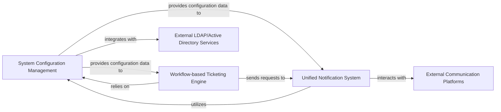

## Component Details

The `Platform Services & Integrations` subsystem forms the backbone of Jumpserver's operational capabilities, providing essential system-wide configurations, a robust notification framework, and a workflow-driven ticketing engine. This layer ensures the system is adaptable, communicative, and capable of managing critical approval processes.

### System Configuration Management
This fundamental component is responsible for centralizing and managing all system-wide configurations. It handles the loading, parsing, and decryption of sensitive settings from various sources (e.g., Python files, environment variables). It also manages the persistence of dynamic settings in the database and facilitates integration with external LDAP/Active Directory services for user authentication and synchronization. It acts as the single source of truth for system settings, ensuring secure and consistent application behavior.

**Related Classes/Methods**:

- <a href="https://github.com/jumpserver/jumpserver/blob/master/apps/jumpserver/conf.py#L139-L904" target="_blank" rel="noopener noreferrer">`jumpserver.conf.Config` (139:904)</a>
- <a href="https://github.com/jumpserver/jumpserver/blob/master/apps/jumpserver/conf.py#L86-L136" target="_blank" rel="noopener noreferrer">`jumpserver.conf.ConfigCrypto` (86:136)</a>
- <a href="https://github.com/jumpserver/jumpserver/blob/master/apps/settings/models.py#L37-L183" target="_blank" rel="noopener noreferrer">`apps.settings.models.Setting` (37:183)</a>
- <a href="https://github.com/jumpserver/jumpserver/blob/master/apps/settings/utils/ldap.py#L47-L83" target="_blank" rel="noopener noreferrer">`apps.settings.utils.ldap.LDAPConfig` (47:83)</a>
- <a href="https://github.com/jumpserver/jumpserver/blob/master/apps/settings/utils/ldap.py#L86-L231" target="_blank" rel="noopener noreferrer">`apps.settings.utils.ldap.LDAPServerUtil` (86:231)</a>

### Unified Notification System
This component provides a standardized and extensible mechanism for sending various types of notifications (e.g., email, SMS, instant messages) to users and administrators. It defines abstract interfaces for message generation and delivery, allowing for easy integration of new communication channels. It relies on the `System Configuration Management` for backend-specific settings (e.g., SMS gateway credentials, email server details).

**Related Classes/Methods**:

- <a href="https://github.com/jumpserver/jumpserver/blob/master/apps/notifications/notifications.py#L56-L253" target="_blank" rel="noopener noreferrer">`apps.notifications.notifications.Message` (56:253)</a>
- <a href="https://github.com/jumpserver/jumpserver/blob/master/apps/notifications/backends/base.py#L3-L31" target="_blank" rel="noopener noreferrer">`apps.notifications.backends.base.BackendBase` (3:31)</a>
- <a href="https://github.com/jumpserver/jumpserver/blob/master/apps/notifications/backends/sms.py#L4-L15" target="_blank" rel="noopener noreferrer">`apps.notifications.backends.sms.SMS` (4:15)</a>
- <a href="https://github.com/jumpserver/jumpserver/blob/master/apps/common/sdk/sms/endpoint.py#L1-L1" target="_blank" rel="noopener noreferrer">`common.sdk.sms.endpoint` (1:1)</a>

### Workflow-based Ticketing Engine
This component manages workflow-driven approval requests and ticketing processes within the system. It defines the core models for tickets and their multi-level approval steps, handles state transitions (e.g., pending, approved, rejected), and orchestrates notifications to relevant parties during the workflow. It ensures that critical operations, such as temporary access requests, are properly reviewed and approved according to defined policies.

**Related Classes/Methods**:

- <a href="https://github.com/jumpserver/jumpserver/blob/master/apps/tickets/models/ticket/general.py#L271-L491" target="_blank" rel="noopener noreferrer">`apps.tickets.models.ticket.general.Ticket` (271:491)</a>
- <a href="https://github.com/jumpserver/jumpserver/blob/master/apps/tickets/models/ticket/general.py#L37-L79" target="_blank" rel="noopener noreferrer">`apps.tickets.models.ticket.general.TicketStep` (37:79)</a>
- <a href="https://github.com/jumpserver/jumpserver/blob/master/apps/tickets/handlers/base.py#L13-L107" target="_blank" rel="noopener noreferrer">`apps.tickets.handlers.base.BaseHandler` (13:107)</a>
- <a href="https://github.com/jumpserver/jumpserver/blob/master/apps/tickets/utils.py#L1-L1" target="_blank" rel="noopener noreferrer">`apps.tickets.utils` (1:1)</a>

### External LDAP/Active Directory Services
These represent external identity management systems (e.g., Microsoft Active Directory, OpenLDAP) that Jumpserver integrates with for user authentication and synchronization. Jumpserver's `System Configuration Management` component handles the configuration and interaction with these services to retrieve user information and authenticate users.

**Related Classes/Methods**: _None_

### External Communication Platforms
These are external services and APIs (e.g., SMS gateways, email servers, instant messaging platforms like DingTalk or WeChat) that the `Unified Notification System` utilizes to deliver messages to users. Jumpserver's notification backends adapt to interact with these platforms.

**Related Classes/Methods**: _None_

### [FAQ](https://github.com/CodeBoarding/GeneratedOnBoardings/tree/main?tab=readme-ov-file#faq)