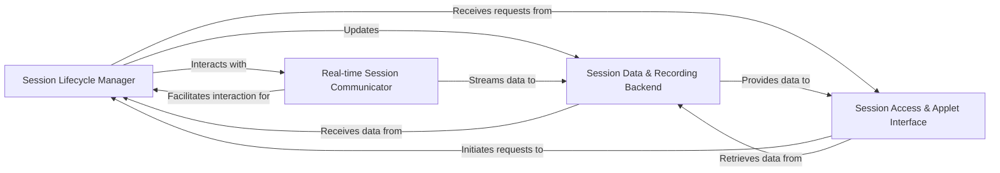

## Component Details

The `Session & Command Control` component is the operational core for managing interactive user sessions with assets. It orchestrates the entire session lifecycle, from establishment and real-time interaction to comprehensive recording and auditing. This functionality is achieved through the close collaboration of several fundamental sub-components:

### Session Lifecycle Manager
This component is the central orchestrator for the entire lifecycle of interactive sessions. It handles session initiation, connection establishment, state transitions, and graceful termination. It processes various session-related events and ensures proper resource allocation and deallocation, forming the backbone of session management.

**Related Classes/Methods**:

- <a href="https://github.com/jumpserver/jumpserver/blob/master/apps/terminal/startup.py#L1-L1" target="_blank" rel="noopener noreferrer">`apps/terminal/startup.py` (1:1)</a>
- <a href="https://github.com/jumpserver/jumpserver/blob/master/apps/terminal/session_lifecycle.py#L1-L1" target="_blank" rel="noopener noreferrer">`apps/terminal/session_lifecycle.py` (1:1)</a>
- <a href="https://github.com/jumpserver/jumpserver/blob/master/apps/terminal/signal_handlers/session.py#L1-L1" target="_blank" rel="noopener noreferrer">`apps/terminal/signal_handlers/session.py` (1:1)</a>

### Real-time Session Communicator
Responsible for facilitating real-time, bidirectional communication between the user's client and the remote asset during an active session, primarily utilizing WebSocket protocols. It ensures immediate transmission of user input (commands) and the display of session output, enabling crucial "real-time monitoring" and interactive experiences.

**Related Classes/Methods**:

- <a href="https://github.com/jumpserver/jumpserver/blob/master/apps/terminal/ws.py#L1-L1" target="_blank" rel="noopener noreferrer">`apps/terminal/ws.py` (1:1)</a>

### Session Data & Recording Backend
Manages the persistent storage, efficient retrieval, and auditing of all session-related data. This includes metadata for active sessions, logs of executed commands, and complete session replay data. It supports various storage mechanisms (e.g., database, Elasticsearch) to meet diverse auditing and performance requirements, fulfilling the "comprehensive session recording for auditing purposes."

**Related Classes/Methods**:

- <a href="https://github.com/jumpserver/jumpserver/blob/master/apps/terminal/models/session/session.py#L1-L1" target="_blank" rel="noopener noreferrer">`apps/terminal/models/session/session.py` (1:1)</a>
- <a href="https://github.com/jumpserver/jumpserver/blob/master/apps/terminal/models/session/command.py#L1-L1" target="_blank" rel="noopener noreferrer">`apps/terminal/models/session/command.py` (1:1)</a>
- <a href="https://github.com/jumpserver/jumpserver/blob/master/apps/terminal/models/session/replay.py#L1-L1" target="_blank" rel="noopener noreferrer">`apps/terminal/models/session/replay.py` (1:1)</a>
- <a href="https://github.com/jumpserver/jumpserver/blob/master/apps/terminal/backends/command/base.py#L1-L1" target="_blank" rel="noopener noreferrer">`apps/terminal/backends/command/base.py` (1:1)</a>
- <a href="https://github.com/jumpserver/jumpserver/blob/master/apps/terminal/backends/command/db.py#L1-L1" target="_blank" rel="noopener noreferrer">`apps/terminal/backends/command/db.py` (1:1)</a>
- <a href="https://github.com/jumpserver/jumpserver/blob/master/apps/terminal/backends/command/es.py#L1-L1" target="_blank" rel="noopener noreferrer">`apps/terminal/backends/command/es.py` (1:1)</a>
- <a href="https://github.com/jumpserver/jumpserver/blob/master/apps/terminal/backends/replay/__init__.py#L1-L1" target="_blank" rel="noopener noreferrer">`apps/terminal/backends/replay/__init__.py` (1:1)</a>

### Session Access & Applet Interface
Provides the external interfaces for interacting with sessions. This includes RESTful APIs for programmatic session management (e.g., listing, creating, updating sessions) and integration points for launching and managing interactive applications (applets like Chrome, Dbeaver) within the session environment. It serves as the "primary operational interface" for both human users and automated systems.

**Related Classes/Methods**:

- <a href="https://github.com/jumpserver/jumpserver/blob/master/apps/terminal/api/session/session.py#L1-L1" target="_blank" rel="noopener noreferrer">`apps/terminal/api/session/session.py` (1:1)</a>
- <a href="https://github.com/jumpserver/jumpserver/blob/master/apps/terminal/api/session/command.py#L1-L1" target="_blank" rel="noopener noreferrer">`apps/terminal/api/session/command.py` (1:1)</a>
- <a href="https://github.com/jumpserver/jumpserver/blob/master/apps/terminal/api/session/sharing.py#L1-L1" target="_blank" rel="noopener noreferrer">`apps/terminal/api/session/sharing.py` (1:1)</a>
- <a href="https://github.com/jumpserver/jumpserver/blob/master/apps/terminal/applets/chrome/app.py#L1-L1" target="_blank" rel="noopener noreferrer">`apps/terminal/applets/chrome/app.py` (1:1)</a>
- <a href="https://github.com/jumpserver/jumpserver/blob/master/apps/terminal/applets/dbeaver/app.py#L1-L1" target="_blank" rel="noopener noreferrer">`apps/terminal/applets/dbeaver/app.py` (1:1)</a>
- <a href="https://github.com/jumpserver/jumpserver/blob/master/apps/terminal/models/applet/applet.py#L1-L1" target="_blank" rel="noopener noreferrer">`apps/terminal/models/applet/applet.py` (1:1)</a>

### [FAQ](https://github.com/CodeBoarding/GeneratedOnBoardings/tree/main?tab=readme-ov-file#faq)