```mermaid
graph LR
    Identity_Access_Management_IAM_["Identity & Access Management (IAM)"]
    Asset_Credential_Management["Asset & Credential Management"]
    Session_Command_Control["Session & Command Control"]
    Auditing_Compliance["Auditing & Compliance"]
    Automation_Orchestration["Automation & Orchestration"]
    Platform_Services_Integrations["Platform Services & Integrations"]
    Identity_Access_Management_IAM_ -- "applies permissions to" --> Asset_Credential_Management
    Asset_Credential_Management -- "provides assets and accounts for" --> Identity_Access_Management_IAM_
    Identity_Access_Management_IAM_ -- "validates permissions for" --> Session_Command_Control
    Session_Command_Control -- "requests authentication and authorization from" --> Identity_Access_Management_IAM_
    Identity_Access_Management_IAM_ -- "logs activities to" --> Auditing_Compliance
    Auditing_Compliance -- "provides audit trails for" --> Identity_Access_Management_IAM_
    Identity_Access_Management_IAM_ -- "uses configuration from" --> Platform_Services_Integrations
    Platform_Services_Integrations -- "applies temporary permissions via" --> Identity_Access_Management_IAM_
    Asset_Credential_Management -- "provides connectivity details and credentials for" --> Session_Command_Control
    Session_Command_Control -- "connects to assets using accounts from" --> Asset_Credential_Management
    Asset_Credential_Management -- "provides assets and accounts for" --> Automation_Orchestration
    Automation_Orchestration -- "performs operations on" --> Asset_Credential_Management
    Asset_Credential_Management -- "logs changes and events to" --> Auditing_Compliance
    Auditing_Compliance -- "records and reports on activities of" --> Asset_Credential_Management
    Asset_Credential_Management -- "uses Vault integration settings from" --> Platform_Services_Integrations
    Session_Command_Control -- "sends session logs and command records to" --> Auditing_Compliance
    Auditing_Compliance -- "stores and makes available activity from" --> Session_Command_Control
    Session_Command_Control -- "uses terminal-specific settings from" --> Platform_Services_Integrations
    Auditing_Compliance -- "triggers alerts via" --> Platform_Services_Integrations
    Platform_Services_Integrations -- "sends ticket status changes to" --> Auditing_Compliance
    Automation_Orchestration -- "logs job outcomes and details to" --> Auditing_Compliance
    Auditing_Compliance -- "provides logs for" --> Automation_Orchestration
    Automation_Orchestration -- "uses configured automation settings from" --> Platform_Services_Integrations
    click Identity_Access_Management_IAM_ href "https://github.com/CodeBoarding/GeneratedOnBoardings/blob/main//jumpserver/Identity_Access_Management_IAM_.md" "Details"
    click Asset_Credential_Management href "https://github.com/CodeBoarding/GeneratedOnBoardings/blob/main//jumpserver/Asset_Credential_Management.md" "Details"
    click Session_Command_Control href "https://github.com/CodeBoarding/GeneratedOnBoardings/blob/main//jumpserver/Session_Command_Control.md" "Details"
    click Auditing_Compliance href "https://github.com/CodeBoarding/GeneratedOnBoardings/blob/main//jumpserver/Auditing_Compliance.md" "Details"
    click Automation_Orchestration href "https://github.com/CodeBoarding/GeneratedOnBoardings/blob/main//jumpserver/Automation_Orchestration.md" "Details"
    click Platform_Services_Integrations href "https://github.com/CodeBoarding/GeneratedOnBoardings/blob/main//jumpserver/Platform_Services_Integrations.md" "Details"
```

## Component Details

The architecture of `jumpserver` can be effectively understood through six core components, each playing a critical role in its functionality and security posture. These components are chosen for their distinct responsibilities and their central role in the system's data flow and control.

### Identity & Access Management (IAM)
The central authority for managing user identities, authentication mechanisms (local, LDAP, OAuth, MFA), and granular authorization policies (ACLs, RBAC). It also handles multi-tenancy through organizational units, ensuring users and resources are properly scoped. This component is fundamental as it dictates *who* can do *what* and *where* within the system.

**Related Classes/Methods**:

- <a href="https://github.com/jumpserver/jumpserver/blob/master/apps/users/models/user/__init__.py#L1-L1" target="_blank" rel="noopener noreferrer">`apps/users/models/user/__init__.py` (1:1)</a>
- <a href="https://github.com/jumpserver/jumpserver/blob/master/apps/authentication/backends/base.py#L1-L1" target="_blank" rel="noopener noreferrer">`apps/authentication/backends/base.py` (1:1)</a>
- <a href="https://github.com/jumpserver/jumpserver/blob/master/apps/acls/models/base.py#L1-L1" target="_blank" rel="noopener noreferrer">`apps/acls/models/base.py` (1:1)</a>
- <a href="https://github.com/jumpserver/jumpserver/blob/master/apps/perms/models/asset_permission.py#L1-L1" target="_blank" rel="noopener noreferrer">`apps/perms/models/asset_permission.py` (1:1)</a>
- <a href="https://github.com/jumpserver/jumpserver/blob/master/apps/rbac/permissions.py#L1-L1" target="_blank" rel="noopener noreferrer">`apps/rbac/permissions.py` (1:1)</a>
- <a href="https://github.com/jumpserver/jumpserver/blob/master/apps/orgs/models.py#L1-L1" target="_blank" rel="noopener noreferrer">`apps/orgs/models.py` (1:1)</a>
- <a href="https://github.com/jumpserver/jumpserver/blob/master/apps/orgs/middleware.py#L1-L1" target="_blank" rel="noopener noreferrer">`apps/orgs/middleware.py` (1:1)</a>

### Asset & Credential Management
Responsible for cataloging and organizing all managed IT resources (hosts, databases, cloud assets) within a hierarchical node structure. It also manages associated credentials (accounts), including secret generation, rotation, and integration with external secret management systems. This component defines *what* resources Jumpserver manages and *how* it accesses them.

**Related Classes/Methods**:

- <a href="https://github.com/jumpserver/jumpserver/blob/master/apps/assets/models/asset/common.py#L1-L1" target="_blank" rel="noopener noreferrer">`apps/assets/models/asset/common.py` (1:1)</a>
- <a href="https://github.com/jumpserver/jumpserver/blob/master/apps/assets/models/node.py#L1-L1" target="_blank" rel="noopener noreferrer">`apps/assets/models/node.py` (1:1)</a>
- <a href="https://github.com/jumpserver/jumpserver/blob/master/apps/accounts/models/account.py#L1-L1" target="_blank" rel="noopener noreferrer">`apps/accounts/models/account.py` (1:1)</a>
- <a href="https://github.com/jumpserver/jumpserver/blob/master/apps/accounts/automations/change_secret/manager.py#L1-L1" target="_blank" rel="noopener noreferrer">`apps/accounts/automations/change_secret/manager.py` (1:1)</a>
- <a href="https://github.com/jumpserver/jumpserver/blob/master/apps/accounts/backends/base/vault.py#L1-L1" target="_blank" rel="noopener noreferrer">`apps/accounts/backends/base/vault.py` (1:1)</a>

### Session & Command Control
Manages the entire lifecycle of interactive sessions (SSH, RDP, VNC, databases, web) between users and assets. It handles session establishment, real-time monitoring, command execution, and comprehensive session recording for auditing purposes. This is the primary operational interface, crucial for both access facilitation and real-time monitoring.

**Related Classes/Methods**:

- <a href="https://github.com/jumpserver/jumpserver/blob/master/apps/terminal/models/session/session.py#L1-L1" target="_blank" rel="noopener noreferrer">`apps/terminal/models/session/session.py` (1:1)</a>
- <a href="https://github.com/jumpserver/jumpserver/blob/master/apps/terminal/startup.py#L1-L1" target="_blank" rel="noopener noreferrer">`apps/terminal/startup.py` (1:1)</a>
- <a href="https://github.com/jumpserver/jumpserver/blob/master/apps/terminal/applets/chrome/app.py#L1-L1" target="_blank" rel="noopener noreferrer">`apps/terminal/applets/chrome/app.py` (1:1)</a>

### Auditing & Compliance
Collects, stores, and provides access to detailed audit trails of all system activities, including user logins, session recordings, command executions, file transfers, and administrative operations. This is paramount for security, compliance, and forensic analysis, answering the question of *what happened*.

**Related Classes/Methods**:

- <a href="https://github.com/jumpserver/jumpserver/blob/master/apps/audits/models.py#L1-L1" target="_blank" rel="noopener noreferrer">`apps/audits/models.py` (1:1)</a>
- <a href="https://github.com/jumpserver/jumpserver/blob/master/apps/audits/handler.py#L1-L1" target="_blank" rel="noopener noreferrer">`apps/audits/handler.py` (1:1)</a>
- <a href="https://github.com/jumpserver/jumpserver/blob/master/apps/audits/backends/es.py#L1-L1" target="_blank" rel="noopener noreferrer">`apps/audits/backends/es.py` (1:1)</a>

### Automation & Orchestration
Provides a robust framework for executing automated tasks across managed assets, such as asset discovery, password rotation, and custom playbooks (often leveraging Ansible). It manages task scheduling, execution, and logging, enabling efficiency and scalability.

**Related Classes/Methods**:

- <a href="https://github.com/jumpserver/jumpserver/blob/master/apps/ops/models/job.py#L1-L1" target="_blank" rel="noopener noreferrer">`apps/ops/models/job.py` (1:1)</a>
- <a href="https://github.com/jumpserver/jumpserver/blob/master/apps/ops/ansible/runner.py#L1-L1" target="_blank" rel="noopener noreferrer">`apps/ops/ansible/runner.py` (1:1)</a>
- <a href="https://github.com/jumpserver/jumpserver/blob/master/apps/ops/celery/logger.py#L1-L1" target="_blank" rel="noopener noreferrer">`apps/ops/celery/logger.py` (1:1)</a>

### Platform Services & Integrations
A foundational layer providing system-wide configurations, a unified notification system (email, SMS, IM platforms), and a workflow-based ticketing engine for managing approval requests (e.g., temporary access). It ensures the system is configurable, extensible, and can communicate effectively with its environment and users.

**Related Classes/Methods**:

- <a href="https://github.com/jumpserver/jumpserver/blob/master/apps/jumpserver/conf.py#L1-L1" target="_blank" rel="noopener noreferrer">`jumpserver/conf.py` (1:1)</a>
- <a href="https://github.com/jumpserver/jumpserver/blob/master/apps/settings/models.py#L1-L1" target="_blank" rel="noopener noreferrer">`apps/settings/models.py` (1:1)</a>
- <a href="https://github.com/jumpserver/jumpserver/blob/master/apps/settings/utils/ldap.py#L1-L1" target="_blank" rel="noopener noreferrer">`apps/settings/utils/ldap.py` (1:1)</a>
- <a href="https://github.com/jumpserver/jumpserver/blob/master/apps/notifications/notifications.py#L1-L1" target="_blank" rel="noopener noreferrer">`apps/notifications/notifications.py` (1:1)</a>
- <a href="https://github.com/jumpserver/jumpserver/blob/master/apps/notifications/backends/sms.py#L1-L1" target="_blank" rel="noopener noreferrer">`apps/notifications/backends/sms.py` (1:1)</a>
- <a href="https://github.com/jumpserver/jumpserver/blob/master/apps/tickets/models/ticket/general.py#L1-L1" target="_blank" rel="noopener noreferrer">`apps/tickets/models/ticket/general.py` (1:1)</a>
- <a href="https://github.com/jumpserver/jumpserver/blob/master/apps/tickets/handlers/base.py#L1-L1" target="_blank" rel="noopener noreferrer">`apps/tickets/handlers/base.py` (1:1)</a>

### [FAQ](https://github.com/CodeBoarding/GeneratedOnBoardings/tree/main?tab=readme-ov-file#faq)