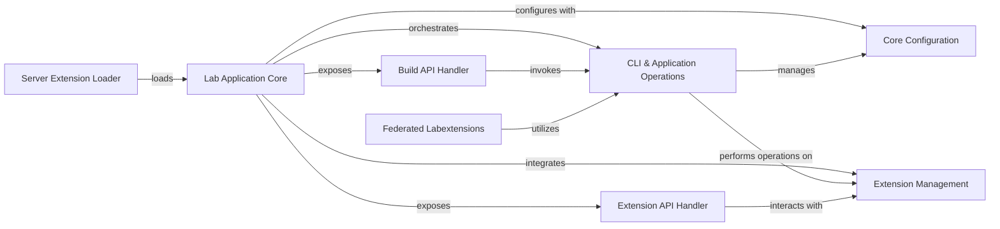

## Component Details

This graph illustrates the core components and their interactions within the JupyterLab application, focusing on the command-line interface, application operations, and extension management. The Lab Application Core acts as the central orchestrator, launching the server and integrating various functionalities. It exposes API handlers for building and managing extensions, which in turn interact with the CLI & Application Operations component for performing the actual tasks. The Core Configuration component provides essential build system settings, managed by the CLI & Application Operations. The Server Extension Loader ensures JupyterLab can function as a server extension, while Federated Labextensions leverage the CLI & Application Operations for development tasks.

### CLI & Application Operations
Provides a comprehensive set of command-line interface functions and internal application operations for managing JupyterLab, including installing, uninstalling, updating, linking, and building extensions, as well as managing application directories and ensuring node modules. It serves as the primary operational interface for various application-level tasks.

**Related Classes/Methods**:

- <a href="https://github.com/jupyterlab/jupyterlab/blob/master/jupyterlab/commands.py#L69-L131" target="_blank" rel="noopener noreferrer">`jupyterlab.jupyterlab.commands.ProgressProcess` (69:131)</a>
- <a href="https://github.com/jupyterlab/jupyterlab/blob/master/jupyterlab/commands.py#L139-L143" target="_blank" rel="noopener noreferrer">`jupyterlab.jupyterlab.commands:get_user_settings_dir` (139:143)</a>
- <a href="https://github.com/jupyterlab/jupyterlab/blob/master/jupyterlab/commands.py#L146-L150" target="_blank" rel="noopener noreferrer">`jupyterlab.jupyterlab.commands:get_workspaces_dir` (146:150)</a>
- <a href="https://github.com/jupyterlab/jupyterlab/blob/master/jupyterlab/commands.py#L153-L182" target="_blank" rel="noopener noreferrer">`jupyterlab.jupyterlab.commands:get_app_dir` (153:182)</a>
- <a href="https://github.com/jupyterlab/jupyterlab/blob/master/jupyterlab/commands.py#L185-L212" target="_blank" rel="noopener noreferrer">`jupyterlab.jupyterlab.commands:dedupe_yarn` (185:212)</a>
- <a href="https://github.com/jupyterlab/jupyterlab/blob/master/jupyterlab/commands.py#L215-L232" target="_blank" rel="noopener noreferrer">`jupyterlab.jupyterlab.commands:ensure_node_modules` (215:232)</a>
- <a href="https://github.com/jupyterlab/jupyterlab/blob/master/jupyterlab/commands.py#L235-L243" target="_blank" rel="noopener noreferrer">`jupyterlab.jupyterlab.commands:ensure_dev` (235:243)</a>
- <a href="https://github.com/jupyterlab/jupyterlab/blob/master/jupyterlab/commands.py#L246-L256" target="_blank" rel="noopener noreferrer">`jupyterlab.jupyterlab.commands:ensure_core` (246:256)</a>
- <a href="https://github.com/jupyterlab/jupyterlab/blob/master/jupyterlab/commands.py#L259-L272" target="_blank" rel="noopener noreferrer">`jupyterlab.jupyterlab.commands:ensure_app` (259:272)</a>
- <a href="https://github.com/jupyterlab/jupyterlab/blob/master/jupyterlab/commands.py#L275-L298" target="_blank" rel="noopener noreferrer">`jupyterlab.jupyterlab.commands:watch_packages` (275:298)</a>
- <a href="https://github.com/jupyterlab/jupyterlab/blob/master/jupyterlab/commands.py#L301-L325" target="_blank" rel="noopener noreferrer">`jupyterlab.jupyterlab.commands:watch_dev` (301:325)</a>
- <a href="https://github.com/jupyterlab/jupyterlab/blob/master/jupyterlab/commands.py#L328-L391" target="_blank" rel="noopener noreferrer">`jupyterlab.jupyterlab.commands.AppOptions` (328:391)</a>
- <a href="https://github.com/jupyterlab/jupyterlab/blob/master/jupyterlab/commands.py#L394-L401" target="_blank" rel="noopener noreferrer">`jupyterlab.jupyterlab.commands:_ensure_options` (394:401)</a>
- <a href="https://github.com/jupyterlab/jupyterlab/blob/master/jupyterlab/commands.py#L404-L422" target="_blank" rel="noopener noreferrer">`jupyterlab.jupyterlab.commands:watch` (404:422)</a>
- <a href="https://github.com/jupyterlab/jupyterlab/blob/master/jupyterlab/commands.py#L425-L435" target="_blank" rel="noopener noreferrer">`jupyterlab.jupyterlab.commands:install_extension` (425:435)</a>
- <a href="https://github.com/jupyterlab/jupyterlab/blob/master/jupyterlab/commands.py#L438-L448" target="_blank" rel="noopener noreferrer">`jupyterlab.jupyterlab.commands:uninstall_extension` (438:448)</a>
- <a href="https://github.com/jupyterlab/jupyterlab/blob/master/jupyterlab/commands.py#L451-L462" target="_blank" rel="noopener noreferrer">`jupyterlab.jupyterlab.commands:update_extension` (451:462)</a>
- <a href="https://github.com/jupyterlab/jupyterlab/blob/master/jupyterlab/commands.py#L465-L496" target="_blank" rel="noopener noreferrer">`jupyterlab.jupyterlab.commands:clean` (465:496)</a>
- <a href="https://github.com/jupyterlab/jupyterlab/blob/master/jupyterlab/commands.py#L499-L520" target="_blank" rel="noopener noreferrer">`jupyterlab.jupyterlab.commands:build` (499:520)</a>
- <a href="https://github.com/jupyterlab/jupyterlab/blob/master/jupyterlab/commands.py#L523-L527" target="_blank" rel="noopener noreferrer">`jupyterlab.jupyterlab.commands:get_app_info` (523:527)</a>
- <a href="https://github.com/jupyterlab/jupyterlab/blob/master/jupyterlab/commands.py#L530-L536" target="_blank" rel="noopener noreferrer">`jupyterlab.jupyterlab.commands:enable_extension` (530:536)</a>
- <a href="https://github.com/jupyterlab/jupyterlab/blob/master/jupyterlab/commands.py#L539-L545" target="_blank" rel="noopener noreferrer">`jupyterlab.jupyterlab.commands:disable_extension` (539:545)</a>
- <a href="https://github.com/jupyterlab/jupyterlab/blob/master/jupyterlab/commands.py#L548-L551" target="_blank" rel="noopener noreferrer">`jupyterlab.jupyterlab.commands:check_extension` (548:551)</a>
- <a href="https://github.com/jupyterlab/jupyterlab/blob/master/jupyterlab/commands.py#L554-L557" target="_blank" rel="noopener noreferrer">`jupyterlab.jupyterlab.commands:lock_extension` (554:557)</a>
- <a href="https://github.com/jupyterlab/jupyterlab/blob/master/jupyterlab/commands.py#L560-L563" target="_blank" rel="noopener noreferrer">`jupyterlab.jupyterlab.commands:unlock_extension` (560:563)</a>
- <a href="https://github.com/jupyterlab/jupyterlab/blob/master/jupyterlab/commands.py#L566-L574" target="_blank" rel="noopener noreferrer">`jupyterlab.jupyterlab.commands:build_check` (566:574)</a>
- <a href="https://github.com/jupyterlab/jupyterlab/blob/master/jupyterlab/commands.py#L577-L580" target="_blank" rel="noopener noreferrer">`jupyterlab.jupyterlab.commands:list_extensions` (577:580)</a>
- <a href="https://github.com/jupyterlab/jupyterlab/blob/master/jupyterlab/commands.py#L583-L589" target="_blank" rel="noopener noreferrer">`jupyterlab.jupyterlab.commands:link_package` (583:589)</a>
- <a href="https://github.com/jupyterlab/jupyterlab/blob/master/jupyterlab/commands.py#L592-L598" target="_blank" rel="noopener noreferrer">`jupyterlab.jupyterlab.commands:unlink_package` (592:598)</a>
- <a href="https://github.com/jupyterlab/jupyterlab/blob/master/jupyterlab/commands.py#L601-L604" target="_blank" rel="noopener noreferrer">`jupyterlab.jupyterlab.commands:get_app_version` (601:604)</a>
- <a href="https://github.com/jupyterlab/jupyterlab/blob/master/jupyterlab/commands.py#L607-L610" target="_blank" rel="noopener noreferrer">`jupyterlab.jupyterlab.commands:get_latest_compatible_package_versions` (607:610)</a>
- <a href="https://github.com/jupyterlab/jupyterlab/blob/master/jupyterlab/commands.py#L627-L2075" target="_blank" rel="noopener noreferrer">`jupyterlab.jupyterlab.commands._AppHandler` (627:2075)</a>
- <a href="https://github.com/jupyterlab/jupyterlab/blob/master/jupyterlab/commands.py#L628-L657" target="_blank" rel="noopener noreferrer">`jupyterlab.jupyterlab.commands._AppHandler:__init__` (628:657)</a>
- <a href="https://github.com/jupyterlab/jupyterlab/blob/master/jupyterlab/commands.py#L659-L703" target="_blank" rel="noopener noreferrer">`jupyterlab.jupyterlab.commands._AppHandler:install_extension` (659:703)</a>
- <a href="https://github.com/jupyterlab/jupyterlab/blob/master/jupyterlab/commands.py#L705-L754" target="_blank" rel="noopener noreferrer">`jupyterlab.jupyterlab.commands._AppHandler:build` (705:754)</a>
- <a href="https://github.com/jupyterlab/jupyterlab/blob/master/jupyterlab/commands.py#L756-L774" target="_blank" rel="noopener noreferrer">`jupyterlab.jupyterlab.commands._AppHandler:watch` (756:774)</a>
- <a href="https://github.com/jupyterlab/jupyterlab/blob/master/jupyterlab/commands.py#L776-L845" target="_blank" rel="noopener noreferrer">`jupyterlab.jupyterlab.commands._AppHandler:list_extensions` (776:845)</a>
- <a href="https://github.com/jupyterlab/jupyterlab/blob/master/jupyterlab/commands.py#L847-L928" target="_blank" rel="noopener noreferrer">`jupyterlab.jupyterlab.commands._AppHandler:build_check` (847:928)</a>
- <a href="https://github.com/jupyterlab/jupyterlab/blob/master/jupyterlab/commands.py#L930-L983" target="_blank" rel="noopener noreferrer">`jupyterlab.jupyterlab.commands._AppHandler:uninstall_extension` (930:983)</a>
- <a href="https://github.com/jupyterlab/jupyterlab/blob/master/jupyterlab/commands.py#L985-L994" target="_blank" rel="noopener noreferrer">`jupyterlab.jupyterlab.commands._AppHandler:uninstall_all_extensions` (985:994)</a>
- <a href="https://github.com/jupyterlab/jupyterlab/blob/master/jupyterlab/commands.py#L996-L1008" target="_blank" rel="noopener noreferrer">`jupyterlab.jupyterlab.commands._AppHandler:update_all_extensions` (996:1008)</a>
- <a href="https://github.com/jupyterlab/jupyterlab/blob/master/jupyterlab/commands.py#L1010-L1018" target="_blank" rel="noopener noreferrer">`jupyterlab.jupyterlab.commands._AppHandler:update_extension` (1010:1018)</a>
- <a href="https://github.com/jupyterlab/jupyterlab/blob/master/jupyterlab/commands.py#L1020-L1040" target="_blank" rel="noopener noreferrer">`jupyterlab.jupyterlab.commands._AppHandler:_update_extension` (1020:1040)</a>
- <a href="https://github.com/jupyterlab/jupyterlab/blob/master/jupyterlab/commands.py#L1042-L1071" target="_blank" rel="noopener noreferrer">`jupyterlab.jupyterlab.commands._AppHandler:link_package` (1042:1071)</a>
- <a href="https://github.com/jupyterlab/jupyterlab/blob/master/jupyterlab/commands.py#L1073-L1106" target="_blank" rel="noopener noreferrer">`jupyterlab.jupyterlab.commands._AppHandler:unlink_package` (1073:1106)</a>
- <a href="https://github.com/jupyterlab/jupyterlab/blob/master/jupyterlab/commands.py#L1120-L1161" target="_blank" rel="noopener noreferrer">`jupyterlab.jupyterlab.commands._AppHandler:toggle_extension` (1120:1161)</a>
- <a href="https://github.com/jupyterlab/jupyterlab/blob/master/jupyterlab/commands.py#L1188-L1209" target="_blank" rel="noopener noreferrer">`jupyterlab.jupyterlab.commands._AppHandler:toggle_extension_lock` (1188:1209)</a>
- <a href="https://github.com/jupyterlab/jupyterlab/blob/master/jupyterlab/commands.py#L1211-L1223" target="_blank" rel="noopener noreferrer">`jupyterlab.jupyterlab.commands._AppHandler:check_extension` (1211:1223)</a>
- <a href="https://github.com/jupyterlab/jupyterlab/blob/master/jupyterlab/commands.py#L1239-L1259" target="_blank" rel="noopener noreferrer">`jupyterlab.jupyterlab.commands._AppHandler:_check_common_extension` (1239:1259)</a>
- <a href="https://github.com/jupyterlab/jupyterlab/blob/master/jupyterlab/commands.py#L1261-L1295" target="_blank" rel="noopener noreferrer">`jupyterlab.jupyterlab.commands._AppHandler:_get_app_info` (1261:1295)</a>
- <a href="https://github.com/jupyterlab/jupyterlab/blob/master/jupyterlab/commands.py#L1329-L1468" target="_blank" rel="noopener noreferrer">`jupyterlab.jupyterlab.commands._AppHandler:_populate_staging` (1329:1468)</a>
- <a href="https://github.com/jupyterlab/jupyterlab/blob/master/jupyterlab/commands.py#L1470-L1543" target="_blank" rel="noopener noreferrer">`jupyterlab.jupyterlab.commands._AppHandler:_get_package_template` (1470:1543)</a>
- <a href="https://github.com/jupyterlab/jupyterlab/blob/master/jupyterlab/commands.py#L1545-L1558" target="_blank" rel="noopener noreferrer">`jupyterlab.jupyterlab.commands._AppHandler:_check_local` (1545:1558)</a>
- <a href="https://github.com/jupyterlab/jupyterlab/blob/master/jupyterlab/commands.py#L1560-L1582" target="_blank" rel="noopener noreferrer">`jupyterlab.jupyterlab.commands._AppHandler:_update_local` (1560:1582)</a>
- <a href="https://github.com/jupyterlab/jupyterlab/blob/master/jupyterlab/commands.py#L1584-L1602" target="_blank" rel="noopener noreferrer">`jupyterlab.jupyterlab.commands._AppHandler:_get_extensions` (1584:1602)</a>
- <a href="https://github.com/jupyterlab/jupyterlab/blob/master/jupyterlab/commands.py#L1604-L1634" target="_blank" rel="noopener noreferrer">`jupyterlab.jupyterlab.commands._AppHandler:_get_extensions_in_dir` (1604:1634)</a>
- <a href="https://github.com/jupyterlab/jupyterlab/blob/master/jupyterlab/commands.py#L1636-L1650" target="_blank" rel="noopener noreferrer">`jupyterlab.jupyterlab.commands._AppHandler:_get_extension_compat` (1636:1650)</a>
- <a href="https://github.com/jupyterlab/jupyterlab/blob/master/jupyterlab/commands.py#L1652-L1654" target="_blank" rel="noopener noreferrer">`jupyterlab.jupyterlab.commands._AppHandler:_get_local_extensions` (1652:1654)</a>
- <a href="https://github.com/jupyterlab/jupyterlab/blob/master/jupyterlab/commands.py#L1656-L1679" target="_blank" rel="noopener noreferrer">`jupyterlab.jupyterlab.commands._AppHandler:_get_linked_packages` (1656:1679)</a>
- <a href="https://github.com/jupyterlab/jupyterlab/blob/master/jupyterlab/commands.py#L1681-L1684" target="_blank" rel="noopener noreferrer">`jupyterlab.jupyterlab.commands._AppHandler:_get_uninstalled_core_extensions` (1681:1684)</a>
- <a href="https://github.com/jupyterlab/jupyterlab/blob/master/jupyterlab/commands.py#L1686-L1696" target="_blank" rel="noopener noreferrer">`jupyterlab.jupyterlab.commands._AppHandler:_ensure_app_dirs` (1686:1696)</a>
- <a href="https://github.com/jupyterlab/jupyterlab/blob/master/jupyterlab/commands.py#L1698-L1732" target="_blank" rel="noopener noreferrer">`jupyterlab.jupyterlab.commands._AppHandler:_list_extensions` (1698:1732)</a>
- <a href="https://github.com/jupyterlab/jupyterlab/blob/master/jupyterlab/commands.py#L1734-L1767" target="_blank" rel="noopener noreferrer">`jupyterlab.jupyterlab.commands._AppHandler:_list_federated_extensions` (1734:1767)</a>
- <a href="https://github.com/jupyterlab/jupyterlab/blob/master/jupyterlab/commands.py#L1769-L1787" target="_blank" rel="noopener noreferrer">`jupyterlab.jupyterlab.commands._AppHandler:_compose_extra_status` (1769:1787)</a>
- <a href="https://github.com/jupyterlab/jupyterlab/blob/master/jupyterlab/commands.py#L1789-L1796" target="_blank" rel="noopener noreferrer">`jupyterlab.jupyterlab.commands._AppHandler:_read_build_config` (1789:1796)</a>
- <a href="https://github.com/jupyterlab/jupyterlab/blob/master/jupyterlab/commands.py#L1798-L1803" target="_blank" rel="noopener noreferrer">`jupyterlab.jupyterlab.commands._AppHandler:_write_build_config` (1798:1803)</a>
- <a href="https://github.com/jupyterlab/jupyterlab/blob/master/jupyterlab/commands.py#L1805-L1824" target="_blank" rel="noopener noreferrer">`jupyterlab.jupyterlab.commands._AppHandler:_get_local_data` (1805:1824)</a>
- <a href="https://github.com/jupyterlab/jupyterlab/blob/master/jupyterlab/commands.py#L1826-L1883" target="_blank" rel="noopener noreferrer">`jupyterlab.jupyterlab.commands._AppHandler:_install_extension` (1826:1883)</a>
- <a href="https://github.com/jupyterlab/jupyterlab/blob/master/jupyterlab/commands.py#L1885-L1922" target="_blank" rel="noopener noreferrer">`jupyterlab.jupyterlab.commands._AppHandler:_extract_package` (1885:1922)</a>
- <a href="https://github.com/jupyterlab/jupyterlab/blob/master/jupyterlab/commands.py#L1924-L1955" target="_blank" rel="noopener noreferrer">`jupyterlab.jupyterlab.commands._AppHandler:_latest_compatible_package_version` (1924:1955)</a>
- <a href="https://github.com/jupyterlab/jupyterlab/blob/master/jupyterlab/commands.py#L1957-L2007" target="_blank" rel="noopener noreferrer">`jupyterlab.jupyterlab.commands._AppHandler:latest_compatible_package_versions` (1957:2007)</a>
- <a href="https://github.com/jupyterlab/jupyterlab/blob/master/jupyterlab/commands.py#L2009-L2061" target="_blank" rel="noopener noreferrer">`jupyterlab.jupyterlab.commands._AppHandler:_format_no_compatible_package_version` (2009:2061)</a>
- <a href="https://github.com/jupyterlab/jupyterlab/blob/master/jupyterlab/commands.py#L2063-L2075" target="_blank" rel="noopener noreferrer">`jupyterlab.jupyterlab.commands._AppHandler:_run` (2063:2075)</a>
- <a href="https://github.com/jupyterlab/jupyterlab/blob/master/jupyterlab/commands.py#L2078-L2088" target="_blank" rel="noopener noreferrer">`jupyterlab.jupyterlab.commands:_node_check` (2078:2088)</a>
- <a href="https://github.com/jupyterlab/jupyterlab/blob/master/jupyterlab/commands.py#L2167-L2174" target="_blank" rel="noopener noreferrer">`jupyterlab.jupyterlab.commands:_rmtree_star` (2167:2174)</a>
- <a href="https://github.com/jupyterlab/jupyterlab/blob/master/jupyterlab/commands.py#L2251-L2258" target="_blank" rel="noopener noreferrer">`jupyterlab.jupyterlab.commands:_get_static_data` (2251:2258)</a>
- <a href="https://github.com/jupyterlab/jupyterlab/blob/master/jupyterlab/commands.py#L2261-L2277" target="_blank" rel="noopener noreferrer">`jupyterlab.jupyterlab.commands:_validate_compatibility` (2261:2277)</a>
- <a href="https://github.com/jupyterlab/jupyterlab/blob/master/jupyterlab/commands.py#L2280-L2291" target="_blank" rel="noopener noreferrer">`jupyterlab.jupyterlab.commands:_test_overlap` (2280:2291)</a>
- <a href="https://github.com/jupyterlab/jupyterlab/blob/master/jupyterlab/commands.py#L2294-L2380" target="_blank" rel="noopener noreferrer">`jupyterlab.jupyterlab.commands:_compare_ranges` (2294:2380)</a>
- <a href="https://github.com/jupyterlab/jupyterlab/blob/master/jupyterlab/commands.py#L2404-L2421" target="_blank" rel="noopener noreferrer">`jupyterlab.jupyterlab.commands:_is_locked` (2404:2421)</a>
- <a href="https://github.com/jupyterlab/jupyterlab/blob/master/jupyterlab/commands.py#L2424-L2446" target="_blank" rel="noopener noreferrer">`jupyterlab.jupyterlab.commands:_format_compatibility_errors` (2424:2446)</a>
- <a href="https://github.com/jupyterlab/jupyterlab/blob/master/jupyterlab/commands.py#L2449-L2481" target="_blank" rel="noopener noreferrer">`jupyterlab.jupyterlab.commands:_log_multiple_compat_errors` (2449:2481)</a>
- <a href="https://github.com/jupyterlab/jupyterlab/blob/master/jupyterlab/commands.py#L2484-L2492" target="_blank" rel="noopener noreferrer">`jupyterlab.jupyterlab.commands:_log_single_compat_errors` (2484:2492)</a>
- <a href="https://github.com/jupyterlab/jupyterlab/blob/master/jupyterlab/commands.py#L2495-L2518" target="_blank" rel="noopener noreferrer">`jupyterlab.jupyterlab.commands:_compat_error_age` (2495:2518)</a>
- <a href="https://github.com/jupyterlab/jupyterlab/blob/master/jupyterlab/commands.py#L2551-L2573" target="_blank" rel="noopener noreferrer">`jupyterlab.jupyterlab.commands:_semver_key` (2551:2573)</a>
- <a href="https://github.com/jupyterlab/jupyterlab/blob/master/jupyterlab/labextensions.py#L154-L157" target="_blank" rel="noopener noreferrer">`jupyterlab.jupyterlab.labextensions.BaseExtensionApp:_default_labextensions_path` (154:157)</a>
- <a href="https://github.com/jupyterlab/jupyterlab/blob/master/jupyterlab/labextensions.py#L160-L162" target="_blank" rel="noopener noreferrer">`jupyterlab.jupyterlab.labextensions.BaseExtensionApp:_default_splice_source` (160:162)</a>
- <a href="https://github.com/jupyterlab/jupyterlab/blob/master/jupyterlab/labextensions.py#L164-L183" target="_blank" rel="noopener noreferrer">`jupyterlab.jupyterlab.labextensions.BaseExtensionApp:start` (164:183)</a>
- <a href="https://github.com/jupyterlab/jupyterlab/blob/master/jupyterlab/labextensions.py#L217-L236" target="_blank" rel="noopener noreferrer">`jupyterlab.jupyterlab.labextensions.InstallLabExtensionApp:run_task` (217:236)</a>
- <a href="https://github.com/jupyterlab/jupyterlab/blob/master/jupyterlab/labextensions.py#L254-L266" target="_blank" rel="noopener noreferrer">`jupyterlab.jupyterlab.labextensions.DevelopLabExtensionApp:run_task` (254:266)</a>
- <a href="https://github.com/jupyterlab/jupyterlab/blob/master/jupyterlab/labextensions.py#L291-L300" target="_blank" rel="noopener noreferrer">`jupyterlab.jupyterlab.labextensions.BuildLabExtensionApp:run_task` (291:300)</a>
- <a href="https://github.com/jupyterlab/jupyterlab/blob/master/jupyterlab/labextensions.py#L322-L332" target="_blank" rel="noopener noreferrer">`jupyterlab.jupyterlab.labextensions.WatchLabExtensionApp:run_task` (322:332)</a>
- <a href="https://github.com/jupyterlab/jupyterlab/blob/master/jupyterlab/labextensions.py#L341-L358" target="_blank" rel="noopener noreferrer">`jupyterlab.jupyterlab.labextensions.UpdateLabExtensionApp:run_task` (341:358)</a>
- <a href="https://github.com/jupyterlab/jupyterlab/blob/master/jupyterlab/labextensions.py#L371-L379" target="_blank" rel="noopener noreferrer">`jupyterlab.jupyterlab.labextensions.LinkLabExtensionApp:run_task` (371:379)</a>
- <a href="https://github.com/jupyterlab/jupyterlab/blob/master/jupyterlab/labextensions.py#L385-L393" target="_blank" rel="noopener noreferrer">`jupyterlab.jupyterlab.labextensions.UnlinkLabExtensionApp:run_task` (385:393)</a>
- <a href="https://github.com/jupyterlab/jupyterlab/blob/master/jupyterlab/labextensions.py#L402-L416" target="_blank" rel="noopener noreferrer">`jupyterlab.jupyterlab.labextensions.UninstallLabExtensionApp:run_task` (402:416)</a>
- <a href="https://github.com/jupyterlab/jupyterlab/blob/master/jupyterlab/labextensions.py#L424-L433" target="_blank" rel="noopener noreferrer">`jupyterlab.jupyterlab.labextensions.ListLabExtensionsApp:run_task` (424:433)</a>
- <a href="https://github.com/jupyterlab/jupyterlab/blob/master/jupyterlab/labextensions.py#L444-L454" target="_blank" rel="noopener noreferrer">`jupyterlab.jupyterlab.labextensions.EnableLabExtensionsApp:run_task` (444:454)</a>
- <a href="https://github.com/jupyterlab/jupyterlab/blob/master/jupyterlab/labextensions.py#L465-L481" target="_blank" rel="noopener noreferrer">`jupyterlab.jupyterlab.labextensions.DisableLabExtensionsApp:run_task` (465:481)</a>
- <a href="https://github.com/jupyterlab/jupyterlab/blob/master/jupyterlab/labextensions.py#L492-L499" target="_blank" rel="noopener noreferrer">`jupyterlab.jupyterlab.labextensions.LockLabExtensionsApp:run_task` (492:499)</a>
- <a href="https://github.com/jupyterlab/jupyterlab/blob/master/jupyterlab/labextensions.py#L510-L520" target="_blank" rel="noopener noreferrer">`jupyterlab.jupyterlab.labextensions.UnlockLabExtensionsApp:run_task` (510:520)</a>
- <a href="https://github.com/jupyterlab/jupyterlab/blob/master/jupyterlab/labextensions.py#L533-L547" target="_blank" rel="noopener noreferrer">`jupyterlab.jupyterlab.labextensions.CheckLabExtensionsApp:run_task` (533:547)</a>

### Lab Application Core
The central application component responsible for launching the JupyterLab server, managing different operational modes (core, dev, app), and initializing various handlers and configurations. It acts as the orchestrator for the entire JupyterLab environment.

**Related Classes/Methods**:

- <a href="https://github.com/jupyterlab/jupyterlab/blob/master/jupyterlab/labapp.py#L416-L942" target="_blank" rel="noopener noreferrer">`jupyterlab.labapp.LabApp` (416:942)</a>
- <a href="https://github.com/jupyterlab/jupyterlab/blob/master/jupyterlab/labapp.py#L144-L209" target="_blank" rel="noopener noreferrer">`jupyterlab.labapp.LabBuildApp` (144:209)</a>
- <a href="https://github.com/jupyterlab/jupyterlab/blob/master/jupyterlab/labapp.py#L244-L283" target="_blank" rel="noopener noreferrer">`jupyterlab.labapp.LabCleanApp` (244:283)</a>
- <a href="https://github.com/jupyterlab/jupyterlab/blob/master/jupyterlab/labapp.py#L286-L304" target="_blank" rel="noopener noreferrer">`jupyterlab.labapp.LabPathApp` (286:304)</a>
- <a href="https://github.com/jupyterlab/jupyterlab/blob/master/jupyterlab/labapp.py#L331-L360" target="_blank" rel="noopener noreferrer">`jupyterlab.labapp.LabWorkspaceApp` (331:360)</a>
- <a href="https://github.com/jupyterlab/jupyterlab/blob/master/jupyterlab/labapp.py#L363-L397" target="_blank" rel="noopener noreferrer">`jupyterlab.labapp.LabLicensesApp` (363:397)</a>

### Extension Management
Defines the abstract framework for managing JupyterLab extensions. It provides core interfaces and data structures for listing, installing, uninstalling, enabling, and disabling extensions, acting as a blueprint for concrete extension manager implementations.

**Related Classes/Methods**:

- <a href="https://github.com/jupyterlab/jupyterlab/blob/master/jupyterlab/extensions/manager.py#L300-L690" target="_blank" rel="noopener noreferrer">`jupyterlab.extensions.manager.ExtensionManager` (300:690)</a>
- <a href="https://github.com/jupyterlab/jupyterlab/blob/master/jupyterlab/extensions/manager.py#L181-L297" target="_blank" rel="noopener noreferrer">`jupyterlab.extensions.manager.PluginManager` (181:297)</a>
- <a href="https://github.com/jupyterlab/jupyterlab/blob/master/jupyterlab/extensions/manager.py#L56-L101" target="_blank" rel="noopener noreferrer">`jupyterlab.extensions.manager.ExtensionPackage` (56:101)</a>
- <a href="https://github.com/jupyterlab/jupyterlab/blob/master/jupyterlab/extensions/manager.py#L105-L118" target="_blank" rel="noopener noreferrer">`jupyterlab.extensions.manager.ActionResult` (105:118)</a>

### Build API Handler
Exposes REST API endpoints for managing the JupyterLab application build process. It allows clients to query the build status, initiate a new build, or cancel an ongoing build, delegating the actual build logic to the CLI & Application Operations component.

**Related Classes/Methods**:

- <a href="https://github.com/jupyterlab/jupyterlab/blob/master/jupyterlab/handlers/build_handler.py#L17-L121" target="_blank" rel="noopener noreferrer">`jupyterlab.handlers.build_handler.Builder` (17:121)</a>
- <a href="https://github.com/jupyterlab/jupyterlab/blob/master/jupyterlab/handlers/build_handler.py#L124-L158" target="_blank" rel="noopener noreferrer">`jupyterlab.handlers.build_handler.BuildHandler` (124:158)</a>

### Extension API Handler
Provides REST API endpoints for interacting with the JupyterLab extension management system. It enables clients to list, install, uninstall, enable, and disable extensions through HTTP requests, acting as a bridge between the frontend and the Extension Management component.

**Related Classes/Methods**:

- <a href="https://github.com/jupyterlab/jupyterlab/blob/master/jupyterlab/handlers/extension_manager_handler.py#L16-L136" target="_blank" rel="noopener noreferrer">`jupyterlab.handlers.extension_manager_handler.ExtensionHandler` (16:136)</a>

### Core Configuration
Manages the fundamental configuration data for the JupyterLab build system, including definitions for core dependencies, extensions, and singleton packages. It provides methods to add, remove, and clear package configurations.

**Related Classes/Methods**:

- <a href="https://github.com/jupyterlab/jupyterlab/blob/master/jupyterlab/coreconfig.py#L42-L159" target="_blank" rel="noopener noreferrer">`jupyterlab.coreconfig.CoreConfig` (42:159)</a>

### Server Extension Loader
A compatibility layer that allows JupyterLab to be loaded as a server extension within a Jupyter Server environment. It initializes the main JupyterLab application and registers its handlers with the server.

**Related Classes/Methods**:

- <a href="https://github.com/jupyterlab/jupyterlab/blob/master/jupyterlab/serverextension.py#L8-L71" target="_blank" rel="noopener noreferrer">`jupyterlab.serverextension.load_jupyter_server_extension` (8:71)</a>

### Federated Labextensions
Provides utilities for developing and managing JavaScript extensions for JupyterLab, specifically focusing on 'federated' extensions. It handles tasks like symlinking extension source directories and building extensions using Node.js tools.

**Related Classes/Methods**:

- <a href="https://github.com/jupyterlab/jupyterlab/blob/master/jupyterlab/federated_labextensions.py#L46-L151" target="_blank" rel="noopener noreferrer">`jupyterlab.federated_labextensions.develop_labextension` (46:151)</a>
- <a href="https://github.com/jupyterlab/jupyterlab/blob/master/jupyterlab/federated_labextensions.py#L154-L194" target="_blank" rel="noopener noreferrer">`jupyterlab.federated_labextensions.develop_labextension_py` (154:194)</a>
- <a href="https://github.com/jupyterlab/jupyterlab/blob/master/jupyterlab/federated_labextensions.py#L197-L218" target="_blank" rel="noopener noreferrer">`jupyterlab.federated_labextensions.build_labextension` (197:218)</a>
- <a href="https://github.com/jupyterlab/jupyterlab/blob/master/jupyterlab/federated_labextensions.py#L221-L253" target="_blank" rel="noopener noreferrer">`jupyterlab.federated_labextensions.watch_labextension` (221:253)</a>

### [FAQ](https://github.com/CodeBoarding/GeneratedOnBoardings/tree/main?tab=readme-ov-file#faq)