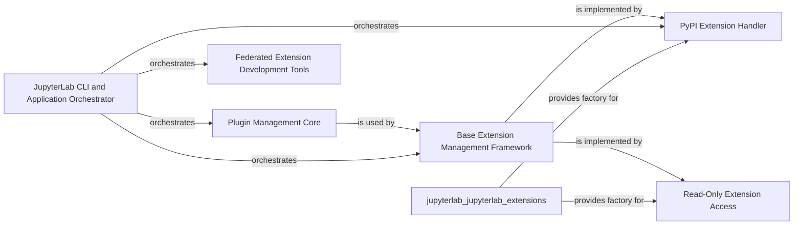

## Component Details

The Extension Management subsystem in JupyterLab provides a comprehensive framework for managing extensions, encompassing plugin management, listing, installation, uninstallation, and compatibility checks. It supports various extension sources, including PyPI and read-only modes, and offers specialized functionalities for federated extensions. The core flow involves different managers handling specific extension types, all orchestrated by a central CLI and application component. This system ensures that extensions are properly integrated, managed, and compatible with the JupyterLab environment, facilitating both user-friendly extension management and developer-centric tools for federated extensions.

### Plugin Management Core
Manages the activation and deactivation of individual plugins within extensions, enforcing rules for locked components. It's a core utility used by higher-level extension managers and handles compatibility checks related to plugins.

**Related Classes/Methods**:

- <a href="https://github.com/jupyterlab/jupyterlab/blob/master/jupyterlab/extensions/manager.py#L28-L31" target="_blank" rel="noopener noreferrer">`jupyterlab.jupyterlab.extensions.manager._ensure_compat_errors` (28:31)</a>
- <a href="https://github.com/jupyterlab/jupyterlab/blob/master/jupyterlab/extensions/manager.py#L41-L52" target="_blank" rel="noopener noreferrer">`jupyterlab.jupyterlab.extensions.manager._build_check_info` (41:52)</a>
- <a href="https://github.com/jupyterlab/jupyterlab/blob/master/jupyterlab/extensions/manager.py#L181-L297" target="_blank" rel="noopener noreferrer">`jupyterlab.jupyterlab.extensions.manager.PluginManager` (181:297)</a>
- <a href="https://github.com/jupyterlab/jupyterlab/blob/master/jupyterlab/extensions/manager.py#L202-L219" target="_blank" rel="noopener noreferrer">`jupyterlab.jupyterlab.extensions.manager.PluginManager:__init__` (202:219)</a>
- <a href="https://github.com/jupyterlab/jupyterlab/blob/master/jupyterlab/extensions/manager.py#L247-L271" target="_blank" rel="noopener noreferrer">`jupyterlab.jupyterlab.extensions.manager.PluginManager:disable` (247:271)</a>
- <a href="https://github.com/jupyterlab/jupyterlab/blob/master/jupyterlab/extensions/manager.py#L273-L297" target="_blank" rel="noopener noreferrer">`jupyterlab.jupyterlab.extensions.manager.PluginManager:enable` (273:297)</a>

### Base Extension Management Framework
Provides the fundamental interface and shared functionalities for managing JupyterLab extensions, including listing, refreshing, and retrieving metadata. It serves as a base for specific extension sources and utilizes the Plugin Management Core.

**Related Classes/Methods**:

- <a href="https://github.com/jupyterlab/jupyterlab/blob/master/jupyterlab/extensions/manager.py#L300-L690" target="_blank" rel="noopener noreferrer">`jupyterlab.jupyterlab.extensions.manager.ExtensionManager` (300:690)</a>
- <a href="https://github.com/jupyterlab/jupyterlab/blob/master/jupyterlab/extensions/manager.py#L328-L356" target="_blank" rel="noopener noreferrer">`jupyterlab.jupyterlab.extensions.manager.ExtensionManager:__init__` (328:356)</a>
- <a href="https://github.com/jupyterlab/jupyterlab/blob/master/jupyterlab/extensions/manager.py#L458-L502" target="_blank" rel="noopener noreferrer">`jupyterlab.jupyterlab.extensions.manager.ExtensionManager:list_extensions` (458:502)</a>
- <a href="https://github.com/jupyterlab/jupyterlab/blob/master/jupyterlab/extensions/manager.py#L504-L508" target="_blank" rel="noopener noreferrer">`jupyterlab.jupyterlab.extensions.manager.ExtensionManager:refresh` (504:508)</a>
- <a href="https://github.com/jupyterlab/jupyterlab/blob/master/jupyterlab/extensions/manager.py#L540-L644" target="_blank" rel="noopener noreferrer">`jupyterlab.jupyterlab.extensions.manager.ExtensionManager:_get_installed_extensions` (540:644)</a>
- <a href="https://github.com/jupyterlab/jupyterlab/blob/master/jupyterlab/extensions/manager.py#L674-L690" target="_blank" rel="noopener noreferrer">`jupyterlab.jupyterlab.extensions.manager.ExtensionManager:_update_extensions_list` (674:690)</a>

### PyPI Extension Handler
Specializes in handling JupyterLab extensions distributed via PyPI, providing capabilities for installation, uninstallation, and fetching package metadata by interacting with pip and PyPI's API.

**Related Classes/Methods**:

- <a href="https://github.com/jupyterlab/jupyterlab/blob/master/jupyterlab/extensions/pypi.py#L122-L576" target="_blank" rel="noopener noreferrer">`jupyterlab.jupyterlab.extensions.pypi.PyPIExtensionManager` (122:576)</a>
- <a href="https://github.com/jupyterlab/jupyterlab/blob/master/jupyterlab/extensions/pypi.py#L141-L165" target="_blank" rel="noopener noreferrer">`jupyterlab.jupyterlab.extensions.pypi.PyPIExtensionManager:__init__` (141:165)</a>
- <a href="https://github.com/jupyterlab/jupyterlab/blob/master/jupyterlab/extensions/pypi.py#L168-L170" target="_blank" rel="noopener noreferrer">`jupyterlab.jupyterlab.extensions.pypi.PyPIExtensionManager:metadata` (168:170)</a>
- <a href="https://github.com/jupyterlab/jupyterlab/blob/master/jupyterlab/extensions/pypi.py#L172-L193" target="_blank" rel="noopener noreferrer">`jupyterlab.jupyterlab.extensions.pypi.PyPIExtensionManager:get_latest_version` (172:193)</a>
- <a href="https://github.com/jupyterlab/jupyterlab/blob/master/jupyterlab/extensions/pypi.py#L195-L212" target="_blank" rel="noopener noreferrer">`jupyterlab.jupyterlab.extensions.pypi.PyPIExtensionManager:get_normalized_name` (195:212)</a>
- <a href="https://github.com/jupyterlab/jupyterlab/blob/master/jupyterlab/extensions/pypi.py#L214-L246" target="_blank" rel="noopener noreferrer">`jupyterlab.jupyterlab.extensions.pypi.PyPIExtensionManager:__throttleRequest` (214:246)</a>
- <a href="https://github.com/jupyterlab/jupyterlab/blob/master/jupyterlab/extensions/pypi.py#L254-L354" target="_blank" rel="noopener noreferrer">`jupyterlab.jupyterlab.extensions.pypi.PyPIExtensionManager:list_packages` (254:354)</a>
- <a href="https://github.com/jupyterlab/jupyterlab/blob/master/jupyterlab/extensions/pypi.py#L356-L368" target="_blank" rel="noopener noreferrer">`jupyterlab.jupyterlab.extensions.pypi.PyPIExtensionManager:__get_all_extensions` (356:368)</a>
- <a href="https://github.com/jupyterlab/jupyterlab/blob/master/jupyterlab/extensions/pypi.py#L370-L491" target="_blank" rel="noopener noreferrer">`jupyterlab.jupyterlab.extensions.pypi.PyPIExtensionManager:install` (370:491)</a>
- <a href="https://github.com/jupyterlab/jupyterlab/blob/master/jupyterlab/extensions/pypi.py#L493-L564" target="_blank" rel="noopener noreferrer">`jupyterlab.jupyterlab.extensions.pypi.PyPIExtensionManager:uninstall` (493:564)</a>
- `jupyterlab.jupyterlab.extensions:get_pypi_manager` (full file reference)

### Read-Only Extension Access
Offers a restricted interface for viewing installed JupyterLab extensions, explicitly preventing any modifications such as installation or uninstallation, suitable for environments where extension changes are disallowed.

**Related Classes/Methods**:

- <a href="https://github.com/jupyterlab/jupyterlab/blob/master/jupyterlab/extensions/readonly.py#L14-L82" target="_blank" rel="noopener noreferrer">`jupyterlab.jupyterlab.extensions.readonly.ReadOnlyExtensionManager` (14:82)</a>
- <a href="https://github.com/jupyterlab/jupyterlab/blob/master/jupyterlab/extensions/readonly.py#L18-L20" target="_blank" rel="noopener noreferrer">`jupyterlab.jupyterlab.extensions.readonly.ReadOnlyExtensionManager:metadata` (18:20)</a>
- <a href="https://github.com/jupyterlab/jupyterlab/blob/master/jupyterlab/extensions/readonly.py#L47-L64" target="_blank" rel="noopener noreferrer">`jupyterlab.jupyterlab.extensions.readonly.ReadOnlyExtensionManager:install` (47:64)</a>
- <a href="https://github.com/jupyterlab/jupyterlab/blob/master/jupyterlab/extensions/readonly.py#L66-L82" target="_blank" rel="noopener noreferrer">`jupyterlab.jupyterlab.extensions.readonly.ReadOnlyExtensionManager:uninstall` (66:82)</a>
- `jupyterlab.jupyterlab.extensions:get_readonly_manager` (full file reference)

### JupyterLab CLI and Application Orchestrator
Acts as the central orchestrator for JupyterLab's command-line interface and application lifecycle, managing extension operations (install, uninstall, enable, disable, check), overseeing the application's build process, and providing core application information. It integrates various extension managers and handlers.

**Related Classes/Methods**:

- <a href="https://github.com/jupyterlab/jupyterlab/blob/master/jupyterlab/commands.py#L627-L2075" target="_blank" rel="noopener noreferrer">`jupyterlab.commands._AppHandler` (627:2075)</a>
- <a href="https://github.com/jupyterlab/jupyterlab/blob/master/jupyterlab/commands.py#L328-L391" target="_blank" rel="noopener noreferrer">`jupyterlab.commands.AppOptions` (328:391)</a>
- <a href="https://github.com/jupyterlab/jupyterlab/blob/master/jupyterlab/commands.py#L69-L131" target="_blank" rel="noopener noreferrer">`jupyterlab.commands.ProgressProcess` (69:131)</a>
- <a href="https://github.com/jupyterlab/jupyterlab/blob/master/jupyterlab/commands.py#L523-L527" target="_blank" rel="noopener noreferrer">`jupyterlab.commands.get_app_info` (523:527)</a>
- <a href="https://github.com/jupyterlab/jupyterlab/blob/master/jupyterlab/commands.py#L539-L545" target="_blank" rel="noopener noreferrer">`jupyterlab.commands.disable_extension` (539:545)</a>
- <a href="https://github.com/jupyterlab/jupyterlab/blob/master/jupyterlab/commands.py#L530-L536" target="_blank" rel="noopener noreferrer">`jupyterlab.commands.enable_extension` (530:536)</a>
- <a href="https://github.com/jupyterlab/jupyterlab/blob/master/jupyterlab/commands.py#L566-L574" target="_blank" rel="noopener noreferrer">`jupyterlab.commands.build_check` (566:574)</a>
- <a href="https://github.com/jupyterlab/jupyterlab/blob/master/jupyterlab/commands.py#L394-L401" target="_blank" rel="noopener noreferrer">`jupyterlab.commands._ensure_options` (394:401)</a>
- <a href="https://github.com/jupyterlab/jupyterlab/blob/master/jupyterlab/commands.py#L2280-L2291" target="_blank" rel="noopener noreferrer">`jupyterlab.commands._test_overlap` (2280:2291)</a>

### Federated Extension Development Tools
Provides a set of utilities for developers to manage JupyterLab federated extensions during their development lifecycle, including functionalities for installing from local sources, building, and live-reloading (watching) extensions.

**Related Classes/Methods**:

- <a href="https://github.com/jupyterlab/jupyterlab/blob/master/jupyterlab/federated_labextensions.py#L46-L151" target="_blank" rel="noopener noreferrer">`jupyterlab.jupyterlab.federated_labextensions:develop_labextension` (46:151)</a>
- <a href="https://github.com/jupyterlab/jupyterlab/blob/master/jupyterlab/federated_labextensions.py#L154-L194" target="_blank" rel="noopener noreferrer">`jupyterlab.jupyterlab.federated_labextensions:develop_labextension_py` (154:194)</a>
- <a href="https://github.com/jupyterlab/jupyterlab/blob/master/jupyterlab/federated_labextensions.py#L197-L218" target="_blank" rel="noopener noreferrer">`jupyterlab.jupyterlab.federated_labextensions:build_labextension` (197:218)</a>
- <a href="https://github.com/jupyterlab/jupyterlab/blob/master/jupyterlab/federated_labextensions.py#L221-L253" target="_blank" rel="noopener noreferrer">`jupyterlab.jupyterlab.federated_labextensions:watch_labextension` (221:253)</a>
- <a href="https://github.com/jupyterlab/jupyterlab/blob/master/jupyterlab/federated_labextensions.py#L261-L310" target="_blank" rel="noopener noreferrer">`jupyterlab.jupyterlab.federated_labextensions:_ensure_builder` (261:310)</a>
- <a href="https://github.com/jupyterlab/jupyterlab/blob/master/jupyterlab/federated_labextensions.py#L341-L357" target="_blank" rel="noopener noreferrer">`jupyterlab.jupyterlab.federated_labextensions:_maybe_copy` (341:357)</a>

### [FAQ](https://github.com/CodeBoarding/GeneratedOnBoardings/tree/main?tab=readme-ov-file#faq)