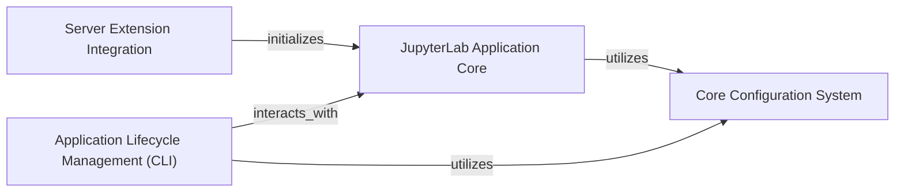

## Component Details

The JupyterLab Core System manages the main JupyterLab application lifecycle, including server extension loading, and provides fundamental configuration settings and data. It acts as the central orchestrator for the JupyterLab server and its core behavior.

### Server Extension Integration
This component is responsible for integrating JupyterLab as a server extension within a Jupyter server environment. It acts as the initial entry point, setting up the core JupyterLab application and its associated handlers.

**Related Classes/Methods**:

- <a href="https://github.com/jupyterlab/jupyterlab/blob/master/jupyterlab/serverextension.py#L8-L71" target="_blank" rel="noopener noreferrer">`jupyterlab.jupyterlab.serverextension:load_jupyter_server_extension` (8:71)</a>

### JupyterLab Application Core
This is the primary application component of JupyterLab, managing the overall lifecycle and behavior of the JupyterLab environment. It handles application modes (core, dev), initializes various server-side handlers, and defines default paths for application resources. It orchestrates interactions with other core components like configuration and extensions.

**Related Classes/Methods**:

- <a href="https://github.com/jupyterlab/jupyterlab/blob/master/jupyterlab/labapp.py#L416-L942" target="_blank" rel="noopener noreferrer">`jupyterlab.jupyterlab.labapp.LabApp` (416:942)</a>
- <a href="https://github.com/jupyterlab/jupyterlab/blob/master/jupyterlab/labapp.py#L626-L632" target="_blank" rel="noopener noreferrer">`jupyterlab.jupyterlab.labapp.LabApp:_default_app_dir` (626:632)</a>
- <a href="https://github.com/jupyterlab/jupyterlab/blob/master/jupyterlab/labapp.py#L635-L636" target="_blank" rel="noopener noreferrer">`jupyterlab.jupyterlab.labapp.LabApp:_default_app_settings_dir` (635:636)</a>
- <a href="https://github.com/jupyterlab/jupyterlab/blob/master/jupyterlab/labapp.py#L647-L648" target="_blank" rel="noopener noreferrer">`jupyterlab.jupyterlab.labapp.LabApp:_default_schemas_dir` (647:648)</a>
- <a href="https://github.com/jupyterlab/jupyterlab/blob/master/jupyterlab/labapp.py#L651-L652" target="_blank" rel="noopener noreferrer">`jupyterlab.jupyterlab.labapp.LabApp:_default_templates_dir` (651:652)</a>
- <a href="https://github.com/jupyterlab/jupyterlab/blob/master/jupyterlab/labapp.py#L655-L658" target="_blank" rel="noopener noreferrer">`jupyterlab.jupyterlab.labapp.LabApp:_default_themes_dir` (655:658)</a>
- <a href="https://github.com/jupyterlab/jupyterlab/blob/master/jupyterlab/labapp.py#L661-L662" target="_blank" rel="noopener noreferrer">`jupyterlab.jupyterlab.labapp.LabApp:_default_static_dir` (661:662)</a>
- <a href="https://github.com/jupyterlab/jupyterlab/blob/master/jupyterlab/labapp.py#L678-L722" target="_blank" rel="noopener noreferrer">`jupyterlab.jupyterlab.labapp.LabApp:initialize_templates` (678:722)</a>
- <a href="https://github.com/jupyterlab/jupyterlab/blob/master/jupyterlab/labapp.py#L728-L922" target="_blank" rel="noopener noreferrer">`jupyterlab.jupyterlab.labapp.LabApp:initialize_handlers` (728:922)</a>

### Application Lifecycle Management (CLI)
This component provides command-line functionalities for managing the JupyterLab application's lifecycle, including building, cleaning, path management, workspace operations (export, import, list), and license information display. These are distinct CLI applications that interact with the core system.

**Related Classes/Methods**:

- <a href="https://github.com/jupyterlab/jupyterlab/blob/master/jupyterlab/labapp.py#L144-L209" target="_blank" rel="noopener noreferrer">`jupyterlab.jupyterlab.labapp.LabBuildApp` (144:209)</a>
- <a href="https://github.com/jupyterlab/jupyterlab/blob/master/jupyterlab/labapp.py#L244-L283" target="_blank" rel="noopener noreferrer">`jupyterlab.jupyterlab.labapp.LabCleanApp` (244:283)</a>
- <a href="https://github.com/jupyterlab/jupyterlab/blob/master/jupyterlab/labapp.py#L286-L304" target="_blank" rel="noopener noreferrer">`jupyterlab.jupyterlab.labapp.LabPathApp` (286:304)</a>
- <a href="https://github.com/jupyterlab/jupyterlab/blob/master/jupyterlab/labapp.py#L307-L312" target="_blank" rel="noopener noreferrer">`jupyterlab.jupyterlab.labapp.LabWorkspaceExportApp` (307:312)</a>
- <a href="https://github.com/jupyterlab/jupyterlab/blob/master/jupyterlab/labapp.py#L315-L320" target="_blank" rel="noopener noreferrer">`jupyterlab.jupyterlab.labapp.LabWorkspaceImportApp` (315:320)</a>
- <a href="https://github.com/jupyterlab/jupyterlab/blob/master/jupyterlab/labapp.py#L323-L328" target="_blank" rel="noopener noreferrer">`jupyterlab.jupyterlab.labapp.LabWorkspaceListApp` (323:328)</a>
- <a href="https://github.com/jupyterlab/jupyterlab/blob/master/jupyterlab/labapp.py#L363-L397" target="_blank" rel="noopener noreferrer">`jupyterlab.jupyterlab.labapp.LabLicensesApp` (363:397)</a>

### Core Configuration System
This component handles the underlying configuration of JupyterLab's build system and core settings, specifically managing package resolutions, extensions, MIME extensions, and singleton packages. It provides methods to manipulate these core settings and is utilized by the main application and command-line tools.

**Related Classes/Methods**:

- <a href="https://github.com/jupyterlab/jupyterlab/blob/master/jupyterlab/coreconfig.py#L42-L159" target="_blank" rel="noopener noreferrer">`jupyterlab.jupyterlab.coreconfig.CoreConfig` (42:159)</a>
- <a href="https://github.com/jupyterlab/jupyterlab/blob/master/jupyterlab/coreconfig.py#L49-L50" target="_blank" rel="noopener noreferrer">`jupyterlab.jupyterlab.coreconfig.CoreConfig:__init__` (49:50)</a>
- <a href="https://github.com/jupyterlab/jupyterlab/blob/master/jupyterlab/coreconfig.py#L111-L131" target="_blank" rel="noopener noreferrer">`jupyterlab.jupyterlab.coreconfig.CoreConfig:clear_packages` (111:131)</a>
- <a href="https://github.com/jupyterlab/jupyterlab/blob/master/jupyterlab/coreconfig.py#L16-L19" target="_blank" rel="noopener noreferrer">`jupyterlab.jupyterlab.coreconfig:_get_default_core_data` (16:19)</a>
- <a href="https://github.com/jupyterlab/jupyterlab/blob/master/jupyterlab/coreconfig.py#L27-L39" target="_blank" rel="noopener noreferrer">`jupyterlab.jupyterlab.coreconfig:_only_nonlab` (27:39)</a>

### [FAQ](https://github.com/CodeBoarding/GeneratedOnBoardings/tree/main?tab=readme-ov-file#faq)