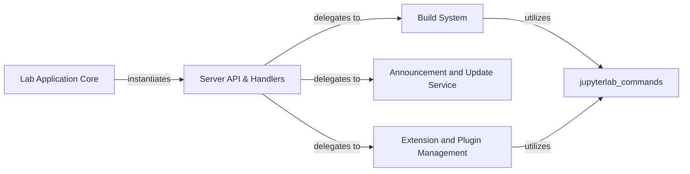

## Component Details

The Server API & Handlers component in JupyterLab is responsible for exposing various server-side functionalities through API endpoints. It acts as the primary interface for client-side requests related to the build process, fetching build status, managing announcements and update notifications, and handling extension and plugin operations. This component orchestrates interactions with underlying services and managers to fulfill client requests, ensuring proper authentication and error handling.

### Server API & Handlers
Manages server-side API endpoints for JupyterLab, handling requests related to the build process, retrieving build status, providing announcements and update notifications, and managing extensions and plugins. These handlers act as the interface between the client and the backend logic.

**Related Classes/Methods**:

- <a href="https://github.com/jupyterlab/jupyterlab/blob/master/jupyterlab/handlers/build_handler.py#L17-L121" target="_blank" rel="noopener noreferrer">`jupyterlab.jupyterlab.handlers.build_handler.Builder` (17:121)</a>
- <a href="https://github.com/jupyterlab/jupyterlab/blob/master/jupyterlab/handlers/build_handler.py#L25-L31" target="_blank" rel="noopener noreferrer">`jupyterlab.jupyterlab.handlers.build_handler.Builder:__init__` (25:31)</a>
- <a href="https://github.com/jupyterlab/jupyterlab/blob/master/jupyterlab/handlers/build_handler.py#L34-L55" target="_blank" rel="noopener noreferrer">`jupyterlab.jupyterlab.handlers.build_handler.Builder:get_status` (34:55)</a>
- <a href="https://github.com/jupyterlab/jupyterlab/blob/master/jupyterlab/handlers/build_handler.py#L58-L82" target="_blank" rel="noopener noreferrer">`jupyterlab.jupyterlab.handlers.build_handler.Builder:build` (58:82)</a>
- <a href="https://github.com/jupyterlab/jupyterlab/blob/master/jupyterlab/handlers/build_handler.py#L95-L103" target="_blank" rel="noopener noreferrer">`jupyterlab.jupyterlab.handlers.build_handler.Builder:_run_build_check` (95:103)</a>
- <a href="https://github.com/jupyterlab/jupyterlab/blob/master/jupyterlab/handlers/build_handler.py#L106-L121" target="_blank" rel="noopener noreferrer">`jupyterlab.jupyterlab.handlers.build_handler.Builder:_run_build` (106:121)</a>
- <a href="https://github.com/jupyterlab/jupyterlab/blob/master/jupyterlab/handlers/build_handler.py#L124-L158" target="_blank" rel="noopener noreferrer">`jupyterlab.jupyterlab.handlers.build_handler.BuildHandler` (124:158)</a>
- <a href="https://github.com/jupyterlab/jupyterlab/blob/master/jupyterlab/handlers/build_handler.py#L125-L127" target="_blank" rel="noopener noreferrer">`jupyterlab.jupyterlab.handlers.build_handler.BuildHandler:initialize` (125:127)</a>
- <a href="https://github.com/jupyterlab/jupyterlab/blob/master/jupyterlab/handlers/build_handler.py#L131-L133" target="_blank" rel="noopener noreferrer">`jupyterlab.jupyterlab.handlers.build_handler.BuildHandler:get` (131:133)</a>
- <a href="https://github.com/jupyterlab/jupyterlab/blob/master/jupyterlab/handlers/build_handler.py#L137-L143" target="_blank" rel="noopener noreferrer">`jupyterlab.jupyterlab.handlers.build_handler.BuildHandler:delete` (137:143)</a>
- <a href="https://github.com/jupyterlab/jupyterlab/blob/master/jupyterlab/handlers/build_handler.py#L147-L158" target="_blank" rel="noopener noreferrer">`jupyterlab.jupyterlab.handlers.build_handler.BuildHandler:post` (147:158)</a>
- <a href="https://github.com/jupyterlab/jupyterlab/blob/master/jupyterlab/handlers/announcements.py#L145-L188" target="_blank" rel="noopener noreferrer">`jupyterlab.jupyterlab.handlers.announcements.CheckForUpdateHandler` (145:188)</a>
- <a href="https://github.com/jupyterlab/jupyterlab/blob/master/jupyterlab/handlers/announcements.py#L152-L160" target="_blank" rel="noopener noreferrer">`jupyterlab.jupyterlab.handlers.announcements.CheckForUpdateHandler:initialize` (152:160)</a>
- <a href="https://github.com/jupyterlab/jupyterlab/blob/master/jupyterlab/handlers/announcements.py#L163-L188" target="_blank" rel="noopener noreferrer">`jupyterlab.jupyterlab.handlers.announcements.CheckForUpdateHandler:get` (163:188)</a>
- <a href="https://github.com/jupyterlab/jupyterlab/blob/master/jupyterlab/handlers/announcements.py#L191-L293" target="_blank" rel="noopener noreferrer">`jupyterlab.jupyterlab.handlers.announcements.NewsHandler` (191:293)</a>
- <a href="https://github.com/jupyterlab/jupyterlab/blob/master/jupyterlab/handlers/announcements.py#L206-L293" target="_blank" rel="noopener noreferrer">`jupyterlab.jupyterlab.handlers.announcements.NewsHandler:get` (206:293)</a>
- <a href="https://github.com/jupyterlab/jupyterlab/blob/master/jupyterlab/handlers/extension_manager_handler.py#L16-L136" target="_blank" rel="noopener noreferrer">`jupyterlab.jupyterlab.handlers.extension_manager_handler.ExtensionHandler` (16:136)</a>
- <a href="https://github.com/jupyterlab/jupyterlab/blob/master/jupyterlab/handlers/extension_manager_handler.py#L17-L19" target="_blank" rel="noopener noreferrer">`jupyterlab.jupyterlab.handlers.extension_manager_handler.ExtensionHandler:initialize` (17:19)</a>
- <a href="https://github.com/jupyterlab/jupyterlab/blob/master/jupyterlab/handlers/extension_manager_handler.py#L22-L96" target="_blank" rel="noopener noreferrer">`jupyterlab.jupyterlab.handlers.extension_manager_handler.ExtensionHandler:get` (22:96)</a>
- <a href="https://github.com/jupyterlab/jupyterlab/blob/master/jupyterlab/handlers/extension_manager_handler.py#L99-L136" target="_blank" rel="noopener noreferrer">`jupyterlab.jupyterlab.handlers.extension_manager_handler.ExtensionHandler:post` (99:136)</a>
- <a href="https://github.com/jupyterlab/jupyterlab/blob/master/jupyterlab/handlers/plugin_manager_handler.py#L15-L60" target="_blank" rel="noopener noreferrer">`jupyterlab.jupyterlab.handlers.plugin_manager_handler.PluginHandler` (15:60)</a>
- <a href="https://github.com/jupyterlab/jupyterlab/blob/master/jupyterlab/handlers/plugin_manager_handler.py#L16-L18" target="_blank" rel="noopener noreferrer">`jupyterlab.jupyterlab.handlers.plugin_manager_handler.PluginHandler:initialize` (16:18)</a>
- <a href="https://github.com/jupyterlab/jupyterlab/blob/master/jupyterlab/handlers/plugin_manager_handler.py#L21-L26" target="_blank" rel="noopener noreferrer">`jupyterlab.jupyterlab.handlers.plugin_manager_handler.PluginHandler:get` (21:26)</a>
- <a href="https://github.com/jupyterlab/jupyterlab/blob/master/jupyterlab/handlers/plugin_manager_handler.py#L29-L60" target="_blank" rel="noopener noreferrer">`jupyterlab.jupyterlab.handlers.plugin_manager_handler.PluginHandler:post` (29:60)</a>

### Lab Application Core
The central application component of JupyterLab, responsible for initializing the server, configuring various handlers, and managing the overall application lifecycle and operational modes (core, dev, app). It acts as the entry point for the JupyterLab environment.

**Related Classes/Methods**:

- <a href="https://github.com/jupyterlab/jupyterlab/blob/master/jupyterlab/labapp.py#L416-L942" target="_blank" rel="noopener noreferrer">`jupyterlab.jupyterlab.labapp.LabApp` (416:942)</a>
- <a href="https://github.com/jupyterlab/jupyterlab/blob/master/jupyterlab/labapp.py#L728-L922" target="_blank" rel="noopener noreferrer">`jupyterlab.jupyterlab.labapp.LabApp:initialize_handlers` (728:922)</a>

### Build System
This component manages the build process of the JupyterLab frontend. It provides functionalities to check the build status, initiate new builds, and clean existing build artifacts. It encapsulates the Builder class and its interactions with core JupyterLab build commands.

**Related Classes/Methods**:

- <a href="https://github.com/jupyterlab/jupyterlab/blob/master/jupyterlab/commands.py#L328-L391" target="_blank" rel="noopener noreferrer">`jupyterlab.commands.AppOptions` (328:391)</a>
- <a href="https://github.com/jupyterlab/jupyterlab/blob/master/jupyterlab/commands.py#L394-L401" target="_blank" rel="noopener noreferrer">`jupyterlab.commands._ensure_options` (394:401)</a>
- <a href="https://github.com/jupyterlab/jupyterlab/blob/master/jupyterlab/commands.py#L566-L574" target="_blank" rel="noopener noreferrer">`jupyterlab.commands.build_check` (566:574)</a>
- <a href="https://github.com/jupyterlab/jupyterlab/blob/master/jupyterlab/commands.py#L499-L520" target="_blank" rel="noopener noreferrer">`jupyterlab.commands.build` (499:520)</a>
- <a href="https://github.com/jupyterlab/jupyterlab/blob/master/jupyterlab/commands.py#L465-L496" target="_blank" rel="noopener noreferrer">`jupyterlab.commands.clean` (465:496)</a>

### Announcement and Update Service
This component is responsible for managing and serving announcements and update notifications within JupyterLab. It handles checking for new updates and retrieving news feeds, formatting the information for display to the user, and utilizes internal classes for update logic and notification formatting.

**Related Classes/Methods**:

- <a href="https://github.com/jupyterlab/jupyterlab/blob/master/jupyterlab/handlers/announcements.py#L120-L142" target="_blank" rel="noopener noreferrer">`jupyterlab.jupyterlab.handlers.announcements.NeverCheckForUpdate` (120:142)</a>
- <a href="https://github.com/jupyterlab/jupyterlab/blob/master/jupyterlab/handlers/announcements.py#L32-L49" target="_blank" rel="noopener noreferrer">`jupyterlab.jupyterlab.handlers.announcements.Notification` (32:49)</a>
- <a href="https://github.com/jupyterlab/jupyterlab/blob/master/jupyterlab/handlers/announcements.py#L27-L28" target="_blank" rel="noopener noreferrer">`jupyterlab.jupyterlab.handlers.announcements.format_datetime` (27:28)</a>
- `jupyterlab.jupyterlab.handlers.announcements.NewsHandler.get.build_entry.get_xml_text` (full file reference)
- <a href="https://github.com/jupyterlab/jupyterlab/blob/master/jupyterlab/handlers/announcements.py#L52-L76" target="_blank" rel="noopener noreferrer">`jupyterlab.jupyterlab.handlers.announcements.CheckForUpdateABC` (52:76)</a>

### Extension and Plugin Management
Manages the lifecycle and operations of JupyterLab extensions and plugins, including installation, uninstallation, enabling, disabling, and listing. It provides the core logic for interacting with the extension system.

**Related Classes/Methods**:

- <a href="https://github.com/jupyterlab/jupyterlab/blob/master/jupyterlab/extensions/manager.py#L300-L690" target="_blank" rel="noopener noreferrer">`jupyterlab.extensions.manager.ExtensionManager` (300:690)</a>
- <a href="https://github.com/jupyterlab/jupyterlab/blob/master/jupyterlab/extensions/manager.py#L181-L297" target="_blank" rel="noopener noreferrer">`jupyterlab.extensions.manager.PluginManager` (181:297)</a>
- <a href="https://github.com/jupyterlab/jupyterlab/blob/master/jupyterlab/extensions/pypi.py#L122-L576" target="_blank" rel="noopener noreferrer">`jupyterlab.extensions.pypi.PyPIExtensionManager` (122:576)</a>
- <a href="https://github.com/jupyterlab/jupyterlab/blob/master/jupyterlab/extensions/readonly.py#L14-L82" target="_blank" rel="noopener noreferrer">`jupyterlab.extensions.readonly.ReadOnlyExtensionManager` (14:82)</a>
- `jupyterlab.commands` (full file reference)

### [FAQ](https://github.com/CodeBoarding/GeneratedOnBoardings/tree/main?tab=readme-ov-file#faq)