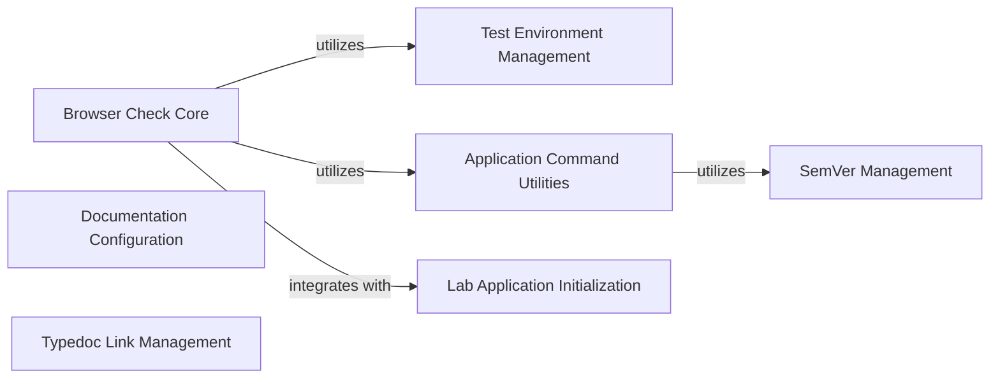

## Component Details

This graph illustrates the structure and interactions of the 'Supporting Utilities & Testing' component within JupyterLab. It encompasses modules for semantic versioning, browser-based testing, documentation generation, and link management. The core flow involves setting up test environments, running browser checks, and ensuring the integrity of documentation links and versioning for compatibility.

### SemVer Management
This component provides a comprehensive set of utilities for parsing, validating, comparing, and manipulating semantic versions. It supports various comparison operators, range matching, and version incrementing, adhering to the semantic versioning specification.

**Related Classes/Methods**:

- <a href="https://github.com/jupyterlab/jupyterlab/blob/master/jupyterlab/semver.py#L327-L333" target="_blank" rel="noopener noreferrer">`jupyterlab.jupyterlab.semver:parse` (327:333)</a>
- <a href="https://github.com/jupyterlab/jupyterlab/blob/master/jupyterlab/semver.py#L336-L341" target="_blank" rel="noopener noreferrer">`jupyterlab.jupyterlab.semver:valid` (336:341)</a>
- <a href="https://github.com/jupyterlab/jupyterlab/blob/master/jupyterlab/semver.py#L344-L349" target="_blank" rel="noopener noreferrer">`jupyterlab.jupyterlab.semver:clean` (344:349)</a>
- <a href="https://github.com/jupyterlab/jupyterlab/blob/master/jupyterlab/semver.py#L355-L368" target="_blank" rel="noopener noreferrer">`jupyterlab.jupyterlab.semver:semver` (355:368)</a>
- <a href="https://github.com/jupyterlab/jupyterlab/blob/master/jupyterlab/semver.py#L374-L556" target="_blank" rel="noopener noreferrer">`jupyterlab.jupyterlab.semver.SemVer` (374:556)</a>
- <a href="https://github.com/jupyterlab/jupyterlab/blob/master/jupyterlab/semver.py#L375-L411" target="_blank" rel="noopener noreferrer">`jupyterlab.jupyterlab.semver.SemVer:__init__` (375:411)</a>
- <a href="https://github.com/jupyterlab/jupyterlab/blob/master/jupyterlab/semver.py#L425-L431" target="_blank" rel="noopener noreferrer">`jupyterlab.jupyterlab.semver.SemVer:compare` (425:431)</a>
- <a href="https://github.com/jupyterlab/jupyterlab/blob/master/jupyterlab/semver.py#L433-L441" target="_blank" rel="noopener noreferrer">`jupyterlab.jupyterlab.semver.SemVer:compare_main` (433:441)</a>
- <a href="https://github.com/jupyterlab/jupyterlab/blob/master/jupyterlab/semver.py#L443-L473" target="_blank" rel="noopener noreferrer">`jupyterlab.jupyterlab.semver.SemVer:compare_pre` (443:473)</a>
- <a href="https://github.com/jupyterlab/jupyterlab/blob/master/jupyterlab/semver.py#L559-L564" target="_blank" rel="noopener noreferrer">`jupyterlab.jupyterlab.semver:inc` (559:564)</a>
- <a href="https://github.com/jupyterlab/jupyterlab/blob/master/jupyterlab/semver.py#L587-L588" target="_blank" rel="noopener noreferrer">`jupyterlab.jupyterlab.semver:rcompare_identifiers` (587:588)</a>
- <a href="https://github.com/jupyterlab/jupyterlab/blob/master/jupyterlab/semver.py#L591-L592" target="_blank" rel="noopener noreferrer">`jupyterlab.jupyterlab.semver:compare` (591:592)</a>
- <a href="https://github.com/jupyterlab/jupyterlab/blob/master/jupyterlab/semver.py#L595-L596" target="_blank" rel="noopener noreferrer">`jupyterlab.jupyterlab.semver:compare_loose` (595:596)</a>
- <a href="https://github.com/jupyterlab/jupyterlab/blob/master/jupyterlab/semver.py#L599-L600" target="_blank" rel="noopener noreferrer">`jupyterlab.jupyterlab.semver:rcompare` (599:600)</a>
- <a href="https://github.com/jupyterlab/jupyterlab/blob/master/jupyterlab/semver.py#L603-L615" target="_blank" rel="noopener noreferrer">`jupyterlab.jupyterlab.semver:make_key_function` (603:615)</a>
- <a href="https://github.com/jupyterlab/jupyterlab/blob/master/jupyterlab/semver.py#L634-L635" target="_blank" rel="noopener noreferrer">`jupyterlab.jupyterlab.semver:gt` (634:635)</a>
- <a href="https://github.com/jupyterlab/jupyterlab/blob/master/jupyterlab/semver.py#L638-L639" target="_blank" rel="noopener noreferrer">`jupyterlab.jupyterlab.semver:lt` (638:639)</a>
- <a href="https://github.com/jupyterlab/jupyterlab/blob/master/jupyterlab/semver.py#L642-L643" target="_blank" rel="noopener noreferrer">`jupyterlab.jupyterlab.semver:eq` (642:643)</a>
- <a href="https://github.com/jupyterlab/jupyterlab/blob/master/jupyterlab/semver.py#L646-L647" target="_blank" rel="noopener noreferrer">`jupyterlab.jupyterlab.semver:neq` (646:647)</a>
- <a href="https://github.com/jupyterlab/jupyterlab/blob/master/jupyterlab/semver.py#L650-L651" target="_blank" rel="noopener noreferrer">`jupyterlab.jupyterlab.semver:gte` (650:651)</a>
- <a href="https://github.com/jupyterlab/jupyterlab/blob/master/jupyterlab/semver.py#L654-L655" target="_blank" rel="noopener noreferrer">`jupyterlab.jupyterlab.semver:lte` (654:655)</a>
- <a href="https://github.com/jupyterlab/jupyterlab/blob/master/jupyterlab/semver.py#L658-L677" target="_blank" rel="noopener noreferrer">`jupyterlab.jupyterlab.semver:cmp` (658:677)</a>
- <a href="https://github.com/jupyterlab/jupyterlab/blob/master/jupyterlab/semver.py#L680-L689" target="_blank" rel="noopener noreferrer">`jupyterlab.jupyterlab.semver:comparator` (680:689)</a>
- <a href="https://github.com/jupyterlab/jupyterlab/blob/master/jupyterlab/semver.py#L697-L736" target="_blank" rel="noopener noreferrer">`jupyterlab.jupyterlab.semver.Comparator` (697:736)</a>
- <a href="https://github.com/jupyterlab/jupyterlab/blob/master/jupyterlab/semver.py#L700-L708" target="_blank" rel="noopener noreferrer">`jupyterlab.jupyterlab.semver.Comparator:__init__` (700:708)</a>
- <a href="https://github.com/jupyterlab/jupyterlab/blob/master/jupyterlab/semver.py#L710-L723" target="_blank" rel="noopener noreferrer">`jupyterlab.jupyterlab.semver.Comparator:parse` (710:723)</a>
- <a href="https://github.com/jupyterlab/jupyterlab/blob/master/jupyterlab/semver.py#L731-L736" target="_blank" rel="noopener noreferrer">`jupyterlab.jupyterlab.semver.Comparator:test` (731:736)</a>
- <a href="https://github.com/jupyterlab/jupyterlab/blob/master/jupyterlab/semver.py#L739-L745" target="_blank" rel="noopener noreferrer">`jupyterlab.jupyterlab.semver:make_range` (739:745)</a>
- <a href="https://github.com/jupyterlab/jupyterlab/blob/master/jupyterlab/semver.py#L748-L818" target="_blank" rel="noopener noreferrer">`jupyterlab.jupyterlab.semver.Range` (748:818)</a>
- <a href="https://github.com/jupyterlab/jupyterlab/blob/master/jupyterlab/semver.py#L749-L759" target="_blank" rel="noopener noreferrer">`jupyterlab.jupyterlab.semver.Range:__init__` (749:759)</a>
- <a href="https://github.com/jupyterlab/jupyterlab/blob/master/jupyterlab/semver.py#L774-L809" target="_blank" rel="noopener noreferrer">`jupyterlab.jupyterlab.semver.Range:parse_range` (774:809)</a>
- <a href="https://github.com/jupyterlab/jupyterlab/blob/master/jupyterlab/semver.py#L811-L818" target="_blank" rel="noopener noreferrer">`jupyterlab.jupyterlab.semver.Range:test` (811:818)</a>
- <a href="https://github.com/jupyterlab/jupyterlab/blob/master/jupyterlab/semver.py#L822-L826" target="_blank" rel="noopener noreferrer">`jupyterlab.jupyterlab.semver:to_comparators` (822:826)</a>
- <a href="https://github.com/jupyterlab/jupyterlab/blob/master/jupyterlab/semver.py#L834-L844" target="_blank" rel="noopener noreferrer">`jupyterlab.jupyterlab.semver:parse_comparator` (834:844)</a>
- <a href="https://github.com/jupyterlab/jupyterlab/blob/master/jupyterlab/semver.py#L859-L860" target="_blank" rel="noopener noreferrer">`jupyterlab.jupyterlab.semver:replace_tildes` (859:860)</a>
- <a href="https://github.com/jupyterlab/jupyterlab/blob/master/jupyterlab/semver.py#L863-L888" target="_blank" rel="noopener noreferrer">`jupyterlab.jupyterlab.semver:replace_tilde` (863:888)</a>
- <a href="https://github.com/jupyterlab/jupyterlab/blob/master/jupyterlab/semver.py#L897-L898" target="_blank" rel="noopener noreferrer">`jupyterlab.jupyterlab.semver:replace_carets` (897:898)</a>
- <a href="https://github.com/jupyterlab/jupyterlab/blob/master/jupyterlab/semver.py#L901-L992" target="_blank" rel="noopener noreferrer">`jupyterlab.jupyterlab.semver:replace_caret` (901:992)</a>
- <a href="https://github.com/jupyterlab/jupyterlab/blob/master/jupyterlab/semver.py#L995-L997" target="_blank" rel="noopener noreferrer">`jupyterlab.jupyterlab.semver:replace_xranges` (995:997)</a>
- <a href="https://github.com/jupyterlab/jupyterlab/blob/master/jupyterlab/semver.py#L1000-L1062" target="_blank" rel="noopener noreferrer">`jupyterlab.jupyterlab.semver:replace_xrange` (1000:1062)</a>
- <a href="https://github.com/jupyterlab/jupyterlab/blob/master/jupyterlab/semver.py#L1078-L1099" target="_blank" rel="noopener noreferrer">`jupyterlab.jupyterlab.semver:hyphen_replace` (1078:1099)</a>
- <a href="https://github.com/jupyterlab/jupyterlab/blob/master/jupyterlab/semver.py#L1128-L1133" target="_blank" rel="noopener noreferrer">`jupyterlab.jupyterlab.semver:satisfies` (1128:1133)</a>
- <a href="https://github.com/jupyterlab/jupyterlab/blob/master/jupyterlab/semver.py#L1136-L1148" target="_blank" rel="noopener noreferrer">`jupyterlab.jupyterlab.semver:max_satisfying` (1136:1148)</a>
- <a href="https://github.com/jupyterlab/jupyterlab/blob/master/jupyterlab/semver.py#L1151-L1157" target="_blank" rel="noopener noreferrer">`jupyterlab.jupyterlab.semver:valid_range` (1151:1157)</a>
- <a href="https://github.com/jupyterlab/jupyterlab/blob/master/jupyterlab/semver.py#L1161-L1162" target="_blank" rel="noopener noreferrer">`jupyterlab.jupyterlab.semver:ltr` (1161:1162)</a>
- <a href="https://github.com/jupyterlab/jupyterlab/blob/master/jupyterlab/semver.py#L1166-L1167" target="_blank" rel="noopener noreferrer">`jupyterlab.jupyterlab.semver:rtr` (1166:1167)</a>
- <a href="https://github.com/jupyterlab/jupyterlab/blob/master/jupyterlab/semver.py#L1170-L1219" target="_blank" rel="noopener noreferrer">`jupyterlab.jupyterlab.semver:outside` (1170:1219)</a>

### Browser Check Core
This component provides the core logic for performing browser-based checks and running asynchronous processes. It acts as an orchestrator for browser testing, interacting with test environments and application utilities.

**Related Classes/Methods**:

- <a href="https://github.com/jupyterlab/jupyterlab/blob/master/jupyterlab/browser_check.py#L75-L131" target="_blank" rel="noopener noreferrer">`jupyterlab.jupyterlab.browser_check:run_test_async` (75:131)</a>
- <a href="https://github.com/jupyterlab/jupyterlab/blob/master/jupyterlab/browser_check.py#L143-L157" target="_blank" rel="noopener noreferrer">`jupyterlab.jupyterlab.browser_check:run_browser` (143:157)</a>
- <a href="https://github.com/jupyterlab/jupyterlab/blob/master/jupyterlab/browser_check.py#L160-L173" target="_blank" rel="noopener noreferrer">`jupyterlab.jupyterlab.browser_check:run_browser_sync` (160:173)</a>
- <a href="https://github.com/jupyterlab/jupyterlab/blob/master/jupyterlab/browser_check.py#L176-L206" target="_blank" rel="noopener noreferrer">`jupyterlab.jupyterlab.browser_check.BrowserApp` (176:206)</a>
- <a href="https://github.com/jupyterlab/jupyterlab/blob/master/jupyterlab/browser_check.py#L198-L206" target="_blank" rel="noopener noreferrer">`jupyterlab.jupyterlab.browser_check.BrowserApp:initialize_handlers` (198:206)</a>

### Test Environment Management
This component is responsible for setting up and tearing down test environments for JupyterLab, providing a controlled context for running automated tests.

**Related Classes/Methods**:

- <a href="https://github.com/jupyterlab/jupyterlab/blob/master/jupyterlab/tests/test_app.py#L94-L134" target="_blank" rel="noopener noreferrer">`jupyterlab.jupyterlab.tests.test_app.TestEnv` (94:134)</a>
- <a href="https://github.com/jupyterlab/jupyterlab/blob/master/jupyterlab/tests/test_app.py#L100-L119" target="_blank" rel="noopener noreferrer">`jupyterlab.jupyterlab.tests.test_app.TestEnv.start` (100:119)</a>
- <a href="https://github.com/jupyterlab/jupyterlab/blob/master/jupyterlab/tests/test_app.py#L121-L127" target="_blank" rel="noopener noreferrer">`jupyterlab.jupyterlab.tests.test_app.TestEnv.stop` (121:127)</a>

### Application Command Utilities
This component provides utilities for retrieving application-specific directories, which are essential for various JupyterLab operations, including browser checks.

**Related Classes/Methods**:

- <a href="https://github.com/jupyterlab/jupyterlab/blob/master/jupyterlab/commands.py#L153-L182" target="_blank" rel="noopener noreferrer">`jupyterlab.jupyterlab.commands.get_app_dir` (153:182)</a>

### Lab Application Initialization
This component handles the initialization of handlers for the main JupyterLab application, integrating with the browser check process.

**Related Classes/Methods**:

- <a href="https://github.com/jupyterlab/jupyterlab/blob/master/jupyterlab/labapp.py#L728-L922" target="_blank" rel="noopener noreferrer">`jupyterlab.jupyterlab.labapp.LabApp.initialize_handlers` (728:922)</a>

### Documentation Configuration
This component manages the configuration and setup processes for JupyterLab's documentation, including building API documentation and copying relevant files.

**Related Classes/Methods**:

- <a href="https://github.com/jupyterlab/jupyterlab/blob/master/docs/source/conf.py#L404-L437" target="_blank" rel="noopener noreferrer">`jupyterlab.docs.source.conf:setup` (404:437)</a>

### Typedoc Link Management
This component is responsible for ensuring the correctness and integrity of Typedoc links within the JupyterLab documentation, including adding package indexes and handling redirects.

**Related Classes/Methods**:

- <a href="https://github.com/jupyterlab/jupyterlab/blob/master/scripts/ensure_typedoc_links.py#L57-L62" target="_blank" rel="noopener noreferrer">`jupyterlab.scripts.ensure_typedoc_links:main` (57:62)</a>

### [FAQ](https://github.com/CodeBoarding/GeneratedOnBoardings/tree/main?tab=readme-ov-file#faq)