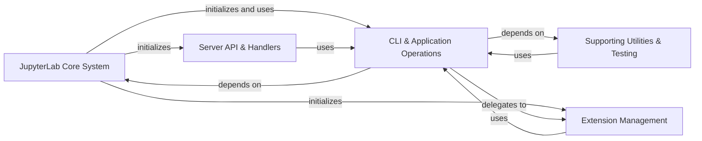

## Component Details

The JupyterLab architecture is centered around a core application system that manages its lifecycle and fundamental configurations. This core system interacts heavily with a robust CLI and application operations component, which serves as the primary interface for managing various aspects of JupyterLab, including its extensive extension ecosystem. The extension management system, supporting both standard and federated extensions, relies on these CLI operations for installation, updates, and compatibility checks, often leveraging semantic versioning utilities. Server-side API handlers provide interfaces for build processes and announcements, frequently utilizing the underlying CLI operations for their tasks. Finally, a set of supporting utilities and testing components ensure the overall stability and functionality of the application.

### JupyterLab Core System
Manages the main JupyterLab application lifecycle, including server extension loading, and provides fundamental configuration settings and data. It acts as the central orchestrator for the JupyterLab server and its core behavior.

**Related Classes/Methods**:

- <a href="https://github.com/jupyterlab/jupyterlab/blob/master/jupyterlab/labapp.py#L416-L942" target="_blank" rel="noopener noreferrer">`jupyterlab.jupyterlab.labapp.LabApp` (416:942)</a>
- <a href="https://github.com/jupyterlab/jupyterlab/blob/master/jupyterlab/labapp.py#L144-L209" target="_blank" rel="noopener noreferrer">`jupyterlab.jupyterlab.labapp.LabBuildApp` (144:209)</a>
- <a href="https://github.com/jupyterlab/jupyterlab/blob/master/jupyterlab/labapp.py#L244-L283" target="_blank" rel="noopener noreferrer">`jupyterlab.jupyterlab.labapp.LabCleanApp` (244:283)</a>
- <a href="https://github.com/jupyterlab/jupyterlab/blob/master/jupyterlab/labapp.py#L286-L304" target="_blank" rel="noopener noreferrer">`jupyterlab.jupyterlab.labapp.LabPathApp` (286:304)</a>
- <a href="https://github.com/jupyterlab/jupyterlab/blob/master/jupyterlab/labapp.py#L307-L312" target="_blank" rel="noopener noreferrer">`jupyterlab.jupyterlab.labapp.LabWorkspaceExportApp` (307:312)</a>
- <a href="https://github.com/jupyterlab/jupyterlab/blob/master/jupyterlab/labapp.py#L315-L320" target="_blank" rel="noopener noreferrer">`jupyterlab.jupyterlab.labapp.LabWorkspaceImportApp` (315:320)</a>
- <a href="https://github.com/jupyterlab/jupyterlab/blob/master/jupyterlab/labapp.py#L323-L328" target="_blank" rel="noopener noreferrer">`jupyterlab.jupyterlab.labapp.LabWorkspaceListApp` (323:328)</a>
- <a href="https://github.com/jupyterlab/jupyterlab/blob/master/jupyterlab/labapp.py#L363-L397" target="_blank" rel="noopener noreferrer">`jupyterlab.jupyterlab.labapp.LabLicensesApp` (363:397)</a>
- <a href="https://github.com/jupyterlab/jupyterlab/blob/master/jupyterlab/serverextension.py#L8-L71" target="_blank" rel="noopener noreferrer">`jupyterlab.jupyterlab.serverextension:load_jupyter_server_extension` (8:71)</a>
- <a href="https://github.com/jupyterlab/jupyterlab/blob/master/jupyterlab/labapp.py#L626-L632" target="_blank" rel="noopener noreferrer">`jupyterlab.jupyterlab.labapp.LabApp:_default_app_dir` (626:632)</a>
- <a href="https://github.com/jupyterlab/jupyterlab/blob/master/jupyterlab/labapp.py#L635-L636" target="_blank" rel="noopener noreferrer">`jupyterlab.jupyterlab.labapp.LabApp:_default_app_settings_dir` (635:636)</a>
- <a href="https://github.com/jupyterlab/jupyterlab/blob/master/jupyterlab/labapp.py#L647-L648" target="_blank" rel="noopener noreferrer">`jupyterlab.jupyterlab.labapp.LabApp:_default_schemas_dir` (647:648)</a>
- <a href="https://github.com/jupyterlab/jupyterlab/blob/master/jupyterlab/labapp.py#L651-L652" target="_blank" rel="noopener noreferrer">`jupyterlab.jupyterlab.labapp.LabApp:_default_templates_dir` (651:652)</a>
- <a href="https://github.com/jupyterlab/jupyterlab/blob/master/jupyterlab/labapp.py#L655-L658" target="_blank" rel="noopener noreferrer">`jupyterlab.jupyterlab.labapp.LabApp:_default_themes_dir` (655:658)</a>
- <a href="https://github.com/jupyterlab/jupyterlab/blob/master/jupyterlab/labapp.py#L661-L662" target="_blank" rel="noopener noreferrer">`jupyterlab.jupyterlab.labapp.LabApp:_default_static_dir` (661:662)</a>
- <a href="https://github.com/jupyterlab/jupyterlab/blob/master/jupyterlab/labapp.py#L678-L722" target="_blank" rel="noopener noreferrer">`jupyterlab.jupyterlab.labapp.LabApp:initialize_templates` (678:722)</a>
- <a href="https://github.com/jupyterlab/jupyterlab/blob/master/jupyterlab/labapp.py#L728-L922" target="_blank" rel="noopener noreferrer">`jupyterlab.jupyterlab.labapp.LabApp:initialize_handlers` (728:922)</a>
- <a href="https://github.com/jupyterlab/jupyterlab/blob/master/jupyterlab/coreconfig.py#L16-L19" target="_blank" rel="noopener noreferrer">`jupyterlab.jupyterlab.coreconfig:_get_default_core_data` (16:19)</a>
- <a href="https://github.com/jupyterlab/jupyterlab/blob/master/jupyterlab/coreconfig.py#L27-L39" target="_blank" rel="noopener noreferrer">`jupyterlab.jupyterlab.coreconfig:_only_nonlab` (27:39)</a>
- <a href="https://github.com/jupyterlab/jupyterlab/blob/master/jupyterlab/coreconfig.py#L42-L159" target="_blank" rel="noopener noreferrer">`jupyterlab.jupyterlab.coreconfig.CoreConfig` (42:159)</a>
- <a href="https://github.com/jupyterlab/jupyterlab/blob/master/jupyterlab/coreconfig.py#L49-L50" target="_blank" rel="noopener noreferrer">`jupyterlab.jupyterlab.coreconfig.CoreConfig:__init__` (49:50)</a>
- <a href="https://github.com/jupyterlab/jupyterlab/blob/master/jupyterlab/coreconfig.py#L111-L131" target="_blank" rel="noopener noreferrer">`jupyterlab.jupyterlab.coreconfig.CoreConfig:clear_packages` (111:131)</a>

### Extension Management
Provides a comprehensive framework for managing JupyterLab extensions, including plugin management, listing, installation, uninstallation, compatibility checks, and specific functionalities for federated extensions. It supports various extension sources like PyPI and read-only modes.

**Related Classes/Methods**:

- <a href="https://github.com/jupyterlab/jupyterlab/blob/master/jupyterlab/extensions/manager.py#L28-L31" target="_blank" rel="noopener noreferrer">`jupyterlab.jupyterlab.extensions.manager._ensure_compat_errors` (28:31)</a>
- <a href="https://github.com/jupyterlab/jupyterlab/blob/master/jupyterlab/extensions/manager.py#L41-L52" target="_blank" rel="noopener noreferrer">`jupyterlab.jupyterlab.extensions.manager._build_check_info` (41:52)</a>
- <a href="https://github.com/jupyterlab/jupyterlab/blob/master/jupyterlab/extensions/manager.py#L181-L297" target="_blank" rel="noopener noreferrer">`jupyterlab.jupyterlab.extensions.manager.PluginManager` (181:297)</a>
- <a href="https://github.com/jupyterlab/jupyterlab/blob/master/jupyterlab/extensions/manager.py#L202-L219" target="_blank" rel="noopener noreferrer">`jupyterlab.jupyterlab.extensions.manager.PluginManager:__init__` (202:219)</a>
- <a href="https://github.com/jupyterlab/jupyterlab/blob/master/jupyterlab/extensions/manager.py#L247-L271" target="_blank" rel="noopener noreferrer">`jupyterlab.jupyterlab.extensions.manager.PluginManager:disable` (247:271)</a>
- <a href="https://github.com/jupyterlab/jupyterlab/blob/master/jupyterlab/extensions/manager.py#L273-L297" target="_blank" rel="noopener noreferrer">`jupyterlab.jupyterlab.extensions.manager.PluginManager:enable` (273:297)</a>
- <a href="https://github.com/jupyterlab/jupyterlab/blob/master/jupyterlab/extensions/manager.py#L300-L690" target="_blank" rel="noopener noreferrer">`jupyterlab.jupyterlab.extensions.manager.ExtensionManager` (300:690)</a>
- <a href="https://github.com/jupyterlab/jupyterlab/blob/master/jupyterlab/extensions/manager.py#L328-L356" target="_blank" rel="noopener noreferrer">`jupyterlab.jupyterlab.extensions.manager.ExtensionManager:__init__` (328:356)</a>
- <a href="https://github.com/jupyterlab/jupyterlab/blob/master/jupyterlab/extensions/manager.py#L458-L502" target="_blank" rel="noopener noreferrer">`jupyterlab.jupyterlab.extensions.manager.ExtensionManager:list_extensions` (458:502)</a>
- <a href="https://github.com/jupyterlab/jupyterlab/blob/master/jupyterlab/extensions/manager.py#L504-L508" target="_blank" rel="noopener noreferrer">`jupyterlab.jupyterlab.extensions.manager.ExtensionManager:refresh` (504:508)</a>
- <a href="https://github.com/jupyterlab/jupyterlab/blob/master/jupyterlab/extensions/manager.py#L540-L644" target="_blank" rel="noopener noreferrer">`jupyterlab.jupyterlab.extensions.manager.ExtensionManager:_get_installed_extensions` (540:644)</a>
- <a href="https://github.com/jupyterlab/jupyterlab/blob/master/jupyterlab/extensions/manager.py#L674-L690" target="_blank" rel="noopener noreferrer">`jupyterlab.jupyterlab.extensions.manager.ExtensionManager:_update_extensions_list` (674:690)</a>
- <a href="https://github.com/jupyterlab/jupyterlab/blob/master/jupyterlab/extensions/pypi.py#L122-L576" target="_blank" rel="noopener noreferrer">`jupyterlab.jupyterlab.extensions.pypi.PyPIExtensionManager` (122:576)</a>
- <a href="https://github.com/jupyterlab/jupyterlab/blob/master/jupyterlab/extensions/pypi.py#L141-L165" target="_blank" rel="noopener noreferrer">`jupyterlab.jupyterlab.extensions.pypi.PyPIExtensionManager:__init__` (141:165)</a>
- <a href="https://github.com/jupyterlab/jupyterlab/blob/master/jupyterlab/extensions/pypi.py#L168-L170" target="_blank" rel="noopener noreferrer">`jupyterlab.jupyterlab.extensions.pypi.PyPIExtensionManager:metadata` (168:170)</a>
- <a href="https://github.com/jupyterlab/jupyterlab/blob/master/jupyterlab/extensions/pypi.py#L172-L193" target="_blank" rel="noopener noreferrer">`jupyterlab.jupyterlab.extensions.pypi.PyPIExtensionManager:get_latest_version` (172:193)</a>
- <a href="https://github.com/jupyterlab/jupyterlab/blob/master/jupyterlab/extensions/pypi.py#L195-L212" target="_blank" rel="noopener noreferrer">`jupyterlab.jupyterlab.extensions.pypi.PyPIExtensionManager:get_normalized_name` (195:212)</a>
- <a href="https://github.com/jupyterlab/jupyterlab/blob/master/jupyterlab/extensions/pypi.py#L214-L246" target="_blank" rel="noopener noreferrer">`jupyterlab.jupyterlab.extensions.pypi.PyPIExtensionManager:__throttleRequest` (214:246)</a>
- <a href="https://github.com/jupyterlab/jupyterlab/blob/master/jupyterlab/extensions/pypi.py#L254-L354" target="_blank" rel="noopener noreferrer">`jupyterlab.jupyterlab.extensions.pypi.PyPIExtensionManager:list_packages` (254:354)</a>
- <a href="https://github.com/jupyterlab/jupyterlab/blob/master/jupyterlab/extensions/pypi.py#L356-L368" target="_blank" rel="noopener noreferrer">`jupyterlab.jupyterlab.extensions.pypi.PyPIExtensionManager:__get_all_extensions` (356:368)</a>
- <a href="https://github.com/jupyterlab/jupyterlab/blob/master/jupyterlab/extensions/pypi.py#L370-L491" target="_blank" rel="noopener noreferrer">`jupyterlab.jupyterlab.extensions.pypi.PyPIExtensionManager:install` (370:491)</a>
- <a href="https://github.com/jupyterlab/jupyterlab/blob/master/jupyterlab/extensions/pypi.py#L493-L564" target="_blank" rel="noopener noreferrer">`jupyterlab.jupyterlab.extensions.pypi.PyPIExtensionManager:uninstall` (493:564)</a>
- `jupyterlab.jupyterlab.extensions:get_pypi_manager` (full file reference)
- <a href="https://github.com/jupyterlab/jupyterlab/blob/master/jupyterlab/extensions/readonly.py#L14-L82" target="_blank" rel="noopener noreferrer">`jupyterlab.jupyterlab.extensions.readonly.ReadOnlyExtensionManager` (14:82)</a>
- <a href="https://github.com/jupyterlab/jupyterlab/blob/master/jupyterlab/extensions/readonly.py#L18-L20" target="_blank" rel="noopener noreferrer">`jupyterlab.jupyterlab.extensions.readonly.ReadOnlyExtensionManager:metadata` (18:20)</a>
- <a href="https://github.com/jupyterlab/jupyterlab/blob/master/jupyterlab/extensions/readonly.py#L47-L64" target="_blank" rel="noopener noreferrer">`jupyterlab.jupyterlab.extensions.readonly.ReadOnlyExtensionManager:install` (47:64)</a>
- <a href="https://github.com/jupyterlab/jupyterlab/blob/master/jupyterlab/extensions/readonly.py#L66-L82" target="_blank" rel="noopener noreferrer">`jupyterlab.jupyterlab.extensions.readonly.ReadOnlyExtensionManager:uninstall` (66:82)</a>
- `jupyterlab.jupyterlab.extensions:get_readonly_manager` (full file reference)
- <a href="https://github.com/jupyterlab/jupyterlab/blob/master/jupyterlab/federated_labextensions.py#L46-L151" target="_blank" rel="noopener noreferrer">`jupyterlab.jupyterlab.federated_labextensions:develop_labextension` (46:151)</a>
- <a href="https://github.com/jupyterlab/jupyterlab/blob/master/jupyterlab/federated_labextensions.py#L154-L194" target="_blank" rel="noopener noreferrer">`jupyterlab.jupyterlab.federated_labextensions:develop_labextension_py` (154:194)</a>
- <a href="https://github.com/jupyterlab/jupyterlab/blob/master/jupyterlab/federated_labextensions.py#L197-L218" target="_blank" rel="noopener noreferrer">`jupyterlab.jupyterlab.federated_labextensions:build_labextension` (197:218)</a>
- <a href="https://github.com/jupyterlab/jupyterlab/blob/master/jupyterlab/federated_labextensions.py#L221-L253" target="_blank" rel="noopener noreferrer">`jupyterlab.jupyterlab.federated_labextensions:watch_labextension` (221:253)</a>
- <a href="https://github.com/jupyterlab/jupyterlab/blob/master/jupyterlab/federated_labextensions.py#L261-L310" target="_blank" rel="noopener noreferrer">`jupyterlab.jupyterlab.federated_labextensions:_ensure_builder` (261:310)</a>
- <a href="https://github.com/jupyterlab/jupyterlab/blob/master/jupyterlab/federated_labextensions.py#L341-L357" target="_blank" rel="noopener noreferrer">`jupyterlab.jupyterlab.federated_labextensions:_maybe_copy` (341:357)</a>

### CLI & Application Operations
Provides a comprehensive set of command-line interface functions and internal application operations for managing JupyterLab, including installing, uninstalling, updating, linking, and building extensions, as well as managing application directories and ensuring node modules. It serves as the primary operational interface for various application-level tasks.

**Related Classes/Methods**:

- <a href="https://github.com/jupyterlab/jupyterlab/blob/master/jupyterlab/commands.py#L69-L131" target="_blank" rel="noopener noreferrer">`jupyterlab.jupyterlab.commands.ProgressProcess` (69:131)</a>
- <a href="https://github.com/jupyterlab/jupyterlab/blob/master/jupyterlab/commands.py#L139-L143" target="_blank" rel="noopener noreferrer">`jupyterlab.jupyterlab.commands:get_user_settings_dir` (139:143)</a>
- <a href="https://github.com/jupyterlab/jupyterlab/blob/master/jupyterlab/commands.py#L146-L150" target="_blank" rel="noopener noreferrer">`jupyterlab.jupyterlab.commands:get_workspaces_dir` (146:150)</a>
- <a href="https://github.com/jupyterlab/jupyterlab/blob/master/jupyterlab/commands.py#L153-L182" target="_blank" rel="noopener noreferrer">`jupyterlab.jupyterlab.commands:get_app_dir` (153:182)</a>
- <a href="https://github.com/jupyterlab/jupyterlab/blob/master/jupyterlab/commands.py#L185-L212" target="_blank" rel="noopener noreferrer">`jupyterlab.jupyterlab.commands:dedupe_yarn` (185:212)</a>
- <a href="https://github.com/jupyterlab/jupyterlab/blob/master/jupyterlab/commands.py#L215-L232" target="_blank" rel="noopener noreferrer">`jupyterlab.jupyterlab.commands:ensure_node_modules` (215:232)</a>
- <a href="https://github.com/jupyterlab/jupyterlab/blob/master/jupyterlab/commands.py#L235-L243" target="_blank" rel="noopener noreferrer">`jupyterlab.jupyterlab.commands:ensure_dev` (235:243)</a>
- <a href="https://github.com/jupyterlab/jupyterlab/blob/master/jupyterlab/commands.py#L246-L256" target="_blank" rel="noopener noreferrer">`jupyterlab.jupyterlab.commands:ensure_core` (246:256)</a>
- <a href="https://github.com/jupyterlab/jupyterlab/blob/master/jupyterlab/commands.py#L259-L272" target="_blank" rel="noopener noreferrer">`jupyterlab.jupyterlab.commands:ensure_app` (259:272)</a>
- <a href="https://github.com/jupyterlab/jupyterlab/blob/master/jupyterlab/commands.py#L275-L298" target="_blank" rel="noopener noreferrer">`jupyterlab.jupyterlab.commands:watch_packages` (275:298)</a>
- <a href="https://github.com/jupyterlab/jupyterlab/blob/master/jupyterlab/commands.py#L301-L325" target="_blank" rel="noopener noreferrer">`jupyterlab.jupyterlab.commands:watch_dev` (301:325)</a>
- <a href="https://github.com/jupyterlab/jupyterlab/blob/master/jupyterlab/commands.py#L328-L391" target="_blank" rel="noopener noreferrer">`jupyterlab.jupyterlab.commands.AppOptions` (328:391)</a>
- <a href="https://github.com/jupyterlab/jupyterlab/blob/master/jupyterlab/commands.py#L394-L401" target="_blank" rel="noopener noreferrer">`jupyterlab.jupyterlab.commands:_ensure_options` (394:401)</a>
- <a href="https://github.com/jupyterlab/jupyterlab/blob/master/jupyterlab/commands.py#L404-L422" target="_blank" rel="noopener noreferrer">`jupyterlab.jupyterlab.commands:watch` (404:422)</a>
- <a href="https://github.com/jupyterlab/jupyterlab/blob/master/jupyterlab/commands.py#L425-L435" target="_blank" rel="noopener noreferrer">`jupyterlab.jupyterlab.commands:install_extension` (425:435)</a>
- <a href="https://github.com/jupyterlab/jupyterlab/blob/master/jupyterlab/commands.py#L438-L448" target="_blank" rel="noopener noreferrer">`jupyterlab.jupyterlab.commands:uninstall_extension` (438:448)</a>
- <a href="https://github.com/jupyterlab/jupyterlab/blob/master/jupyterlab/commands.py#L451-L462" target="_blank" rel="noopener noreferrer">`jupyterlab.jupyterlab.commands:update_extension` (451:462)</a>
- <a href="https://github.com/jupyterlab/jupyterlab/blob/master/jupyterlab/commands.py#L465-L496" target="_blank" rel="noopener noreferrer">`jupyterlab.jupyterlab.commands:clean` (465:496)</a>
- <a href="https://github.com/jupyterlab/jupyterlab/blob/master/jupyterlab/commands.py#L499-L520" target="_blank" rel="noopener noreferrer">`jupyterlab.jupyterlab.commands:build` (499:520)</a>
- <a href="https://github.com/jupyterlab/jupyterlab/blob/master/jupyterlab/commands.py#L523-L527" target="_blank" rel="noopener noreferrer">`jupyterlab.jupyterlab.commands:get_app_info` (523:527)</a>
- <a href="https://github.com/jupyterlab/jupyterlab/blob/master/jupyterlab/commands.py#L530-L536" target="_blank" rel="noopener noreferrer">`jupyterlab.jupyterlab.commands:enable_extension` (530:536)</a>
- <a href="https://github.com/jupyterlab/jupyterlab/blob/master/jupyterlab/commands.py#L539-L545" target="_blank" rel="noopener noreferrer">`jupyterlab.jupyterlab.commands:disable_extension` (539:545)</a>
- <a href="https://github.com/jupyterlab/jupyterlab/blob/master/jupyterlab/commands.py#L548-L551" target="_blank" rel="noopener noreferrer">`jupyterlab.jupyterlab.commands:check_extension` (548:551)</a>
- <a href="https://github.com/jupyterlab/jupyterlab/blob/master/jupyterlab/commands.py#L554-L557" target="_blank" rel="noopener noreferrer">`jupyterlab.jupyterlab.commands:lock_extension` (554:557)</a>
- <a href="https://github.com/jupyterlab/jupyterlab/blob/master/jupyterlab/commands.py#L560-L563" target="_blank" rel="noopener noreferrer">`jupyterlab.jupyterlab.commands:unlock_extension` (560:563)</a>
- <a href="https://github.com/jupyterlab/jupyterlab/blob/master/jupyterlab/commands.py#L566-L574" target="_blank" rel="noopener noreferrer">`jupyterlab.jupyterlab.commands:build_check` (566:574)</a>
- <a href="https://github.com/jupyterlab/jupyterlab/blob/master/jupyterlab/commands.py#L577-L580" target="_blank" rel="noopener noreferrer">`jupyterlab.jupyterlab.commands:list_extensions` (577:580)</a>
- <a href="https://github.com/jupyterlab/jupyterlab/blob/master/jupyterlab/commands.py#L583-L589" target="_blank" rel="noopener noreferrer">`jupyterlab.jupyterlab.commands:link_package` (583:589)</a>
- <a href="https://github.com/jupyterlab/jupyterlab/blob/master/jupyterlab/commands.py#L592-L598" target="_blank" rel="noopener noreferrer">`jupyterlab.jupyterlab.commands:unlink_package` (592:598)</a>
- <a href="https://github.com/jupyterlab/jupyterlab/blob/master/jupyterlab/commands.py#L601-L604" target="_blank" rel="noopener noreferrer">`jupyterlab.jupyterlab.commands:get_app_version` (601:604)</a>
- <a href="https://github.com/jupyterlab/jupyterlab/blob/master/jupyterlab/commands.py#L607-L610" target="_blank" rel="noopener noreferrer">`jupyterlab.jupyterlab.commands:get_latest_compatible_package_versions` (607:610)</a>
- <a href="https://github.com/jupyterlab/jupyterlab/blob/master/jupyterlab/commands.py#L627-L2075" target="_blank" rel="noopener noreferrer">`jupyterlab.jupyterlab.commands._AppHandler` (627:2075)</a>
- <a href="https://github.com/jupyterlab/jupyterlab/blob/master/jupyterlab/commands.py#L628-L657" target="_blank" rel="noopener noreferrer">`jupyterlab.jupyterlab.commands._AppHandler:__init__` (628:657)</a>
- <a href="https://github.com/jupyterlab/jupyterlab/blob/master/jupyterlab/commands.py#L659-L703" target="_blank" rel="noopener noreferrer">`jupyterlab.jupyterlab.commands._AppHandler:install_extension` (659:703)</a>
- <a href="https://github.com/jupyterlab/jupyterlab/blob/master/jupyterlab/commands.py#L705-L754" target="_blank" rel="noopener noreferrer">`jupyterlab.jupyterlab.commands._AppHandler:build` (705:754)</a>
- <a href="https://github.com/jupyterlab/jupyterlab/blob/master/jupyterlab/commands.py#L756-L774" target="_blank" rel="noopener noreferrer">`jupyterlab.jupyterlab.commands._AppHandler:watch` (756:774)</a>
- <a href="https://github.com/jupyterlab/jupyterlab/blob/master/jupyterlab/commands.py#L776-L845" target="_blank" rel="noopener noreferrer">`jupyterlab.jupyterlab.commands._AppHandler:list_extensions` (776:845)</a>
- <a href="https://github.com/jupyterlab/jupyterlab/blob/master/jupyterlab/commands.py#L847-L928" target="_blank" rel="noopener noreferrer">`jupyterlab.jupyterlab.commands._AppHandler:build_check` (847:928)</a>
- <a href="https://github.com/jupyterlab/jupyterlab/blob/master/jupyterlab/commands.py#L930-L983" target="_blank" rel="noopener noreferrer">`jupyterlab.jupyterlab.commands._AppHandler:uninstall_extension` (930:983)</a>
- <a href="https://github.com/jupyterlab/jupyterlab/blob/master/jupyterlab/commands.py#L985-L994" target="_blank" rel="noopener noreferrer">`jupyterlab.jupyterlab.commands._AppHandler:uninstall_all_extensions` (985:994)</a>
- <a href="https://github.com/jupyterlab/jupyterlab/blob/master/jupyterlab/commands.py#L996-L1008" target="_blank" rel="noopener noreferrer">`jupyterlab.jupyterlab.commands._AppHandler:update_all_extensions` (996:1008)</a>
- <a href="https://github.com/jupyterlab/jupyterlab/blob/master/jupyterlab/commands.py#L1010-L1018" target="_blank" rel="noopener noreferrer">`jupyterlab.jupyterlab.commands._AppHandler:update_extension` (1010:1018)</a>
- <a href="https://github.com/jupyterlab/jupyterlab/blob/master/jupyterlab/commands.py#L1020-L1040" target="_blank" rel="noopener noreferrer">`jupyterlab.jupyterlab.commands._AppHandler:_update_extension` (1020:1040)</a>
- <a href="https://github.com/jupyterlab/jupyterlab/blob/master/jupyterlab/commands.py#L1042-L1071" target="_blank" rel="noopener noreferrer">`jupyterlab.jupyterlab.commands._AppHandler:link_package` (1042:1071)</a>
- <a href="https://github.com/jupyterlab/jupyterlab/blob/master/jupyterlab/commands.py#L1073-L1106" target="_blank" rel="noopener noreferrer">`jupyterlab.jupyterlab.commands._AppHandler:unlink_package` (1073:1106)</a>
- <a href="https://github.com/jupyterlab/jupyterlab/blob/master/jupyterlab/commands.py#L1120-L1161" target="_blank" rel="noopener noreferrer">`jupyterlab.jupyterlab.commands._AppHandler:toggle_extension` (1120:1161)</a>
- <a href="https://github.com/jupyterlab/jupyterlab/blob/master/jupyterlab/commands.py#L1188-L1209" target="_blank" rel="noopener noreferrer">`jupyterlab.jupyterlab.commands._AppHandler:toggle_extension_lock` (1188:1209)</a>
- <a href="https://github.com/jupyterlab/jupyterlab/blob/master/jupyterlab/commands.py#L1211-L1223" target="_blank" rel="noopener noreferrer">`jupyterlab.jupyterlab.commands._AppHandler:check_extension` (1211:1223)</a>
- <a href="https://github.com/jupyterlab/jupyterlab/blob/master/jupyterlab/commands.py#L1239-L1259" target="_blank" rel="noopener noreferrer">`jupyterlab.jupyterlab.commands._AppHandler:_check_common_extension` (1239:1259)</a>
- <a href="https://github.com/jupyterlab/jupyterlab/blob/master/jupyterlab/commands.py#L1261-L1295" target="_blank" rel="noopener noreferrer">`jupyterlab.jupyterlab.commands._AppHandler:_get_app_info` (1261:1295)</a>
- <a href="https://github.com/jupyterlab/jupyterlab/blob/master/jupyterlab/commands.py#L1329-L1468" target="_blank" rel="noopener noreferrer">`jupyterlab.jupyterlab.commands._AppHandler:_populate_staging` (1329:1468)</a>
- <a href="https://github.com/jupyterlab/jupyterlab/blob/master/jupyterlab/commands.py#L1470-L1543" target="_blank" rel="noopener noreferrer">`jupyterlab.jupyterlab.commands._AppHandler:_get_package_template` (1470:1543)</a>
- <a href="https://github.com/jupyterlab/jupyterlab/blob/master/jupyterlab/commands.py#L1545-L1558" target="_blank" rel="noopener noreferrer">`jupyterlab.jupyterlab.commands._AppHandler:_check_local` (1545:1558)</a>
- <a href="https://github.com/jupyterlab/jupyterlab/blob/master/jupyterlab/commands.py#L1560-L1582" target="_blank" rel="noopener noreferrer">`jupyterlab.jupyterlab.commands._AppHandler:_update_local` (1560:1582)</a>
- <a href="https://github.com/jupyterlab/jupyterlab/blob/master/jupyterlab/commands.py#L1584-L1602" target="_blank" rel="noopener noreferrer">`jupyterlab.jupyterlab.commands._AppHandler:_get_extensions` (1584:1602)</a>
- <a href="https://github.com/jupyterlab/jupyterlab/blob/master/jupyterlab/commands.py#L1604-L1634" target="_blank" rel="noopener noreferrer">`jupyterlab.jupyterlab.commands._AppHandler:_get_extensions_in_dir` (1604:1634)</a>
- <a href="https://github.com/jupyterlab/jupyterlab/blob/master/jupyterlab/commands.py#L1636-L1650" target="_blank" rel="noopener noreferrer">`jupyterlab.jupyterlab.commands._AppHandler:_get_extension_compat` (1636:1650)</a>
- <a href="https://github.com/jupyterlab/jupyterlab/blob/master/jupyterlab/commands.py#L1652-L1654" target="_blank" rel="noopener noreferrer">`jupyterlab.jupyterlab.commands._AppHandler:_get_local_extensions` (1652:1654)</a>
- <a href="https://github.com/jupyterlab/jupyterlab/blob/master/jupyterlab/commands.py#L1656-L1679" target="_blank" rel="noopener noreferrer">`jupyterlab.jupyterlab.commands._AppHandler:_get_linked_packages` (1656:1679)</a>
- <a href="https://github.com/jupyterlab/jupyterlab/blob/master/jupyterlab/commands.py#L1681-L1684" target="_blank" rel="noopener noreferrer">`jupyterlab.jupyterlab.commands._AppHandler:_get_uninstalled_core_extensions` (1681:1684)</a>
- <a href="https://github.com/jupyterlab/jupyterlab/blob/master/jupyterlab/commands.py#L1686-L1696" target="_blank" rel="noopener noreferrer">`jupyterlab.jupyterlab.commands._AppHandler:_ensure_app_dirs` (1686:1696)</a>
- <a href="https://github.com/jupyterlab/jupyterlab/blob/master/jupyterlab/commands.py#L1698-L1732" target="_blank" rel="noopener noreferrer">`jupyterlab.jupyterlab.commands._AppHandler:_list_extensions` (1698:1732)</a>
- <a href="https://github.com/jupyterlab/jupyterlab/blob/master/jupyterlab/commands.py#L1734-L1767" target="_blank" rel="noopener noreferrer">`jupyterlab.jupyterlab.commands._AppHandler:_list_federated_extensions` (1734:1767)</a>
- <a href="https://github.com/jupyterlab/jupyterlab/blob/master/jupyterlab/commands.py#L1769-L1787" target="_blank" rel="noopener noreferrer">`jupyterlab.jupyterlab.commands._AppHandler:_compose_extra_status` (1769:1787)</a>
- <a href="https://github.com/jupyterlab/jupyterlab/blob/master/jupyterlab/commands.py#L1789-L1796" target="_blank" rel="noopener noreferrer">`jupyterlab.jupyterlab.commands._AppHandler:_read_build_config` (1789:1796)</a>
- <a href="https://github.com/jupyterlab/jupyterlab/blob/master/jupyterlab/commands.py#L1798-L1803" target="_blank" rel="noopener noreferrer">`jupyterlab.jupyterlab.commands._AppHandler:_write_build_config` (1798:1803)</a>
- <a href="https://github.com/jupyterlab/jupyterlab/blob/master/jupyterlab/commands.py#L1805-L1824" target="_blank" rel="noopener noreferrer">`jupyterlab.jupyterlab.commands._AppHandler:_get_local_data` (1805:1824)</a>
- <a href="https://github.com/jupyterlab/jupyterlab/blob/master/jupyterlab/commands.py#L1826-L1883" target="_blank" rel="noopener noreferrer">`jupyterlab.jupyterlab.commands._AppHandler:_install_extension` (1826:1883)</a>
- <a href="https://github.com/jupyterlab/jupyterlab/blob/master/jupyterlab/commands.py#L1885-L1922" target="_blank" rel="noopener noreferrer">`jupyterlab.jupyterlab.commands._AppHandler:_extract_package` (1885:1922)</a>
- <a href="https://github.com/jupyterlab/jupyterlab/blob/master/jupyterlab/commands.py#L1924-L1955" target="_blank" rel="noopener noreferrer">`jupyterlab.jupyterlab.commands._AppHandler:_latest_compatible_package_version` (1924:1955)</a>
- <a href="https://github.com/jupyterlab/jupyterlab/blob/master/jupyterlab/commands.py#L1957-L2007" target="_blank" rel="noopener noreferrer">`jupyterlab.jupyterlab.commands._AppHandler:latest_compatible_package_versions` (1957:2007)</a>
- <a href="https://github.com/jupyterlab/jupyterlab/blob/master/jupyterlab/commands.py#L2009-L2061" target="_blank" rel="noopener noreferrer">`jupyterlab.jupyterlab.commands._AppHandler:_format_no_compatible_package_version` (2009:2061)</a>
- <a href="https://github.com/jupyterlab/jupyterlab/blob/master/jupyterlab/commands.py#L2063-L2075" target="_blank" rel="noopener noreferrer">`jupyterlab.jupyterlab.commands._AppHandler:_run` (2063:2075)</a>
- <a href="https://github.com/jupyterlab/jupyterlab/blob/master/jupyterlab/commands.py#L2078-L2088" target="_blank" rel="noopener noreferrer">`jupyterlab.jupyterlab.commands:_node_check` (2078:2088)</a>
- <a href="https://github.com/jupyterlab/jupyterlab/blob/master/jupyterlab/commands.py#L2167-L2174" target="_blank" rel="noopener noreferrer">`jupyterlab.jupyterlab.commands:_rmtree_star` (2167:2174)</a>
- <a href="https://github.com/jupyterlab/jupyterlab/blob/master/jupyterlab/commands.py#L2251-L2258" target="_blank" rel="noopener noreferrer">`jupyterlab.jupyterlab.commands:_get_static_data` (2251:2258)</a>
- <a href="https://github.com/jupyterlab/jupyterlab/blob/master/jupyterlab/commands.py#L2261-L2277" target="_blank" rel="noopener noreferrer">`jupyterlab.jupyterlab.commands:_validate_compatibility` (2261:2277)</a>
- <a href="https://github.com/jupyterlab/jupyterlab/blob/master/jupyterlab/commands.py#L2280-L2291" target="_blank" rel="noopener noreferrer">`jupyterlab.jupyterlab.commands:_test_overlap` (2280:2291)</a>
- <a href="https://github.com/jupyterlab/jupyterlab/blob/master/jupyterlab/commands.py#L2294-L2380" target="_blank" rel="noopener noreferrer">`jupyterlab.jupyterlab.commands:_compare_ranges` (2294:2380)</a>
- <a href="https://github.com/jupyterlab/jupyterlab/blob/master/jupyterlab/commands.py#L2404-L2421" target="_blank" rel="noopener noreferrer">`jupyterlab.jupyterlab.commands:_is_locked` (2404:2421)</a>
- <a href="https://github.com/jupyterlab/jupyterlab/blob/master/jupyterlab/commands.py#L2424-L2446" target="_blank" rel="noopener noreferrer">`jupyterlab.jupyterlab.commands:_format_compatibility_errors` (2424:2446)</a>
- <a href="https://github.com/jupyterlab/jupyterlab/blob/master/jupyterlab/commands.py#L2449-L2481" target="_blank" rel="noopener noreferrer">`jupyterlab.jupyterlab.commands:_log_multiple_compat_errors` (2449:2481)</a>
- <a href="https://github.com/jupyterlab/jupyterlab/blob/master/jupyterlab/commands.py#L2484-L2492" target="_blank" rel="noopener noreferrer">`jupyterlab.jupyterlab.commands:_log_single_compat_errors` (2484:2492)</a>
- <a href="https://github.com/jupyterlab/jupyterlab/blob/master/jupyterlab/commands.py#L2495-L2518" target="_blank" rel="noopener noreferrer">`jupyterlab.jupyterlab.commands:_compat_error_age` (2495:2518)</a>
- <a href="https://github.com/jupyterlab/jupyterlab/blob/master/jupyterlab/commands.py#L2551-L2573" target="_blank" rel="noopener noreferrer">`jupyterlab.jupyterlab.commands:_semver_key` (2551:2573)</a>
- <a href="https://github.com/jupyterlab/jupyterlab/blob/master/jupyterlab/labextensions.py#L154-L157" target="_blank" rel="noopener noreferrer">`jupyterlab.jupyterlab.labextensions.BaseExtensionApp:_default_labextensions_path` (154:157)</a>
- <a href="https://github.com/jupyterlab/jupyterlab/blob/master/jupyterlab/labextensions.py#L160-L162" target="_blank" rel="noopener noreferrer">`jupyterlab.jupyterlab.labextensions.BaseExtensionApp:_default_splice_source` (160:162)</a>
- <a href="https://github.com/jupyterlab/jupyterlab/blob/master/jupyterlab/labextensions.py#L164-L183" target="_blank" rel="noopener noreferrer">`jupyterlab.jupyterlab.labextensions.BaseExtensionApp:start` (164:183)</a>
- <a href="https://github.com/jupyterlab/jupyterlab/blob/master/jupyterlab/labextensions.py#L217-L236" target="_blank" rel="noopener noreferrer">`jupyterlab.jupyterlab.labextensions.InstallLabExtensionApp:run_task` (217:236)</a>
- <a href="https://github.com/jupyterlab/jupyterlab/blob/master/jupyterlab/labextensions.py#L254-L266" target="_blank" rel="noopener noreferrer">`jupyterlab.jupyterlab.labextensions.DevelopLabExtensionApp:run_task` (254:266)</a>
- <a href="https://github.com/jupyterlab/jupyterlab/blob/master/jupyterlab/labextensions.py#L291-L300" target="_blank" rel="noopener noreferrer">`jupyterlab.jupyterlab.labextensions.BuildLabExtensionApp:run_task` (291:300)</a>
- <a href="https://github.com/jupyterlab/jupyterlab/blob/master/jupyterlab/labextensions.py#L322-L332" target="_blank" rel="noopener noreferrer">`jupyterlab.jupyterlab.labextensions.WatchLabExtensionApp:run_task` (322:332)</a>
- <a href="https://github.com/jupyterlab/jupyterlab/blob/master/jupyterlab/labextensions.py#L341-L358" target="_blank" rel="noopener noreferrer">`jupyterlab.jupyterlab.labextensions.UpdateLabExtensionApp:run_task` (341:358)</a>
- <a href="https://github.com/jupyterlab/jupyterlab/blob/master/jupyterlab/labextensions.py#L371-L379" target="_blank" rel="noopener noreferrer">`jupyterlab.jupyterlab.labextensions.LinkLabExtensionApp:run_task` (371:379)</a>
- <a href="https://github.com/jupyterlab/jupyterlab/blob/master/jupyterlab/labextensions.py#L385-L393" target="_blank" rel="noopener noreferrer">`jupyterlab.jupyterlab.labextensions.UnlinkLabExtensionApp:run_task` (385:393)</a>
- <a href="https://github.com/jupyterlab/jupyterlab/blob/master/jupyterlab/labextensions.py#L402-L416" target="_blank" rel="noopener noreferrer">`jupyterlab.jupyterlab.labextensions.UninstallLabExtensionApp:run_task` (402:416)</a>
- <a href="https://github.com/jupyterlab/jupyterlab/blob/master/jupyterlab/labextensions.py#L424-L433" target="_blank" rel="noopener noreferrer">`jupyterlab.jupyterlab.labextensions.ListLabExtensionsApp:run_task` (424:433)</a>
- <a href="https://github.com/jupyterlab/jupyterlab/blob/master/jupyterlab/labextensions.py#L444-L454" target="_blank" rel="noopener noreferrer">`jupyterlab.jupyterlab.labextensions.EnableLabExtensionsApp:run_task` (444:454)</a>
- <a href="https://github.com/jupyterlab/jupyterlab/blob/master/jupyterlab/labextensions.py#L465-L481" target="_blank" rel="noopener noreferrer">`jupyterlab.jupyterlab.labextensions.DisableLabExtensionsApp:run_task` (465:481)</a>
- <a href="https://github.com/jupyterlab/jupyterlab/blob/master/jupyterlab/labextensions.py#L492-L499" target="_blank" rel="noopener noreferrer">`jupyterlab.jupyterlab.labextensions.LockLabExtensionsApp:run_task` (492:499)</a>
- <a href="https://github.com/jupyterlab/jupyterlab/blob/master/jupyterlab/labextensions.py#L510-L520" target="_blank" rel="noopener noreferrer">`jupyterlab.jupyterlab.labextensions.UnlockLabExtensionsApp:run_task` (510:520)</a>
- <a href="https://github.com/jupyterlab/jupyterlab/blob/master/jupyterlab/labextensions.py#L533-L547" target="_blank" rel="noopener noreferrer">`jupyterlab.jupyterlab.labextensions.CheckLabExtensionsApp:run_task` (533:547)</a>

### Server API & Handlers
Manages server-side API endpoints for JupyterLab, handling requests related to the build process, retrieving build status, and providing announcements and update notifications.

**Related Classes/Methods**:

- <a href="https://github.com/jupyterlab/jupyterlab/blob/master/jupyterlab/handlers/build_handler.py#L17-L121" target="_blank" rel="noopener noreferrer">`jupyterlab.jupyterlab.handlers.build_handler.Builder` (17:121)</a>
- <a href="https://github.com/jupyterlab/jupyterlab/blob/master/jupyterlab/handlers/build_handler.py#L25-L31" target="_blank" rel="noopener noreferrer">`jupyterlab.jupyterlab.handlers.build_handler.Builder:__init__` (25:31)</a>
- <a href="https://github.com/jupyterlab/jupyterlab/blob/master/jupyterlab/handlers/build_handler.py#L34-L55" target="_blank" rel="noopener noreferrer">`jupyterlab.jupyterlab.handlers.build_handler.Builder:get_status` (34:55)</a>
- <a href="https://github.com/jupyterlab/jupyterlab/blob/master/jupyterlab/handlers/build_handler.py#L58-L82" target="_blank" rel="noopener noreferrer">`jupyterlab.jupyterlab.handlers.build_handler.Builder:build` (58:82)</a>
- <a href="https://github.com/jupyterlab/jupyterlab/blob/master/jupyterlab/handlers/build_handler.py#L95-L103" target="_blank" rel="noopener noreferrer">`jupyterlab.jupyterlab.handlers.build_handler.Builder:_run_build_check` (95:103)</a>
- <a href="https://github.com/jupyterlab/jupyterlab/blob/master/jupyterlab/handlers/build_handler.py#L106-L121" target="_blank" rel="noopener noreferrer">`jupyterlab.jupyterlab.handlers.build_handler.Builder:_run_build` (106:121)</a>
- <a href="https://github.com/jupyterlab/jupyterlab/blob/master/jupyterlab/handlers/announcements.py#L145-L188" target="_blank" rel="noopener noreferrer">`jupyterlab.jupyterlab.handlers.announcements.CheckForUpdateHandler` (145:188)</a>
- <a href="https://github.com/jupyterlab/jupyterlab/blob/master/jupyterlab/handlers/announcements.py#L152-L160" target="_blank" rel="noopener noreferrer">`jupyterlab.jupyterlab.handlers.announcements.CheckForUpdateHandler:initialize` (152:160)</a>
- <a href="https://github.com/jupyterlab/jupyterlab/blob/master/jupyterlab/handlers/announcements.py#L163-L188" target="_blank" rel="noopener noreferrer">`jupyterlab.jupyterlab.handlers.announcements.CheckForUpdateHandler:get` (163:188)</a>
- <a href="https://github.com/jupyterlab/jupyterlab/blob/master/jupyterlab/handlers/announcements.py#L191-L293" target="_blank" rel="noopener noreferrer">`jupyterlab.jupyterlab.handlers.announcements.NewsHandler` (191:293)</a>
- <a href="https://github.com/jupyterlab/jupyterlab/blob/master/jupyterlab/handlers/announcements.py#L206-L293" target="_blank" rel="noopener noreferrer">`jupyterlab.jupyterlab.handlers.announcements.NewsHandler:get` (206:293)</a>

### Supporting Utilities & Testing
Offers foundational utilities for semantic versioning, crucial for compatibility management, and provides tools for running browser-based tests and checks to ensure frontend functionality. It also includes components for documentation generation and link management.

**Related Classes/Methods**:

- <a href="https://github.com/jupyterlab/jupyterlab/blob/master/jupyterlab/semver.py#L327-L333" target="_blank" rel="noopener noreferrer">`jupyterlab.jupyterlab.semver:parse` (327:333)</a>
- <a href="https://github.com/jupyterlab/jupyterlab/blob/master/jupyterlab/semver.py#L336-L341" target="_blank" rel="noopener noreferrer">`jupyterlab.jupyterlab.semver:valid` (336:341)</a>
- <a href="https://github.com/jupyterlab/jupyterlab/blob/master/jupyterlab/semver.py#L344-L349" target="_blank" rel="noopener noreferrer">`jupyterlab.jupyterlab.semver:clean` (344:349)</a>
- <a href="https://github.com/jupyterlab/jupyterlab/blob/master/jupyterlab/semver.py#L355-L368" target="_blank" rel="noopener noreferrer">`jupyterlab.jupyterlab.semver:semver` (355:368)</a>
- <a href="https://github.com/jupyterlab/jupyterlab/blob/master/jupyterlab/semver.py#L374-L556" target="_blank" rel="noopener noreferrer">`jupyterlab.jupyterlab.semver.SemVer` (374:556)</a>
- <a href="https://github.com/jupyterlab/jupyterlab/blob/master/jupyterlab/semver.py#L375-L411" target="_blank" rel="noopener noreferrer">`jupyterlab.jupyterlab.semver.SemVer:__init__` (375:411)</a>
- <a href="https://github.com/jupyterlab/jupyterlab/blob/master/jupyterlab/semver.py#L425-L431" target="_blank" rel="noopener noreferrer">`jupyterlab.jupyterlab.semver.SemVer:compare` (425:431)</a>
- <a href="https://github.com/jupyterlab/jupyterlab/blob/master/jupyterlab/semver.py#L433-L441" target="_blank" rel="noopener noreferrer">`jupyterlab.jupyterlab.semver.SemVer:compare_main` (433:441)</a>
- <a href="https://github.com/jupyterlab/jupyterlab/blob/master/jupyterlab/semver.py#L443-L473" target="_blank" rel="noopener noreferrer">`jupyterlab.jupyterlab.semver.SemVer:compare_pre` (443:473)</a>
- <a href="https://github.com/jupyterlab/jupyterlab/blob/master/jupyterlab/semver.py#L559-L564" target="_blank" rel="noopener noreferrer">`jupyterlab.jupyterlab.semver:inc` (559:564)</a>
- <a href="https://github.com/jupyterlab/jupyterlab/blob/master/jupyterlab/semver.py#L587-L588" target="_blank" rel="noopener noreferrer">`jupyterlab.jupyterlab.semver:rcompare_identifiers` (587:588)</a>
- <a href="https://github.com/jupyterlab/jupyterlab/blob/master/jupyterlab/semver.py#L591-L592" target="_blank" rel="noopener noreferrer">`jupyterlab.jupyterlab.semver:compare` (591:592)</a>
- <a href="https://github.com/jupyterlab/jupyterlab/blob/master/jupyterlab/semver.py#L595-L596" target="_blank" rel="noopener noreferrer">`jupyterlab.jupyterlab.semver:compare_loose` (595:596)</a>
- <a href="https://github.com/jupyterlab/jupyterlab/blob/master/jupyterlab/semver.py#L599-L600" target="_blank" rel="noopener noreferrer">`jupyterlab.jupyterlab.semver:rcompare` (599:600)</a>
- <a href="https://github.com/jupyterlab/jupyterlab/blob/master/jupyterlab/semver.py#L603-L615" target="_blank" rel="noopener noreferrer">`jupyterlab.jupyterlab.semver:make_key_function` (603:615)</a>
- <a href="https://github.com/jupyterlab/jupyterlab/blob/master/jupyterlab/semver.py#L634-L635" target="_blank" rel="noopener noreferrer">`jupyterlab.jupyterlab.semver:gt` (634:635)</a>
- <a href="https://github.com/jupyterlab/jupyterlab/blob/master/jupyterlab/semver.py#L638-L639" target="_blank" rel="noopener noreferrer">`jupyterlab.jupyterlab.semver:lt` (638:639)</a>
- <a href="https://github.com/jupyterlab/jupyterlab/blob/master/jupyterlab/semver.py#L642-L643" target="_blank" rel="noopener noreferrer">`jupyterlab.jupyterlab.semver:eq` (642:643)</a>
- <a href="https://github.com/jupyterlab/jupyterlab/blob/master/jupyterlab/semver.py#L646-L647" target="_blank" rel="noopener noreferrer">`jupyterlab.jupyterlab.semver:neq` (646:647)</a>
- <a href="https://github.com/jupyterlab/jupyterlab/blob/master/jupyterlab/semver.py#L650-L651" target="_blank" rel="noopener noreferrer">`jupyterlab.jupyterlab.semver:gte` (650:651)</a>
- <a href="https://github.com/jupyterlab/jupyterlab/blob/master/jupyterlab/semver.py#L654-L655" target="_blank" rel="noopener noreferrer">`jupyterlab.jupyterlab.semver:lte` (654:655)</a>
- <a href="https://github.com/jupyterlab/jupyterlab/blob/master/jupyterlab/semver.py#L658-L677" target="_blank" rel="noopener noreferrer">`jupyterlab.jupyterlab.semver:cmp` (658:677)</a>
- <a href="https://github.com/jupyterlab/jupyterlab/blob/master/jupyterlab/semver.py#L680-L689" target="_blank" rel="noopener noreferrer">`jupyterlab.jupyterlab.semver:comparator` (680:689)</a>
- <a href="https://github.com/jupyterlab/jupyterlab/blob/master/jupyterlab/semver.py#L697-L736" target="_blank" rel="noopener noreferrer">`jupyterlab.jupyterlab.semver.Comparator` (697:736)</a>
- <a href="https://github.com/jupyterlab/jupyterlab/blob/master/jupyterlab/semver.py#L700-L708" target="_blank" rel="noopener noreferrer">`jupyterlab.jupyterlab.semver.Comparator:__init__` (700:708)</a>
- <a href="https://github.com/jupyterlab/jupyterlab/blob/master/jupyterlab/semver.py#L710-L723" target="_blank" rel="noopener noreferrer">`jupyterlab.jupyterlab.semver.Comparator:parse` (710:723)</a>
- <a href="https://github.com/jupyterlab/jupyterlab/blob/master/jupyterlab/semver.py#L731-L736" target="_blank" rel="noopener noreferrer">`jupyterlab.jupyterlab.semver.Comparator:test` (731:736)</a>
- <a href="https://github.com/jupyterlab/jupyterlab/blob/master/jupyterlab/semver.py#L739-L745" target="_blank" rel="noopener noreferrer">`jupyterlab.jupyterlab.semver:make_range` (739:745)</a>
- <a href="https://github.com/jupyterlab/jupyterlab/blob/master/jupyterlab/semver.py#L748-L818" target="_blank" rel="noopener noreferrer">`jupyterlab.jupyterlab.semver.Range` (748:818)</a>
- <a href="https://github.com/jupyterlab/jupyterlab/blob/master/jupyterlab/semver.py#L749-L759" target="_blank" rel="noopener noreferrer">`jupyterlab.jupyterlab.semver.Range:__init__` (749:759)</a>
- <a href="https://github.com/jupyterlab/jupyterlab/blob/master/jupyterlab/semver.py#L774-L809" target="_blank" rel="noopener noreferrer">`jupyterlab.jupyterlab.semver.Range:parse_range` (774:809)</a>
- <a href="https://github.com/jupyterlab/jupyterlab/blob/master/jupyterlab/semver.py#L811-L818" target="_blank" rel="noopener noreferrer">`jupyterlab.jupyterlab.semver.Range:test` (811:818)</a>
- <a href="https://github.com/jupyterlab/jupyterlab/blob/master/jupyterlab/semver.py#L822-L826" target="_blank" rel="noopener noreferrer">`jupyterlab.jupyterlab.semver:to_comparators` (822:826)</a>
- <a href="https://github.com/jupyterlab/jupyterlab/blob/master/jupyterlab/semver.py#L834-L844" target="_blank" rel="noopener noreferrer">`jupyterlab.jupyterlab.semver:parse_comparator` (834:844)</a>
- <a href="https://github.com/jupyterlab/jupyterlab/blob/master/jupyterlab/semver.py#L859-L860" target="_blank" rel="noopener noreferrer">`jupyterlab.jupyterlab.semver:replace_tildes` (859:860)</a>
- <a href="https://github.com/jupyterlab/jupyterlab/blob/master/jupyterlab/semver.py#L863-L888" target="_blank" rel="noopener noreferrer">`jupyterlab.jupyterlab.semver:replace_tilde` (863:888)</a>
- <a href="https://github.com/jupyterlab/jupyterlab/blob/master/jupyterlab/semver.py#L897-L898" target="_blank" rel="noopener noreferrer">`jupyterlab.jupyterlab.semver:replace_carets` (897:898)</a>
- <a href="https://github.com/jupyterlab/jupyterlab/blob/master/jupyterlab/semver.py#L901-L992" target="_blank" rel="noopener noreferrer">`jupyterlab.jupyterlab.semver:replace_caret` (901:992)</a>
- <a href="https://github.com/jupyterlab/jupyterlab/blob/master/jupyterlab/semver.py#L995-L997" target="_blank" rel="noopener noreferrer">`jupyterlab.jupyterlab.semver:replace_xranges` (995:997)</a>
- <a href="https://github.com/jupyterlab/jupyterlab/blob/master/jupyterlab/semver.py#L1000-L1062" target="_blank" rel="noopener noreferrer">`jupyterlab.jupyterlab.semver:replace_xrange` (1000:1062)</a>
- <a href="https://github.com/jupyterlab/jupyterlab/blob/master/jupyterlab/semver.py#L1078-L1099" target="_blank" rel="noopener noreferrer">`jupyterlab.jupyterlab.semver:hyphen_replace` (1078:1099)</a>
- <a href="https://github.com/jupyterlab/jupyterlab/blob/master/jupyterlab/semver.py#L1128-L1133" target="_blank" rel="noopener noreferrer">`jupyterlab.jupyterlab.semver:satisfies` (1128:1133)</a>
- <a href="https://github.com/jupyterlab/jupyterlab/blob/master/jupyterlab/semver.py#L1136-L1148" target="_blank" rel="noopener noreferrer">`jupyterlab.jupyterlab.semver:max_satisfying` (1136:1148)</a>
- <a href="https://github.com/jupyterlab/jupyterlab/blob/master/jupyterlab/semver.py#L1151-L1157" target="_blank" rel="noopener noreferrer">`jupyterlab.jupyterlab.semver:valid_range` (1151:1157)</a>
- <a href="https://github.com/jupyterlab/jupyterlab/blob/master/jupyterlab/semver.py#L1161-L1162" target="_blank" rel="noopener noreferrer">`jupyterlab.jupyterlab.semver:ltr` (1161:1162)</a>
- <a href="https://github.com/jupyterlab/jupyterlab/blob/master/jupyterlab/semver.py#L1166-L1167" target="_blank" rel="noopener noreferrer">`jupyterlab.jupyterlab.semver:rtr` (1166:1167)</a>
- <a href="https://github.com/jupyterlab/jupyterlab/blob/master/jupyterlab/semver.py#L1170-L1219" target="_blank" rel="noopener noreferrer">`jupyterlab.jupyterlab.semver:outside` (1170:1219)</a>
- <a href="https://github.com/jupyterlab/jupyterlab/blob/master/jupyterlab/browser_check.py#L75-L131" target="_blank" rel="noopener noreferrer">`jupyterlab.jupyterlab.browser_check:run_test_async` (75:131)</a>
- <a href="https://github.com/jupyterlab/jupyterlab/blob/master/jupyterlab/browser_check.py#L143-L157" target="_blank" rel="noopener noreferrer">`jupyterlab.jupyterlab.browser_check:run_browser` (143:157)</a>
- <a href="https://github.com/jupyterlab/jupyterlab/blob/master/jupyterlab/browser_check.py#L160-L173" target="_blank" rel="noopener noreferrer">`jupyterlab.jupyterlab.browser_check:run_browser_sync` (160:173)</a>
- <a href="https://github.com/jupyterlab/jupyterlab/blob/master/jupyterlab/browser_check.py#L176-L206" target="_blank" rel="noopener noreferrer">`jupyterlab.jupyterlab.browser_check.BrowserApp` (176:206)</a>
- <a href="https://github.com/jupyterlab/jupyterlab/blob/master/jupyterlab/browser_check.py#L198-L206" target="_blank" rel="noopener noreferrer">`jupyterlab.jupyterlab.browser_check.BrowserApp:initialize_handlers` (198:206)</a>
- <a href="https://github.com/jupyterlab/jupyterlab/blob/master/docs/source/conf.py#L404-L437" target="_blank" rel="noopener noreferrer">`jupyterlab.docs.source.conf:setup` (404:437)</a>
- <a href="https://github.com/jupyterlab/jupyterlab/blob/master/scripts/ensure_typedoc_links.py#L57-L62" target="_blank" rel="noopener noreferrer">`jupyterlab.scripts.ensure_typedoc_links:main` (57:62)</a>

### [FAQ](https://github.com/CodeBoarding/GeneratedOnBoardings/tree/main?tab=readme-ov-file#faq)