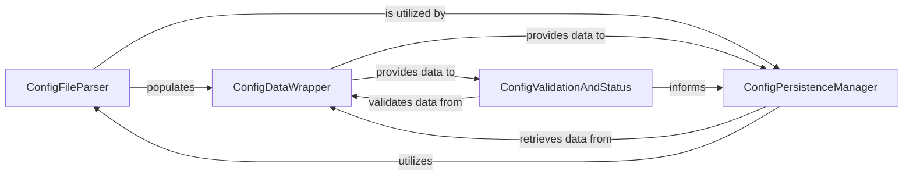

## Details

The `Configuration Management` subsystem is primarily encapsulated within the `klippy.configfile` module, located at `/home/ubuntu/CodeBoarding/repo/kalico/klippy/configfile.py`. This module is responsible for all aspects of loading, parsing, validating, and persisting printer configuration settings from `.cfg` files.

### ConfigFileParser
This component is responsible for the initial reading and parsing of configuration files. It handles complex tasks such as resolving `include` directives (allowing modular configuration files) and extracting autosave data. It also manages the removal of duplicate configuration entries. In an embedded context, this ensures that configuration can be modularized and efficiently loaded from potentially constrained storage.

**Related Classes/Methods**:

- <a href="https://github.com/KalicoCrew/kalico/blob/main/klippy/configfile.py#L1-L100" target="_blank" rel="noopener noreferrer">`klippy.configfile.ConfigFileParser`:1-100</a>

### ConfigDataWrapper
This component provides a structured and type-safe interface for other parts of the system to access configuration options. It wraps the raw parsed data, offering methods to retrieve values as specific data types (e.g., integers, floats, booleans, lists) and to navigate through configuration sections. This is crucial for maintaining data integrity and providing a consistent API for the rest of the firmware.

**Related Classes/Methods**:

- <a href="https://github.com/KalicoCrew/kalico/blob/main/klippy/configfile.py#L1-L100" target="_blank" rel="noopener noreferrer">`klippy.configfile.ConfigDataWrapper`:1-100</a>

### ConfigPersistenceManager
This component manages the process of saving the current configuration state back to disk. It orchestrates the creation of backup files, ensures that changes to included configuration files are also persisted, and constructs the string representation of the configuration for writing. This is essential for ensuring that runtime changes to configuration are preserved across reboots in an embedded system.

**Related Classes/Methods**:

- <a href="https://github.com/KalicoCrew/kalico/blob/main/klippy/configfile.py#L1-L100" target="_blank" rel="noopener noreferrer">`klippy.configfile.ConfigPersistenceManager`:1-100</a>

### ConfigValidationAndStatus
This component is dedicated to ensuring the integrity and correctness of the loaded configuration. It performs checks for issues such as unused options, conflicts arising from included files, and manages runtime warnings and deprecation notices. It also provides mechanisms to retrieve the current status of the configuration. In an embedded firmware, robust validation is critical for system stability and preventing unexpected behavior due to misconfigurations.

**Related Classes/Methods**:

- <a href="https://github.com/KalicoCrew/kalico/blob/main/klippy/configfile.py#L1-L100" target="_blank" rel="noopener noreferrer">`klippy.configfile.ConfigValidationAndStatus`:1-100</a>

### [FAQ](https://github.com/CodeBoarding/GeneratedOnBoardings/tree/main?tab=readme-ov-file#faq)