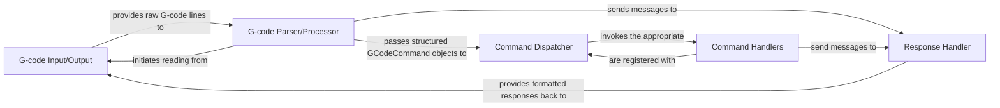

## Details

The G-code & Command Processing subsystem is primarily encapsulated within the klippy.gcode module. Its core responsibility is to interpret G-code commands, manage custom macros, and dispatch corresponding actions to other host components within the Klippy firmware. This subsystem acts as the central hub for external command interpretation and execution.

### G-code Input/Output
Manages the low-level interface for reading raw G-code data from input streams and writing processed responses back to output streams. It serves as the communication gateway for G-code, handling the physical I/O.

**Related Classes/Methods**:

- <a href="https://github.com/KalicoCrew/kalico/blob/main/klippy/gcode.py#L506-L611" target="_blank" rel="noopener noreferrer">`klippy.gcode.GCodeIO`:506-611</a>
- <a href="https://github.com/KalicoCrew/kalico/blob/main/klippy/gcode.py#L554-L600" target="_blank" rel="noopener noreferrer">`klippy.gcode._process_data`:554-600</a>
- <a href="https://github.com/KalicoCrew/kalico/blob/main/klippy/gcode.py#L602-L608" target="_blank" rel="noopener noreferrer">`klippy.gcode._respond_raw`:602-608</a>

### G-code Parser/Processor
Interprets incoming raw G-code lines, extracts commands and their parameters, and orchestrates the overall command execution flow. This component is responsible for the initial syntactic and semantic analysis of G-code.

**Related Classes/Methods**:

- <a href="https://github.com/KalicoCrew/kalico/blob/main/klippy/gcode.py#L288-L323" target="_blank" rel="noopener noreferrer">`klippy.gcode._process_commands`:288-323</a>
- <a href="https://github.com/KalicoCrew/kalico/blob/main/klippy/gcode.py#L17-L134" target="_blank" rel="noopener noreferrer">`klippy.gcode.GCodeCommand`:17-134</a>

### Command Dispatcher
Maintains a registry of all available G-code commands and their corresponding handler functions. It is responsible for looking up and invoking the correct handler for a parsed command, acting as a central routing mechanism.

**Related Classes/Methods**:

- <a href="https://github.com/KalicoCrew/kalico/blob/main/klippy/gcode.py#L193-L228" target="_blank" rel="noopener noreferrer">`klippy.gcode.register_command`:193-228</a>
- <a href="https://github.com/KalicoCrew/kalico/blob/main/klippy/gcode.py#L138-L502" target="_blank" rel="noopener noreferrer">`klippy.gcode.GCodeDispatch`:138-502</a>

### Command Handlers
Implement the specific logic for each individual G-code command. These functions perform the actual operations requested by the G-code, often interacting with other printer modules (e.g., kinematics, heaters, fans, steppers).

**Related Classes/Methods**:

- <a href="https://github.com/KalicoCrew/kalico/blob/main/klippy/gcode.py#L435-L437" target="_blank" rel="noopener noreferrer">`klippy.gcode.cmd_M110`:435-437</a>
- <a href="https://github.com/KalicoCrew/kalico/blob/main/klippy/gcode.py#L465-L466" target="_blank" rel="noopener noreferrer">`klippy.gcode.cmd_RESTART`:465-466</a>
- <a href="https://github.com/KalicoCrew/kalico/blob/main/klippy/gcode.py#L478-L484" target="_blank" rel="noopener noreferrer">`klippy.gcode.cmd_STATUS`:478-484</a>

### Response Handler
Formats and manages the sending of various types of responses back to the client, including informational messages, acknowledgments, and error reports, ensuring proper feedback to the external system.

**Related Classes/Methods**:

- <a href="https://github.com/KalicoCrew/kalico/blob/main/klippy/gcode.py" target="_blank" rel="noopener noreferrer">`klippy.gcode.respond_info`</a>
- <a href="https://github.com/KalicoCrew/kalico/blob/main/klippy/gcode.py" target="_blank" rel="noopener noreferrer">`klippy.gcode.respond_raw`</a>
- <a href="https://github.com/KalicoCrew/kalico/blob/main/klippy/gcode.py#L352-L359" target="_blank" rel="noopener noreferrer">`klippy.gcode._respond_error`:352-359</a>

### [FAQ](https://github.com/CodeBoarding/GeneratedOnBoardings/tree/main?tab=readme-ov-file#faq)