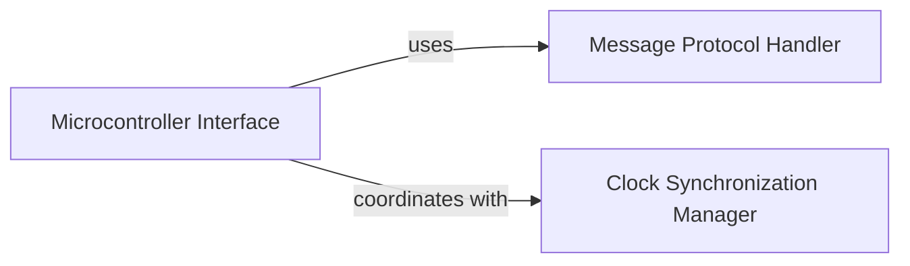

## Details

The Host-MCU Communication Layer subsystem is responsible for managing the robust communication protocol, including message serialization/deserialization and clock synchronization, between the host and the Microcontroller Unit (MCU). This layer ensures reliable and timely data exchange, which is critical for the precise control required in embedded firmware for 3D printing.

### Microcontroller Interface
Acts as the primary interface and Hardware Abstraction Layer (HAL) for interacting with the MCU. It manages the connection lifecycle, dispatches commands to the MCU, processes responses, and handles MCU configuration and identification. It provides a high-level API for host-side components to control various MCU functionalities (e.g., endstops, PWM, ADC, steppers). It also orchestrates firmware restarts and manages command queues for efficient communication.

**Related Classes/Methods**:

- <a href="https://github.com/KalicoCrew/kalico/blob/main/klippy/mcu.py" target="_blank" rel="noopener noreferrer">`klippy/mcu.py`</a>

### Message Protocol Handler
Implements the serialization and deserialization layer for host-MCU communication. It defines the structure of messages, encodes data into a transmittable format, and parses received messages back into structured data. It also incorporates mechanisms for data integrity (e.g., CRC checks) and manages message identifiers and enumerations to ensure correct interpretation of data packets.

**Related Classes/Methods**:

- <a href="https://github.com/KalicoCrew/kalico/blob/main/klippy/msgproto.py" target="_blank" rel="noopener noreferrer">`klippy/msgproto.py`</a>

### Clock Synchronization Manager
Establishes and maintains a synchronized time base between the host and the MCU. This is critical for precise real-time control of 3D printing operations, where timing of commands and events is paramount. It handles clock calibration, converts time between host and MCU clock domains, and manages clock frequency and offset to ensure accurate timing.

**Related Classes/Methods**:

- <a href="https://github.com/KalicoCrew/kalico/blob/main/klippy/clocksync.py" target="_blank" rel="noopener noreferrer">`klippy/clocksync.py`</a>

### [FAQ](https://github.com/CodeBoarding/GeneratedOnBoardings/tree/main?tab=readme-ov-file#faq)