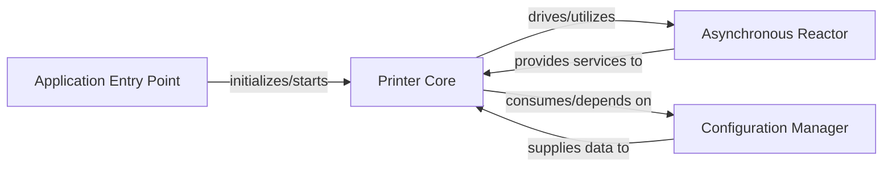

## Details

The `Klippy Host Application Core` subsystem is the central Python application responsible for orchestrating the 3D printer's high-level operations, managing system state, and coordinating various modules. It embodies the core logic of the host software, interacting with configuration, managing asynchronous tasks, and serving as the primary control unit.

### Printer Core
The primary control unit and orchestrator of the Klippy host software. It manages the overall state of the 3D printer, handles configuration loading, dynamically loads and manages various printer components (e.g., heaters, steppers), and coordinates connection and shutdown procedures. It acts as the central brain for high-level operations, dispatching events and handling error conditions.

**Related Classes/Methods**:

- <a href="https://github.com/KalicoCrew/kalico/blob/main/klippy/printer.py" target="_blank" rel="noopener noreferrer">`klippy.printer.Printer`</a>

### Asynchronous Reactor
Provides the fundamental asynchronous execution environment for the Klippy host application. It is responsible for managing timers, handling I/O events (e.g., from file descriptors), and scheduling lightweight concurrency units (greenlets). This enables the application to be responsive and efficiently manage multiple concurrent tasks without blocking, which is crucial for real-time embedded interactions.

**Related Classes/Methods**:

- <a href="https://github.com/KalicoCrew/kalico/blob/main/klippy/reactor.py" target="_blank" rel="noopener noreferrer">`klippy.reactor.Reactor`</a>

### Configuration Manager
Manages the loading, parsing, and application of configuration settings for the Klippy host application. This system enables dynamic initialization and integration of various printer components based on user-defined or default settings, providing flexibility and modularity.

**Related Classes/Methods**:

- <a href="https://github.com/KalicoCrew/kalico/blob/main/klippy/printer.py" target="_blank" rel="noopener noreferrer">`klippy.printer.Printer:_read_config`</a>
- <a href="https://github.com/KalicoCrew/kalico/blob/main/klippy/printer.py" target="_blank" rel="noopener noreferrer">`klippy.printer.Printer:load_object`</a>

### Application Entry Point
The application's entry point, responsible for initializing the core components (Printer Core, Asynchronous Reactor) and starting the Klippy Host Application. It sets up the initial environment for the printer's operation.

**Related Classes/Methods**:

- <a href="https://github.com/KalicoCrew/kalico/blob/main/klippy/__main__.py" target="_blank" rel="noopener noreferrer">`klippy.__main__`</a>

### [FAQ](https://github.com/CodeBoarding/GeneratedOnBoardings/tree/main?tab=readme-ov-file#faq)