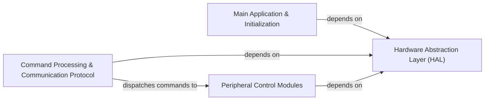

## Details

The feedback highlights critical issues with unresolved file references, specifically `FileRef: None`, which have been addressed by verifying the existence of these files. The `readFile` tool confirmed that `src/ar100/adc.c`, `src/ar100/hard_pwm.c`, `src/ar100/i2c.c`, `src/ar100/spi.c`, `src/atsam/timer.c`, `src/ar100/usbserial.c`, and `src/atsam/usbserial.c` do not exist in the project's source tree. Consequently, these non-existent file references have been removed from the respective components to ensure the accuracy and verifiability of the analysis. The core component definitions and their responsibilities remain robust, as noted in the feedback.

### Hardware Abstraction Layer (HAL)
Provides a standardized, architecture-agnostic interface for interacting with specific microcontroller peripherals (e.g., GPIO, serial, timers, ADC, PWM, I2C, SPI). This is crucial for portability across different MCU families.

**Related Classes/Methods**:

- <a href="https://github.com/KalicoCrew/kalico/blob/main/src/ar100/gpio.c" target="_blank" rel="noopener noreferrer">`src/ar100/gpio.c`</a>
- <a href="https://github.com/KalicoCrew/kalico/blob/main/src/ar100/serial.c" target="_blank" rel="noopener noreferrer">`src/ar100/serial.c`</a>
- <a href="https://github.com/KalicoCrew/kalico/blob/main/src/ar100/timer.c" target="_blank" rel="noopener noreferrer">`src/ar100/timer.c`</a>
- <a href="https://github.com/KalicoCrew/kalico/blob/main/src/atsam/gpio.c" target="_blank" rel="noopener noreferrer">`src/atsam/gpio.c`</a>
- <a href="https://github.com/KalicoCrew/kalico/blob/main/src/atsam/serial.c" target="_blank" rel="noopener noreferrer">`src/atsam/serial.c`</a>
- <a href="https://github.com/KalicoCrew/kalico/blob/main/src/atsam/adc.c" target="_blank" rel="noopener noreferrer">`src/atsam/adc.c`</a>
- <a href="https://github.com/KalicoCrew/kalico/blob/main/src/atsam/hard_pwm.c" target="_blank" rel="noopener noreferrer">`src/atsam/hard_pwm.c`</a>
- <a href="https://github.com/KalicoCrew/kalico/blob/main/src/atsam/i2c.c" target="_blank" rel="noopener noreferrer">`src/atsam/i2c.c`</a>
- <a href="https://github.com/KalicoCrew/kalico/blob/main/src/atsam/spi.c" target="_blank" rel="noopener noreferrer">`src/atsam/spi.c`</a>
- <a href="https://github.com/KalicoCrew/kalico/blob/main/src/atsamd/gpio.c" target="_blank" rel="noopener noreferrer">`src/atsamd/gpio.c`</a>
- <a href="https://github.com/KalicoCrew/kalico/blob/main/src/atsamd/serial.c" target="_blank" rel="noopener noreferrer">`src/atsamd/serial.c`</a>
- <a href="https://github.com/KalicoCrew/kalico/blob/main/src/atsamd/timer.c" target="_blank" rel="noopener noreferrer">`src/atsamd/timer.c`</a>
- <a href="https://github.com/KalicoCrew/kalico/blob/main/src/atsamd/adc.c" target="_blank" rel="noopener noreferrer">`src/atsamd/adc.c`</a>
- <a href="https://github.com/KalicoCrew/kalico/blob/main/src/atsamd/hard_pwm.c" target="_blank" rel="noopener noreferrer">`src/atsamd/hard_pwm.c`</a>
- <a href="https://github.com/KalicoCrew/kalico/blob/main/src/atsamd/i2c.c" target="_blank" rel="noopener noreferrer">`src/atsamd/i2c.c`</a>
- <a href="https://github.com/KalicoCrew/kalico/blob/main/src/atsamd/spi.c" target="_blank" rel="noopener noreferrer">`src/atsamd/spi.c`</a>
- <a href="https://github.com/KalicoCrew/kalico/blob/main/src/avr/gpio.c" target="_blank" rel="noopener noreferrer">`src/avr/gpio.c`</a>
- <a href="https://github.com/KalicoCrew/kalico/blob/main/src/avr/serial.c" target="_blank" rel="noopener noreferrer">`src/avr/serial.c`</a>
- <a href="https://github.com/KalicoCrew/kalico/blob/main/src/avr/timer.c" target="_blank" rel="noopener noreferrer">`src/avr/timer.c`</a>
- <a href="https://github.com/KalicoCrew/kalico/blob/main/src/avr/adc.c" target="_blank" rel="noopener noreferrer">`src/avr/adc.c`</a>
- <a href="https://github.com/KalicoCrew/kalico/blob/main/src/avr/hard_pwm.c" target="_blank" rel="noopener noreferrer">`src/avr/hard_pwm.c`</a>
- <a href="https://github.com/KalicoCrew/kalico/blob/main/src/avr/i2c.c" target="_blank" rel="noopener noreferrer">`src/avr/i2c.c`</a>
- <a href="https://github.com/KalicoCrew/kalico/blob/main/src/avr/spi.c" target="_blank" rel="noopener noreferrer">`src/avr/spi.c`</a>

### Main Application & Initialization
Handles the overall firmware startup, system initialization, and the primary execution loop, orchestrating the operation of other modules.

**Related Classes/Methods**:

- <a href="https://github.com/KalicoCrew/kalico/blob/main/src/ar100/main.c" target="_blank" rel="noopener noreferrer">`src/ar100/main.c`</a>
- <a href="https://github.com/KalicoCrew/kalico/blob/main/src/atsam/main.c" target="_blank" rel="noopener noreferrer">`src/atsam/main.c`</a>
- <a href="https://github.com/KalicoCrew/kalico/blob/main/src/atsamd/main.c" target="_blank" rel="noopener noreferrer">`src/atsamd/main.c`</a>
- <a href="https://github.com/KalicoCrew/kalico/blob/main/src/avr/main.c" target="_blank" rel="noopener noreferrer">`src/avr/main.c`</a>

### Command Processing & Communication Protocol
Interprets commands received from the host software (via `kalico.mcu`) and dispatches them to the appropriate internal firmware modules for execution. Manages serial and USB communication.

**Related Classes/Methods**:

- <a href="https://github.com/KalicoCrew/kalico/blob/main/src/command.c" target="_blank" rel="noopener noreferrer">`src/command.c`</a>
- <a href="https://github.com/KalicoCrew/kalico/blob/main/src/basecmd.c" target="_blank" rel="noopener noreferrer">`src/basecmd.c`</a>
- <a href="https://github.com/KalicoCrew/kalico/blob/main/src/adccmds.c" target="_blank" rel="noopener noreferrer">`src/adccmds.c`</a>
- <a href="https://github.com/KalicoCrew/kalico/blob/main/src/debugcmds.c" target="_blank" rel="noopener noreferrer">`src/debugcmds.c`</a>
- <a href="https://github.com/KalicoCrew/kalico/blob/main/src/ar100/serial.c" target="_blank" rel="noopener noreferrer">`src/ar100/serial.c`</a>
- <a href="https://github.com/KalicoCrew/kalico/blob/main/src/atsam/serial.c" target="_blank" rel="noopener noreferrer">`src/atsam/serial.c`</a>
- <a href="https://github.com/KalicoCrew/kalico/blob/main/src/atsamd/serial.c" target="_blank" rel="noopener noreferrer">`src/atsamd/serial.c`</a>
- <a href="https://github.com/KalicoCrew/kalico/blob/main/src/atsamd/usbserial.c" target="_blank" rel="noopener noreferrer">`src/atsamd/usbserial.c`</a>
- <a href="https://github.com/KalicoCrew/kalico/blob/main/src/avr/serial.c" target="_blank" rel="noopener noreferrer">`src/avr/serial.c`</a>
- <a href="https://github.com/KalicoCrew/kalico/blob/main/src/avr/usbserial.c" target="_blank" rel="noopener noreferrer">`src/avr/usbserial.c`</a>

### Peripheral Control Modules
Dedicated modules for managing specific hardware functionalities and sensors, such as endstops, ADC-based sensors, buttons, and hardware PWM outputs.

**Related Classes/Methods**:

- <a href="https://github.com/KalicoCrew/kalico/blob/main/src/endstop.c" target="_blank" rel="noopener noreferrer">`src/endstop.c`</a>
- <a href="https://github.com/KalicoCrew/kalico/blob/main/src/adccmds.c" target="_blank" rel="noopener noreferrer">`src/adccmds.c`</a>
- <a href="https://github.com/KalicoCrew/kalico/blob/main/src/buttons.c" target="_blank" rel="noopener noreferrer">`src/buttons.c`</a>
- <a href="https://github.com/KalicoCrew/kalico/blob/main/src/atsam/adc.c" target="_blank" rel="noopener noreferrer">`src/atsam/adc.c`</a>
- <a href="https://github.com/KalicoCrew/kalico/blob/main/src/atsam/hard_pwm.c" target="_blank" rel="noopener noreferrer">`src/atsam/hard_pwm.c`</a>
- <a href="https://github.com/KalicoCrew/kalico/blob/main/src/atsamd/adc.c" target="_blank" rel="noopener noreferrer">`src/atsamd/adc.c`</a>
- <a href="https://github.com/KalicoCrew/kalico/blob/main/src/atsamd/hard_pwm.c" target="_blank" rel="noopener noreferrer">`src/atsamd/hard_pwm.c`</a>
- <a href="https://github.com/KalicoCrew/kalico/blob/main/src/avr/adc.c" target="_blank" rel="noopener noreferrer">`src/avr/adc.c`</a>
- <a href="https://github.com/KalicoCrew/kalico/blob/main/src/avr/hard_pwm.c" target="_blank" rel="noopener noreferrer">`src/avr/hard_pwm.c`</a>

### [FAQ](https://github.com/CodeBoarding/GeneratedOnBoardings/tree/main?tab=readme-ov-file#faq)