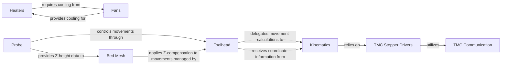

## Details

The core of the system revolves around the `Toolhead`, which orchestrates all printer movements by processing G-code commands and managing velocity/acceleration. It delegates complex movement calculations to `Kinematics`, which translates abstract coordinates into specific stepper motor positions. `Kinematics` in turn relies on `TMC Stepper Drivers` to control the physical motors, with `TMC Communication` handling the low-level interaction. The `Probe` component initiates movements via the `Toolhead` to gather Z-height data, which is then fed to `Bed Mesh` for real-time Z-axis compensation during printing. Separately, `Heaters` manage the temperature of heating elements, and `Fans` provide necessary cooling, with their operations often interdependent to maintain thermal stability.

### Toolhead
The primary orchestrator for all printer movements. It manages velocity and acceleration limits, processes G-code commands related to motion, and maintains a look-ahead queue for smooth execution.

**Related Classes/Methods**:

- <a href="https://github.com/KalicoCrew/kalico/blob/main/klippy/toolhead.py#L256-L961" target="_blank" rel="noopener noreferrer">`klippy.toolhead.ToolHead`:256-961</a>

### Kinematics
Translates abstract Cartesian coordinates (X, Y, Z, E) into specific low-level stepper motor positions and movements tailored to the printer's mechanical configuration (e.g., Cartesian, Delta, CoreXY). It also handles homing procedures and checks for movement validity.

**Related Classes/Methods**:

- <a href="https://github.com/KalicoCrew/kalico/blob/main/klippy/kinematics/cartesian.py#L10-L163" target="_blank" rel="noopener noreferrer">`klippy.kinematics.cartesian.CartKinematics`:10-163</a>
- <a href="https://github.com/KalicoCrew/kalico/blob/main/klippy/kinematics/__init__.py" target="_blank" rel="noopener noreferrer">`klippy.kinematics.Kinematics`</a>

### Heaters
Controls and monitors the temperature of heating elements (e.g., hotend, heated bed) using PID or Bang-Bang control algorithms, ensuring thermal stability.

**Related Classes/Methods**:

- <a href="https://github.com/KalicoCrew/kalico/blob/main/klippy/extras/heaters.py" target="_blank" rel="noopener noreferrer">`klippy.extras.heaters.Heater`</a>
- <a href="https://github.com/KalicoCrew/kalico/blob/main/klippy/extras/heaters.py#L963-L1142" target="_blank" rel="noopener noreferrer">`klippy.extras.heaters.PrinterHeaters`:963-1142</a>

### Fans
Manages the speed of cooling fans, crucial for part cooling and preventing heat creep in the hotend.

**Related Classes/Methods**:

- <a href="https://github.com/KalicoCrew/kalico/blob/main/klippy/extras/fan.py" target="_blank" rel="noopener noreferrer">`klippy.extras.fan.Fan`</a>
- <a href="https://github.com/KalicoCrew/kalico/blob/main/klippy/extras/fan.py#L172-L190" target="_blank" rel="noopener noreferrer">`klippy.extras.fan.PrinterFan`:172-190</a>

### Probe
Executes the bed probing process to determine bed irregularities and Z-offset. It performs probe movements, collects measurement data, and provides Z-height information.

**Related Classes/Methods**:

- <a href="https://github.com/KalicoCrew/kalico/blob/main/klippy/extras/probe.py#L18-L385" target="_blank" rel="noopener noreferrer">`klippy.extras.probe.PrinterProbe`:18-385</a>
- <a href="https://github.com/KalicoCrew/kalico/blob/main/klippy/extras/probe_eddy_current.py#L371-L386" target="_blank" rel="noopener noreferrer">`klippy.extras.probe_eddy_current.PrinterEddyProbe`:371-386</a>

### Bed Mesh
Applies real-time Z-axis compensation to printer movements based on a previously generated bed mesh profile, correcting for non-flat print surfaces.

**Related Classes/Methods**:

- <a href="https://github.com/KalicoCrew/kalico/blob/main/klippy/extras/bed_mesh.py" target="_blank" rel="noopener noreferrer">`klippy.extras.bed_mesh.BedMesh`</a>

### TMC Stepper Drivers
Provides a high-level interface for configuring and controlling Trinamic stepper motor drivers, including setting motor current, microstepping, and reading diagnostic information.

**Related Classes/Methods**:

- <a href="https://github.com/KalicoCrew/kalico/blob/main/klippy/extras/tmc.py" target="_blank" rel="noopener noreferrer">`klippy.extras.tmc.TMC`</a>
- <a href="https://github.com/KalicoCrew/kalico/blob/main/klippy/extras/tmc2130.py" target="_blank" rel="noopener noreferrer">`klippy.extras.tmc2130`</a>
- <a href="https://github.com/KalicoCrew/kalico/blob/main/klippy/extras/tmc5160.py" target="_blank" rel="noopener noreferrer">`klippy.extras.tmc5160`</a>

### TMC Communication
Handles the low-level communication protocols (UART or SPI) for interacting directly with the Trinamic stepper motor drivers on the microcontroller.

**Related Classes/Methods**:

- <a href="https://github.com/KalicoCrew/kalico/blob/main/klippy/extras/tmc_uart.py#L91-L232" target="_blank" rel="noopener noreferrer">`klippy.extras.tmc_uart.MCU_TMC_uart_bitbang`:91-232</a>
- <a href="https://github.com/KalicoCrew/kalico/blob/main/klippy/extras/tmc2130.py#L274-L331" target="_blank" rel="noopener noreferrer">`klippy.extras.tmc2130.MCU_TMC_SPI_chain`:274-331</a>

### [FAQ](https://github.com/CodeBoarding/GeneratedOnBoardings/tree/main?tab=readme-ov-file#faq)