```mermaid
graph LR
    Klippy_Host_Application_Core["Klippy Host Application Core"]
    Microcontroller_Firmware["Microcontroller Firmware"]
    Host_MCU_Communication_Layer["Host-MCU Communication Layer"]
    G_code_Command_Processing["G-code & Command Processing"]
    Motion_Peripheral_Control["Motion & Peripheral Control"]
    Configuration_Management["Configuration Management"]
    Firmware_Toolchain["Firmware Toolchain"]
    Klippy_Host_Application_Core -- "orchestrates" --> G_code_Command_Processing
    Klippy_Host_Application_Core -- "relies on" --> Host_MCU_Communication_Layer
    Host_MCU_Communication_Layer -- "interacts with" --> Microcontroller_Firmware
    G_code_Command_Processing -- "translates commands for" --> Motion_Peripheral_Control
    Motion_Peripheral_Control -- "sends commands via" --> Host_MCU_Communication_Layer
    Configuration_Management -- "provides settings to" --> Klippy_Host_Application_Core
    Firmware_Toolchain -- "interacts with" --> Microcontroller_Firmware
    click Klippy_Host_Application_Core href "https://github.com/CodeBoarding/GeneratedOnBoardings/blob/main/kalico/Klippy_Host_Application_Core.md" "Details"
    click Microcontroller_Firmware href "https://github.com/CodeBoarding/GeneratedOnBoardings/blob/main/kalico/Microcontroller_Firmware.md" "Details"
    click Host_MCU_Communication_Layer href "https://github.com/CodeBoarding/GeneratedOnBoardings/blob/main/kalico/Host_MCU_Communication_Layer.md" "Details"
    click G_code_Command_Processing href "https://github.com/CodeBoarding/GeneratedOnBoardings/blob/main/kalico/G_code_Command_Processing.md" "Details"
    click Motion_Peripheral_Control href "https://github.com/CodeBoarding/GeneratedOnBoardings/blob/main/kalico/Motion_Peripheral_Control.md" "Details"
    click Configuration_Management href "https://github.com/CodeBoarding/GeneratedOnBoardings/blob/main/kalico/Configuration_Management.md" "Details"
```

## Details

The Klippy host application operates as the central orchestrator for 3D printer control, processing G-code commands and managing real-time interactions with the microcontroller. It leverages a reactor pattern for event-driven operations and maintains a robust communication layer with the MCU, ensuring precise motion and peripheral control. Configuration settings are dynamically loaded and applied, allowing for flexible printer setups.

### Klippy Host Application Core [[Expand]](./Klippy_Host_Application_Core.md)
The central Python application orchestrating the 3D printer's high-level operations, managing system state, and coordinating modules.

**Related Classes/Methods**:

- <a href="https://github.com/KalicoCrew/kalico/blob/main/klippy/printer.py" target="_blank" rel="noopener noreferrer">`klippy.printer`</a>
- <a href="https://github.com/KalicoCrew/kalico/blob/main/klippy/reactor.py" target="_blank" rel="noopener noreferrer">`klippy.reactor`</a>
- <a href="https://github.com/KalicoCrew/kalico/blob/main/klippy/__main__.py" target="_blank" rel="noopener noreferrer">`klippy.__main__`</a>

### Microcontroller Firmware [[Expand]](./Microcontroller_Firmware.md)
The low-level C/C++ code running directly on the MCU, responsible for real-time hardware control and executing precise, timed operations.

**Related Classes/Methods**:

- <a href="https://github.com/KalicoCrew/kalico/blob/main/src/" target="_blank" rel="noopener noreferrer">`src/`</a>

### Host-MCU Communication Layer [[Expand]](./Host_MCU_Communication_Layer.md)
Manages the robust communication protocol, including message serialization/deserialization and clock synchronization, between the host and MCU.

**Related Classes/Methods**:

- <a href="https://github.com/KalicoCrew/kalico/blob/main/klippy/mcu.py" target="_blank" rel="noopener noreferrer">`klippy.mcu`</a>
- <a href="https://github.com/KalicoCrew/kalico/blob/main/klippy/msgproto.py" target="_blank" rel="noopener noreferrer">`klippy.msgproto`</a>
- <a href="https://github.com/KalicoCrew/kalico/blob/main/klippy/clocksync.py" target="_blank" rel="noopener noreferrer">`klippy.clocksync`</a>

### G-code & Command Processing [[Expand]](./G_code_Command_Processing.md)
Interprets G-code commands, manages custom macros, and dispatches corresponding actions to other host components.

**Related Classes/Methods**:

- <a href="https://github.com/KalicoCrew/kalico/blob/main/klippy/gcode.py" target="_blank" rel="noopener noreferrer">`klippy.gcode`</a>

### Motion & Peripheral Control [[Expand]](./Motion_Peripheral_Control.md)
Translates high-level movements into precise stepper commands and manages various hardware peripherals like heaters, fans, and probes.

**Related Classes/Methods**:

- <a href="https://github.com/KalicoCrew/kalico/blob/main/klippy/toolhead.py" target="_blank" rel="noopener noreferrer">`klippy.toolhead`</a>
- <a href="https://github.com/KalicoCrew/kalico/blob/main/klippy/kinematics" target="_blank" rel="noopener noreferrer">`klippy.kinematics`</a>
- <a href="https://github.com/KalicoCrew/kalico/blob/main/klippy/extras/heaters.py" target="_blank" rel="noopener noreferrer">`klippy.extras.heaters`</a>
- <a href="https://github.com/KalicoCrew/kalico/blob/main/klippy/extras/fan.py" target="_blank" rel="noopener noreferrer">`klippy.extras.fan`</a>
- <a href="https://github.com/KalicoCrew/kalico/blob/main/klippy/extras/probe.py" target="_blank" rel="noopener noreferrer">`klippy.extras.probe`</a>
- <a href="https://github.com/KalicoCrew/kalico/blob/main/klippy/extras/bed_mesh.py" target="_blank" rel="noopener noreferrer">`klippy.extras.bed_mesh`</a>
- <a href="https://github.com/KalicoCrew/kalico/blob/main/klippy/extras/tmc.py" target="_blank" rel="noopener noreferrer">`klippy.extras.tmc`</a>

### Configuration Management [[Expand]](./Configuration_Management.md)
Handles the loading, parsing, validation, and application of printer configuration settings from `.cfg` files.

**Related Classes/Methods**:

- <a href="https://github.com/KalicoCrew/kalico/blob/main/klippy/configfile.py" target="_blank" rel="noopener noreferrer">`klippy.configfile`</a>

### Firmware Toolchain
A set of external utilities and scripts for compiling and flashing the Microcontroller Firmware onto the target MCU.

**Related Classes/Methods**:

- <a href="https://github.com/KalicoCrew/kalico/blob/main/lib/canboot/flash_can.py" target="_blank" rel="noopener noreferrer">`lib.canboot.flash_can`</a>
- <a href="https://github.com/KalicoCrew/kalico/blob/main/scripts/buildcommands.py" target="_blank" rel="noopener noreferrer">`scripts.buildcommands`</a>

### [FAQ](https://github.com/CodeBoarding/GeneratedOnBoardings/tree/main?tab=readme-ov-file#faq)